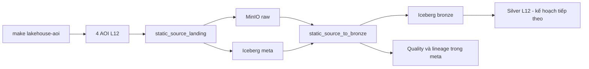
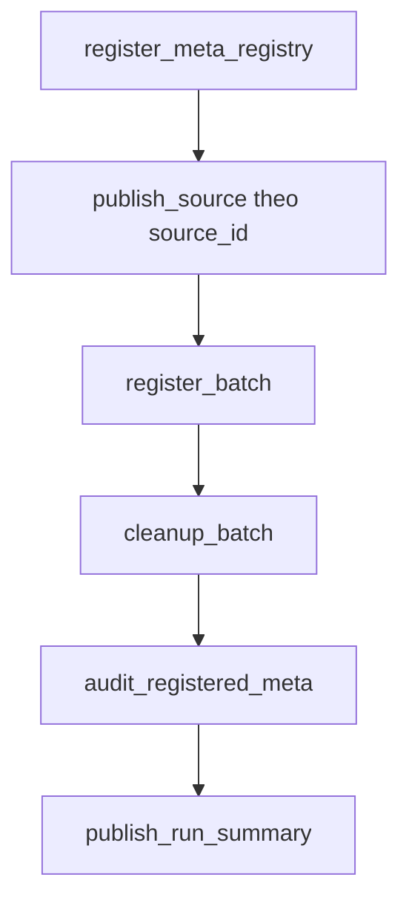

# FloodLakeKG — Geospatial Lakehouse cho lũ quét Sơn La

Repository xây dựng Lakehouse địa không gian để tích hợp dữ liệu theo phiên bản, tạo feature theo
lưu vực nhỏ và chuẩn bị dữ liệu cho threat B0–B3, Knowledge Graph và routing lũ quét tại Sơn La.

Luồng vận hành hiện tại dùng **HydroBASINS level 12 (L12)** và hai DAG Airflow:



Pipeline file-first L10 trước đây không còn là luồng vận hành của project. Artifact L10 trong
`dataset/harmonized`, `dataset/derived` và `dataset/qa` chỉ được giữ để đối chiếu; README không
hướng dẫn chạy lại pipeline đó.

## Trạng thái hiện tại

Cập nhật ngày **23/09/2026**:

| Hạng mục | Trạng thái |
| --- | --- |
| PostgreSQL, MinIO, Polaris và Airflow 3 | Đã vận hành bằng Docker Compose |
| AOI | Đã dựng đủ Core, Hydrological, Environmental và Exposure theo L12 |
| Static Source Landing | 10 nguồn đang hoạt động; source flood-event legacy đã gỡ khỏi DAG nhưng dữ liệu cũ vẫn được giữ |
| Static Bronze | Sáu bảng Bronze đã có dữ liệu; parser chạy idempotent theo `object_id` |
| Trino/DBeaver | Đã có profile đọc Iceberg qua Polaris |
| Spark/Iceberg | Đã có profile tùy chọn và smoke test ghi–đọc bảng tạm |
| Silver L12 | Chưa triển khai |
| GSMaP, ERA5-Land và IFS | Chưa có DAG production |
| Threat B0–B3, KG, routing và dashboard | Chưa triển khai |

Snapshot Iceberg được kiểm tra gần nhất:

| Bảng | Số dòng | Nội dung |
| --- | ---: | --- |
| `meta.source_objects` | 207 | Raw object bất biến của 10 nguồn static đang hoạt động và 1 source flood-event legacy |
| `meta.pipeline_runs` | 210 | Run landing/parse và quyết định publish |
| `meta.quality_results` | 1.209 | Kết quả quality rule theo run/object/snapshot |
| `meta.table_snapshot_ref` | 202 | Liên kết run với Iceberg snapshot |
| `meta.lineage_edges` | 202 | Lineage Raw object → Bronze snapshot |
| `bronze.basin_polygon_raw` | 1.194.591 | HydroBASINS L12 và BasinATLAS L12 |
| `bronze.river_reach_raw` | 1.428.959 | HydroRIVERS Asia |
| `bronze.admin_boundary_raw` | 12.012 | Địa giới Sơn La và GADM lịch sử |
| `bronze.raster_coverage` | 111 | Metadata raster; pixel vẫn nằm trong MinIO |
| `bronze.historical_event_raw` | 32 | Dữ liệu legacy được giữ lại; static DAG không còn cập nhật bảng này |
| `bronze.osm_feature_raw` | 763.704 | Nhóm OSM phục vụ lũ và facility thiết yếu |

Các số trên là snapshot, không phải hằng số. Dùng Trino hoặc `bronze reconcile` để kiểm tra trạng
thái thực tế sau mỗi lần chạy DAG.

## Yêu cầu môi trường

- Linux x86_64 hoặc Windows với WSL2 x86_64.
- Docker Engine và Docker Compose v2.
- Python 3.11, Git, GNU Make và OpenSSL.
- Tài khoản Copernicus Data Space Ecosystem để tải DEM.
- Nên có ít nhất 10 GiB dung lượng trống sau khi tải dữ liệu.

Trên WSL2, đặt repository trong filesystem Linux, ví dụ `~/projects/FloodLakeKG`. Không đặt
PostgreSQL/MinIO hoặc repository dưới `/mnt/c/` vì bind mount và quyền file sẽ chậm, dễ lỗi hơn.

## Cài đặt và khởi động

Bootstrap đầy đủ trên máy mới:

```bash
make bootstrap
```

Lệnh này kiểm tra prerequisite, tạo `.venv`, cài runtime, sinh secret local, build image, khởi
động stack và chạy smoke test. Nếu Python 3.11 có đường dẫn khác:

```bash
make bootstrap PYTHON=/duong/dan/toi/python3.11
```

Các lệnh vận hành stack:

```bash
make lakehouse-up
make lakehouse-status
make lakehouse-smoke
make lakehouse-down
```

`make lakehouse-down` chỉ dừng container và network, không xóa state. Dữ liệu persistent nằm tại:

```text
dataset/lakehouse/postgres/
dataset/lakehouse/minio/
dataset/lakehouse/airflow/logs/
dataset/lakehouse/staging/
```

Có thể đặt `LAKEHOUSE_DATA_ROOT=/duong/dan/tuyet/doi` trong `.env` để chuyển state sang ổ Linux
khác. Không commit `.env`.

### Cấu hình Copernicus DEM

Chạy `make lakehouse-init` hoặc tạo `.env` từ file mẫu, rồi điền:

```dotenv
FLASHFLOOD_CDSE_USERNAME=ten_dang_nhap
FLASHFLOOD_CDSE_PASSWORD=mat_khau
```

Không ghi credential vào YAML, Git, chat hoặc log.

### Cập nhật code trong image Airflow

Package `src/flashflood_data` được cài vào image, không bind mount trực tiếp. Sau khi sửa code
Landing/Bronze, build và recreate các service Airflow trước khi trigger DAG:

```bash
make lakehouse-airflow-build
docker compose up -d --no-deps --force-recreate \
  airflow-api-server airflow-scheduler airflow-dag-processor
make lakehouse-status
```

## Bước 1 — Dựng AOI L12

Đặt `hybas_as_lev12_v1c.*` trong `dataset/hybas_as_lev01-12_v1c/`, sau đó chạy:

```bash
make lakehouse-aoi
```

Lệnh tạo bốn file trong `dataset/harmonized/aoi/`:

| AOI | Ý nghĩa |
| --- | --- |
| `core_aoi.geoparquet` | Địa giới Sơn La hiện hành |
| `hydrological_aoi.geoparquet` | Core và các basin L12 thượng nguồn được chọn |
| `environmental_aoi.geoparquet` | Hydrological AOI cộng buffer để lấy dữ liệu môi trường |
| `exposure_aoi.geoparquet` | Core cộng buffer và giới hạn trong Việt Nam |

Hai DAG không tự dựng AOI. Cần chạy lại bước này khi thay đổi basin level, upstream hops hoặc
buffer trong `config/study_area.yaml`.

### AOI ảnh hưởng dữ liệu raster thế nào

| Nguồn | Đơn vị Raw | Hành vi khi AOI thay đổi |
| --- | --- | --- |
| Copernicus DEM GLO-30 | Tile DEM | Tính lại tile giao Environmental AOI; chỉ tải tile còn thiếu |
| ESA WorldCover 2021 | Tile lớp phủ đất | Tính lại tile giao Environmental AOI; chỉ tải tile còn thiếu |
| SoilGrids 2.0 | GeoTIFF theo property × depth × statistic | Kiểm tra extent thực tế; phủ đủ thì tái sử dụng, thiếu thì tải bbox mới với ID mới |
| WorldPop 2025 | Raster Việt Nam | Raw không được cắt theo AOI ở Landing |

Raw object cũ luôn được giữ. AOI mở rộng chỉ tạo object mới khi xuất hiện tile mới hoặc vượt
extent SoilGrids cũ.

## Bước 2 — DAG `static_source_landing`

DAG Landing acquire hoặc tái sử dụng nguồn, validate, upload object/manifest lên bucket `raw`,
đăng ký Iceberg Meta và ghi audit. DAG dừng ở Raw, chưa parse field và chưa harmonize Silver.



Các task có vai trò khác nhau:

| Task | Tác dụng |
| --- | --- |
| `register_meta_registry` | Upsert khai báo nguồn và dataset vào `meta.source_registry`, `meta.dataset_registry` |
| `publish_source` | Acquire/reuse, validate và upload object cùng manifest lên MinIO |
| `register_batch` | Đăng ký từng object thực tế vào `meta.source_objects` trong một Iceberg commit |
| `cleanup_batch` | Xóa staging và bản local tạm chỉ sau khi commit thành công |
| `audit_registered_meta` | Ghi `ingest_attempts`, `quality_results`, `table_snapshot_ref`, `pipeline_runs` |
| `publish_run_summary` | Tổng hợp source thành công/thất bại cho toàn DAG run |

Mười source hiện được cấu hình trong `config/landing/static.yaml`:

```text
sonla_admin_2025
gadm_vnm_4_1
hydrobasins_v1c
basinatlas_v10
hydrorivers_v10
worldpop_vnm_2025
geofabrik_vietnam_snapshot
cop_dem_glo30_2024_1
soilgrids_2_0
esa_worldcover_2021_v200
```

Object có layout bất biến:

```text
s3://raw/static/<source_id>/<source_version>/<selection>/<asset_id>/<filename>
s3://raw/static/<source_id>/<source_version>/<selection>/<asset_id>/manifest.json
```

MinIO giữ byte nguồn. Iceberg giữ URI, checksum, selection, audit và lineage; GeoTIFF/ZIP không
được đăng ký trực tiếp làm data file của bảng Iceberg.

### Chạy Landing DAG

```bash
make lakehouse-source-landing-smoke
docker compose exec -T airflow-api-server \
  airflow dags unpause static_source_landing
docker compose exec -T airflow-scheduler \
  airflow dags trigger static_source_landing
```

DAG không có schedule. Có thể trigger trong Airflow UI tại <http://127.0.0.1:8080/>.

Chạy lại là an toàn: checksum và `object_id` giúp tái sử dụng object/manifest/row đã tồn tại. Nếu
AOI mở rộng, DEM và WorldCover chỉ bổ sung tile thiếu; SoilGrids chỉ tạo bbox raw mới khi raster
cũ không còn phủ đủ.

Nếu một source lỗi, các source khác vẫn có thể hoàn thành và run được đánh dấu `partial_failure`.
Sau khi sửa nguyên nhân, trigger lại DAG; không xóa bucket Raw hoặc bảng Meta để chạy lại từ đầu.

## Bước 3 — DAG `static_source_to_bronze`

DAG Bronze đọc `meta.source_objects`, tải object từ MinIO, parse định dạng nguồn, chạy quality
gate và ghi Iceberg theo từng `object_id`:

| Bảng Bronze | Nguồn |
| --- | --- |
| `bronze.basin_polygon_raw` | HydroBASINS, BasinATLAS |
| `bronze.river_reach_raw` | HydroRIVERS |
| `bronze.admin_boundary_raw` | Sơn La 2025, GADM |
| `bronze.raster_coverage` | DEM, SoilGrids, WorldCover, WorldPop |
| `bronze.osm_feature_raw` | OSM hydrology, hydraulic structure, critical transport/facility |

`bronze.historical_event_raw` và Raw/Meta liên quan vẫn được giữ từ các lần chạy trước. Source
`historical_flood_evidence_2020_2026` đã được gỡ khỏi cả hai static DAG để chờ pipeline
flood-event riêng tiếp quản; trigger lại static DAG không xử lý source này.

`bronze.raster_coverage` chỉ lưu header, bbox, band, checksum và URI. Pixel vẫn nằm trong object
Raw ở MinIO; Bronze không mosaic hoặc cắt raster theo AOI.

### Idempotence của Bronze

Mỗi lần chạy, task `discover_<source_id>` vẫn kiểm tra toàn bộ object khả dụng. Một object được
skip khi đồng thời có:

- pipeline run đã publish thành công;
- lineage đúng `(object_id, target_table, parser_version)`;
- slice của object vẫn tồn tại trong bảng Bronze.

Object mới từ Landing được parse và thêm slice mới. Object cũ hợp lệ không tạo parse task. Bật
`force_reprocess` sẽ xử lý lại object và replace đúng slice của object đó, không append trùng.

### Chạy Bronze DAG

```bash
make lakehouse-meta-bronze-smoke
docker compose exec -T airflow-api-server \
  airflow dags unpause static_source_to_bronze
docker compose exec -T airflow-scheduler \
  airflow dags trigger static_source_to_bronze
```

Chỉ chạy một source:

```bash
docker compose exec -T airflow-scheduler airflow dags trigger \
  static_source_to_bronze \
  --conf '{"source_id":"geofabrik_vietnam_snapshot"}'
```

Chủ động parse lại source:

```bash
docker compose exec -T airflow-scheduler airflow dags trigger \
  static_source_to_bronze \
  --conf '{"source_id":"geofabrik_vietnam_snapshot","force_reprocess":true}'
```

Đối soát Raw, Bronze và Meta:

```bash
.venv/bin/flashflood-data bronze reconcile
```

## Xem log Airflow

Trong Airflow UI: mở DAG → DAG run → task instance → **Logs**.

```bash
docker compose logs -f \
  airflow-scheduler airflow-dag-processor airflow-api-server

find dataset/lakehouse/airflow/logs -type f | sort
```

Mọi container Airflow phải dùng cùng `AIRFLOW_API_SECRET_KEY`. Nếu đổi key, recreate đồng thời
API server, scheduler và DAG processor; nếu chỉ recreate một container, token log cũ có thể báo
`InvalidSignatureError`.

## Đọc dữ liệu Iceberg

Khởi động Trino read-only:

```bash
make query-up
make query-status
make query-smoke
```

Ví dụ truy vấn:

```bash
docker compose --profile query exec -T trino trino \
  --catalog lakehouse --schema bronze \
  --execute 'SELECT source_id, object_id, bbox_wgs84 FROM raster_coverage LIMIT 10'
```

Trino Web UI tại <http://127.0.0.1:8083/> chỉ hiển thị trạng thái query. Dùng CLI hoặc DBeaver để
viết SQL. Hướng dẫn DBeaver và truy vấn mẫu nằm tại
[docs/query_iceberg_with_trino.md](docs/query_iceberg_with_trino.md).

Các endpoint local:

| Service | Địa chỉ |
| --- | --- |
| Airflow | <http://127.0.0.1:8080/> |
| MinIO Console | <http://127.0.0.1:9001/> |
| MinIO S3 API | `127.0.0.1:9000` |
| Polaris REST API | `127.0.0.1:8181` |
| Trino | <http://127.0.0.1:8083/> |
| PostgreSQL | `127.0.0.1:5432` |

## Spark tùy chọn

Spark không khởi động cùng stack cơ sở:

```bash
make spark-build
make spark-up
make spark-status
make spark-smoke
make spark-down
```

Smoke test tạo một bảng Iceberg tạm qua Polaris/MinIO, đọc lại rồi xóa bảng. Spark hiện là runtime
chuẩn bị cho transform lớn; hai DAG static hiện tại chạy bằng Python/Airflow.

## Cấu trúc code liên quan pipeline DAG

```text
.
├── airflow/dags/
│   ├── static_source_landing.py       # Source → Raw MinIO + Meta
│   └── static_source_to_bronze.py     # Raw/Meta → Bronze + audit/lineage
├── config/
│   ├── study_area.yaml                # L12, upstream hops, buffer và CRS
│   ├── sources/*.yaml                 # Adapter, version và policy của nguồn
│   ├── landing/static.yaml            # 10 source đang hoạt động và selection của Landing
│   ├── bronze/static.yaml             # source → parser/table/version
│   ├── bronze/osm.yaml                # Allowlist OSM phục vụ lũ
│   └── meta/static.yaml               # Registry nguồn/dataset
├── src/flashflood_data/
│   ├── orchestration/landing/         # Acquire, publish, register, audit, cleanup
│   ├── orchestration/bronze/          # Discover, parse, quality, reconcile
│   ├── orchestration/meta/            # Ghi registry, run, quality, snapshot, lineage
│   ├── static/sources/                # Adapter theo từng nhà cung cấp
│   └── storage/                       # MinIO, Polaris và Iceberg table/schema
├── infra/                             # Docker image và cấu hình service
├── tools/bootstrap/                   # Init môi trường và prerequisite
├── tools/smoke/                       # Smoke test stack/pipeline
├── tests/                             # Unit, contract và integration tests
├── compose.yaml
└── Makefile
```

Adapter là lớp nối pipeline chung với chi tiết từng nguồn. Ví dụ SoilGrids adapter tạo WCS bbox,
DEM adapter chọn tile CDSE và WorldCover adapter chọn tile lớp phủ. DAG chỉ điều phối dependency,
retry, mapping và pool; logic dữ liệu nằm trong package để test và CLI recovery dùng chung.

## Pipeline tiếp theo

Thứ tự triển khai dự kiến:

1. `static_bronze_to_silver`: schema chuẩn L12, topology, raster/OSM aggregate theo basin.
2. `flood_event_landing` và `flood_event_to_bronze`: tách sự kiện lũ khỏi static pipeline.
3. Landing/Bronze riêng cho GSMaP, ERA5-Land và IFS theo source/time partition.
4. Silver dynamic và basin-hour dataset.
5. Threat B0–B3, Knowledge Graph, routing, API và dashboard.

Schema contract hiện tại nằm tại [docs/schema_contract/data.md](docs/schema_contract/data.md).
Tổng quan pipeline và kế hoạch tiếp theo nằm tại
[docs/pipeline_architecture_and_roadmap.md](docs/pipeline_architecture_and_roadmap.md).

## Phát triển và kiểm tra

```bash
make test
make lint
docker compose config --quiet
```

Bộ test gần nhất: **545 passed**. Trước khi push, không commit `.env`, volume dưới
`dataset/lakehouse/` hoặc credential cá nhân.
