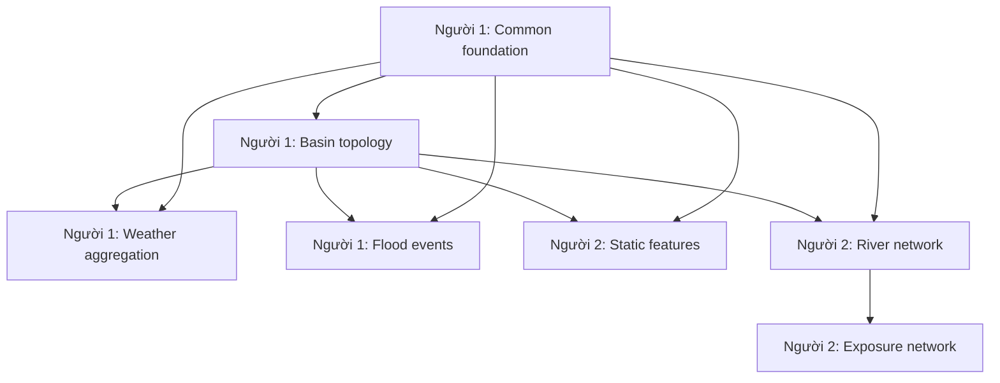

# Phân công triển khai Bronze → Silver cho hai người

## 1. Mục tiêu

Tài liệu này chia toàn bộ phần triển khai Bronze → Silver cho hai người. Mỗi pipeline chỉ có một người sở hữu chính để tránh logic nghiệp vụ bị tách giữa nhiều branch.

Các implementation plan chi tiết vẫn là nguồn hướng dẫn chính. Tài liệu này chỉ xác định:

- người phụ trách từng plan;
- dependency và thời điểm được bắt đầu;
- phạm vi file của mỗi người;
- thứ tự merge;
- cách xử lý các file dùng chung;
- điều kiện bàn giao và review chéo.

## 2. Phân công tổng thể

| Người | Pipeline phụ trách | Số công việc trong plan | Trọng tâm |
| --- | --- | ---: | --- |
| **Người 1** | Common foundation, Basin topology, Weather aggregation, Flood events | 18 | Critical path, orchestration, dữ liệu động, tích hợp chung |
| **Người 2** | Basin static features, River network, Exposure network | 14 | Raster/GIS, hydrology, graph sông/đường và exposure |

Số công việc không phản ánh hoàn toàn độ khó. Ba pipeline của Người 2 ít công việc hơn nhưng có nhiều phép xử lý raster, geometry và network nặng.



## 3. Phần việc của Người 1

Người 1 là **integration owner** và chịu trách nhiệm giữ cho các contract chung, Meta audit và DAG hoạt động thống nhất.

### 3.1 Nền tảng dùng chung cho Silver

- Plan: [Nền tảng dùng chung Silver](superpowers/plans/2026-09-30-silver-common-foundation.vi.md)
- Branch: `feat/silver-common-foundation`
- Có thể bắt đầu ngay.
- Package sở hữu: `src/flashflood_data/orchestration/silver/common/`.
- Đầu ra bàn giao:
  - build signature xác định;
  - snapshot discovery;
  - staging theo run;
  - một writer cho mỗi bảng;
  - Meta audit, snapshot ref và lineage;
  - factory dependency dùng chung.
- Gate hoàn tất: một domain giả lập chạy được chuỗi discover → stage → publish → audit và chạy lại trả về `skip`.

### 3.2 Basin topology

- Plan: [Topology lưu vực](superpowers/plans/2026-09-30-silver-basin-topology.vi.md)
- Branch: `feat/silver-basin-topology`
- Chỉ bắt đầu sau khi common foundation đã merge.
- Package sở hữu: `src/flashflood_data/orchestration/silver/basin/`.
- DAG sở hữu: `airflow/dags/silver_basin_topology.py`.
- Đầu ra bàn giao:
  - `silver.dim_basin`;
  - `silver.basin_edge`;
  - kiểm tra cycle, downstream target và basin L12;
  - rerun cùng snapshot không tạo output thừa.
- Gate hoàn tất: Người 2 xác nhận có thể dùng model và table contract của `dim_basin` mà không import module nội bộ của basin pipeline.

### 3.3 Weather basin aggregation

- Plan: [Tổng hợp thời tiết theo lưu vực](superpowers/plans/2026-09-30-silver-weather-aggregation.vi.md)
- Branch: `feat/silver-weather-aggregation`
- Bắt đầu sau khi basin topology đã merge.
- Package sở hữu: `src/flashflood_data/orchestration/silver/weather/`.
- DAG sở hữu: `airflow/dags/silver_weather_aggregation.py`.
- Đầu ra bàn giao:
  - `silver.grid_basin_weight`;
  - `silver.basin_weather_value`;
  - tổng hợp đúng `cell_index`, nodata và coverage;
  - giữ riêng NOW, Standard, ERA5-Land và IFS;
  - xử lý incremental theo slice/business key.
- Gate hoàn tất: fixture hai cell/hai basin cho ra value và `valid_coverage_fraction` đúng, đồng thời rerun không ghi trùng.

### 3.4 Flood events

- Plan: [Sự kiện lũ](superpowers/plans/2026-09-30-silver-flood-events.vi.md)
- Branch: `feat/silver-flood-events`
- Bắt đầu sau khi basin topology đã merge.
- Package sở hữu: `src/flashflood_data/orchestration/silver/events/`.
- DAG sở hữu: `airflow/dags/silver_flood_events.py`.
- Đầu ra bàn giao:
  - `silver.observed_flood_event`;
  - `silver.event_basin`;
  - stable event ID và revision;
  - diện tích ảnh hưởng chỉ dành cho footprint đã xác minh;
  - không có `document_chunk`, embedding hoặc Qdrant.
- Lưu ý vận hành: chỉ chạy end-to-end khi pipeline flood-event landing/Bronze đã tạo `bronze.historical_event_raw`. Trong lúc chờ, vẫn có thể hoàn thành unit test và integration test bằng fixture.

## 4. Phần việc của Người 2

Người 2 sở hữu toàn bộ logic raster/GIS/network của các domain được giao, nhưng dùng publisher và audit của Người 1.

### 4.1 Basin static features

- Plan: [Đặc trưng tĩnh theo lưu vực](superpowers/plans/2026-09-30-silver-basin-static-features.vi.md)
- Branch: `feat/silver-static-features`
- Bắt đầu sau khi common foundation và basin topology đã merge.
- Package sở hữu: `src/flashflood_data/orchestration/silver/static_features/`.
- DAG sở hữu: `airflow/dags/silver_basin_static_features.py`.
- Đầu ra bàn giao:
  - `silver.basin_static_feature`;
  - `silver.basin_feature_lineage`;
  - `meta.derived_objects`;
  - raster flow direction/flow accumulation trong MinIO;
  - terrain, hydrology, SoilGrids 0–30 cm, land cover và Atlas reference.
- Gate hoàn tất: chạy fixture hai basin, kiểm tra công thức/unit, derived object, lineage và rerun skip trước khi chạy toàn AOI.

### 4.2 River network

- Plan: [Mạng sông](superpowers/plans/2026-09-30-silver-river-network.vi.md)
- Branch: `feat/silver-river-network`
- Có thể triển khai song song với static features sau khi basin topology đã merge.
- Package sở hữu: `src/flashflood_data/orchestration/silver/river/`.
- DAG sở hữu: `airflow/dags/silver_river_network.py`.
- Đầu ra bàn giao:
  - `silver.dim_river_reach`;
  - `silver.river_reach_edge`;
  - `silver.river_basin`;
  - kiểm tra cycle, dangling endpoint và intersection ratio.
- Gate hoàn tất: network version được duyệt trước khi exposure dùng để tìm road-river crossing.

### 4.3 Exposure network

- Plan: [Mạng lưới phơi nhiễm](superpowers/plans/2026-09-30-silver-exposure-network.vi.md)
- Branch: `feat/silver-exposure-network`
- Chỉ bắt đầu sau khi river network đã merge; basin topology cũng phải có sẵn.
- Package sở hữu: `src/flashflood_data/orchestration/silver/exposure/`.
- Module dùng chung sở hữu: `src/flashflood_data/orchestration/spatial_grid.py`.
- DAG sở hữu: `airflow/dags/silver_exposure_network.py`.
- Đầu ra bàn giao:
  - facility và quan hệ facility-basin;
  - population grid và đăng ký source grid WorldPop;
  - road node/edge và road-basin;
  - river crossing;
  - giữ tương thích với weather grid registrar hiện tại.
- Gate hoàn tất: Người 1 chạy lại toàn bộ test weather grid sau khi merge phần tách `spatial_grid.py`.

## 5. Trình tự làm việc khuyến nghị

### Giai đoạn 1 — Mở critical path

| Người 1 | Người 2 |
| --- | --- |
| Triển khai common foundation. | Đọc ba plan được giao; rà fixture DEM, SoilGrids, HydroRIVERS, OSM và WorldPop hiện có. Không viết production code phụ thuộc common khi interface chưa merge. |

Kết thúc giai đoạn khi branch `feat/silver-common-foundation` đã pass test và merge.

### Giai đoạn 2 — Chốt contract basin

| Người 1 | Người 2 |
| --- | --- |
| Triển khai basin topology. | Chuẩn bị fixture/test thuần cho static features và river network trên branch riêng; rebase sau khi basin merge. |

Kết thúc giai đoạn khi `silver.dim_basin` và `silver.basin_edge` đã được chấp nhận.

### Giai đoạn 3 — Chạy song song lần một

| Người 1 | Người 2 |
| --- | --- |
| Triển khai weather aggregation. | Triển khai basin static features. |

Hai người không được dùng service nội bộ của nhau. Cả hai chỉ đọc `silver.dim_basin` qua Iceberg contract.

### Giai đoạn 4 — Chạy song song lần hai

| Người 1 | Người 2 |
| --- | --- |
| Triển khai flood events bằng fixture; chạy production khi Bronze event có dữ liệu. | Triển khai river network. |

Kết thúc khi river network được duyệt và đủ điều kiện làm input cho exposure.

### Giai đoạn 5 — Exposure và tích hợp cuối

| Người 1 | Người 2 |
| --- | --- |
| Review code exposure, xử lý merge file chung, chạy contract/full test và cập nhật tài liệu vận hành. | Triển khai exposure network và sửa lỗi do review. |

## 6. Quy tắc branch và merge

Không tạo một branch lớn cho mỗi người. Mỗi pipeline dùng branch riêng như danh sách ở trên để có thể review và rollback độc lập.

Thứ tự merge bắt buộc:

1. `feat/silver-common-foundation`
2. `feat/silver-basin-topology`
3. `feat/silver-static-features`
4. `feat/silver-weather-aggregation`
5. `feat/silver-river-network`
6. `feat/silver-flood-events`
7. `feat/silver-exposure-network`

Static features và weather có thể được viết song song, nhưng branch merge sau phải rebase lên branch đã merge trước. River và flood events cũng áp dụng quy tắc tương tự.

Trước khi giao review, mỗi branch phải:

```bash
git fetch origin
git rebase origin/<nhanh-tich-hop>
pytest <cac-test-cua-domain> -q
ruff check src tests
```

`<nhanh-tich-hop>` là branch chung mà team đang dùng. Không copy nguyên commit từ branch khác bằng cách chép file thủ công.

## 7. Các file dùng chung dễ conflict

Các file sau có thể được nhiều pipeline sửa:

```text
src/flashflood_data/storage/iceberg_schemas.py
config/meta/static.yaml
tests/contract/storage/test_meta_bronze_schemas.py
tests/contract/infra/test_silver_dags.py
README.md
docs/pipeline_architecture_and_roadmap.md
docs/schema_contract/data.md
```

Quy tắc xử lý:

1. Người phụ trách domain vẫn thêm schema/registry/test cần thiết trong branch của domain để branch tự kiểm thử được.
2. Branch merge sau phải rebase và giữ cả contract đã merge lẫn contract mới của mình.
3. Người 1 là người giải quyết cuối cùng nếu có conflict về schema, registry, DAG contract hoặc tài liệu.
4. Không overwrite toàn bộ `_DEFINITIONS`, registry YAML hoặc file test bằng bản trên branch cá nhân.
5. Mỗi lần giải quyết conflict phải chạy lại toàn bộ contract test, không chỉ test của domain vừa merge.

Lệnh kiểm tra sau mỗi lần merge domain:

```bash
pytest tests/contract/storage/test_meta_bronze_schemas.py tests/contract/infra/test_silver_dags.py tests/contract/test_architecture.py -q
```

## 8. Quy tắc review chéo

| Code do | Người review | Nội dung review bắt buộc |
| --- | --- | --- |
| Người 1 | Người 2 | Interface common có dùng được từ domain khác; basin geometry/topology; weather coverage/window; event area semantics |
| Người 2 | Người 1 | Không bypass common publisher/audit; đúng table key/version; một writer mỗi bảng; Meta lineage đầy đủ |

Reviewer không cần đọc toàn bộ repository. Thứ tự đọc cho mỗi branch:

1. plan tiếng Việt của pipeline;
2. file `config.py` và YAML;
3. `models.py`;
4. transform thuần;
5. `quality.py`;
6. `service.py`;
7. `factory.py`;
8. DAG;
9. test và thay đổi schema/registry.

## 9. Mẫu bàn giao cho mỗi pipeline

Người phụ trách ghi phần sau trong PR hoặc tin nhắn bàn giao:

```text
Pipeline:
Input tables và snapshot dùng để test:
Output tables:
Build signature/version:
Số dòng output:
DQ fatal/warning:
Test đã chạy:
Lệnh trigger DAG:
Truy vấn Trino để kiểm tra:
Rủi ro hoặc phần chưa chạy được trên dữ liệu thật:
```

Không đánh dấu hoàn tất nếu mới pass unit test nhưng chưa có integration test theo plan. Nếu chưa thể chạy dữ liệu thật vì thiếu upstream pipeline, ghi rõ prerequisite còn thiếu thay vì tạo dữ liệu giả trong production table.

## 10. Điều kiện hoàn tất chung

- Hai người đều có thể giải thích flow `DAG → factory → service → transform/quality → publisher/audit` của phần mình.
- Tất cả output truy vấn được bằng Trino.
- Chạy lại cùng input/config không tạo dữ liệu trùng.
- Input snapshot mới chỉ rebuild domain bị ảnh hưởng.
- Không có nhiều mapped task ghi đồng thời vào cùng bảng Iceberg.
- Mọi output snapshot có input snapshot ref, DQ và lineage trong Meta.
- Test của weather vẫn pass sau khi tách shared grid registrar cho exposure.
- Flood-event runtime không chứa document chunk, embedding hoặc Qdrant.
- Toàn bộ test suite và `ruff check src tests` pass sau lần merge cuối.
