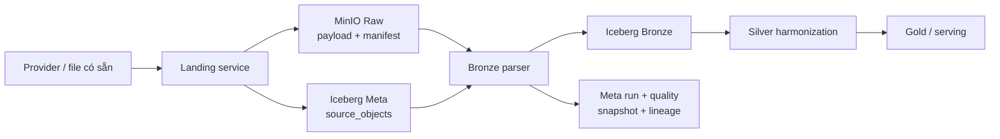
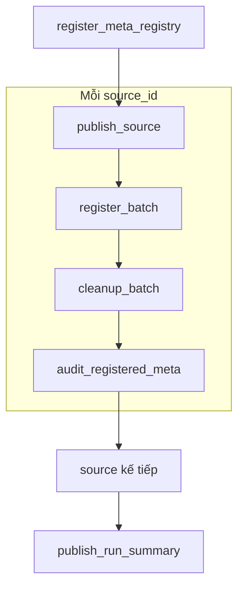
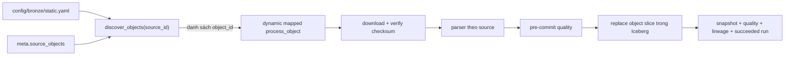
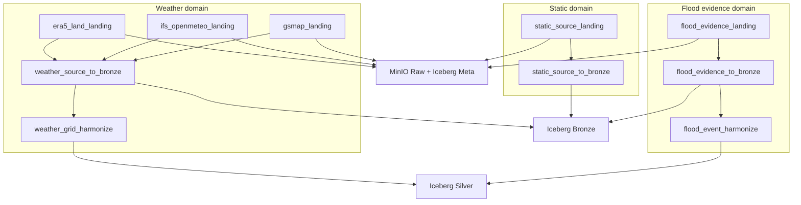

# Kiến trúc pipeline dữ liệu và kế hoạch triển khai

**Cập nhật:** 21/09/2026  
**Phạm vi:** pipeline Raw/Landing, Meta, Bronze hiện có; kế hoạch tách flood event; kế hoạch ingest dữ liệu động GSMaP, ERA5-Land và IFS/Open-Meteo.

Tài liệu này phân biệt rõ:

- **Hiện có:** code, DAG và bảng đã chạy trong repository.
- **Mục tiêu:** thiết kế đã chốt nhưng chưa được triển khai.
- **Kế hoạch:** thứ tự thay đổi code, migration và tiêu chí nghiệm thu.

Schema chi tiết của từng bảng nằm tại [schema_contract/data.md](schema_contract/data.md). README vẫn là tài liệu cài đặt và vận hành nhanh; file này tập trung vào cách pipeline hoạt động và thứ tự đọc code.

## 1. Khái niệm chung

| Khái niệm | Ý nghĩa trong project |
| --- | --- |
| Source | Nhà cung cấp hoặc tập dữ liệu logic, ví dụ HydroBASINS, GSMaP hay IFS. |
| Asset | File hoặc tài nguyên logic được adapter phát hiện/tải về ở catalog local. |
| Landing | Quá trình lấy hoặc chọn asset, kiểm tra, đưa payload bất biến vào MinIO và đăng ký Meta. |
| Raw | Payload gần nguyên trạng do provider trả về, được lưu bất biến trong MinIO. |
| Meta | Registry, run, quality, snapshot và lineage của tất cả pipeline. |
| Bronze | Dữ liệu đã parse theo cấu trúc nguồn nhưng chưa harmonize về mô hình nghiệp vụ chung. |
| Silver | Dữ liệu đã chuẩn hóa CRS, unit, thời gian, ID và quan hệ không gian. |
| Gold | Dữ liệu tổng hợp theo basin, chỉ báo, trạng thái và sản phẩm phân tích. |

Landing là **quá trình**, Raw là **tầng lưu trữ**. Một luồng chuẩn luôn có dạng:



Không truyền file lớn qua Airflow XCom. Task chỉ truyền `source_id`, `object_id`, trạng thái và ID snapshot; bytes nằm trong MinIO.

## 2. Trạng thái pipeline hiện tại

### 2.1. Các pipeline đã có

| DAG | Trạng thái | Nhiệm vụ |
| --- | --- | --- |
| `static_source_landing` | Đã triển khai và đã chạy | Chọn/tải dữ liệu tĩnh, publish payload + manifest vào MinIO, đăng ký `meta.source_objects`, audit Meta. |
| `static_source_to_bronze` | Đã triển khai và đã chạy | Discover raw object chưa có kết quả hợp lệ, parse theo nguồn, chạy QA, ghi bảng Bronze và lineage. |

Hai DAG đều `schedule=None`, `catchup=False`, mặc định pause khi tạo. Việc chạy lại là idempotent theo object và kết quả đã publish, không dựa vào DAG run ID.

### 2.2. Dữ liệu đã có

Snapshot kiểm tra gần nhất có sáu bảng Bronze:

| Bảng | Số dòng | Nội dung |
| --- | ---: | --- |
| `bronze.basin_polygon_raw` | 1.194.591 | HydroBASINS và BasinATLAS level 12. |
| `bronze.river_reach_raw` | 1.428.959 | HydroRIVERS Asia. |
| `bronze.admin_boundary_raw` | 12.012 | Địa giới Sơn La và GADM. |
| `bronze.raster_coverage` | 111 | Chỉ mục band/tile của DEM, SoilGrids, WorldCover, WorldPop. |
| `bronze.historical_event_raw` | 32 | Dòng bằng chứng sự kiện lũ giữ theo nguồn. |
| `bronze.osm_feature_raw` | 763.704 | OSM thuộc các nhóm phục vụ lũ. |

Raw payload tương ứng nằm trong MinIO. `raster_coverage` chỉ lưu metadata band/tile; pixel vẫn nằm trong file Raw.

### 2.3. Nguồn hiện nằm trong static pipeline

| Source ID | Đích Bronze |
| --- | --- |
| `sonla_admin_2025` | `admin_boundary_raw` |
| `gadm_vnm_4_1` | `admin_boundary_raw` |
| `hydrobasins_v1c` | `basin_polygon_raw` |
| `basinatlas_v10` | `basin_polygon_raw` |
| `hydrorivers_v10` | `river_reach_raw` |
| `worldpop_vnm_2025` | `raster_coverage` |
| `historical_flood_evidence_2020_2026` | `historical_event_raw` |
| `geofabrik_vietnam_snapshot` | `osm_feature_raw` |
| `cop_dem_glo30_2024_1` | `raster_coverage` |
| `soilgrids_2_0` | `raster_coverage` |
| `esa_worldcover_2021_v200` | `raster_coverage` |

`historical_flood_evidence_2020_2026` đang nằm tạm trong static pipeline. Mục tiêu là chuyển source này sang pipeline flood event riêng mà không xóa raw object hoặc ingest lại dữ liệu cũ.

## 3. Pipeline `static_source_landing` hiện có

### 3.1. Nhiệm vụ

DAG thực hiện bốn ranh giới chính:

1. Đăng ký source và dataset registry trong Meta.
2. Chuẩn bị, kiểm tra và publish raw payload + manifest vào MinIO.
3. Commit inventory object vào `meta.source_objects`.
4. Audit object đã đăng ký và chỉ dọn staging sau khi commit thành công.

DAG hỗ trợ cả hai loại nguồn:

- Adapter remote có thể resolve và tải từ provider.
- Adapter `existing` chọn file đã có trong dataset/catalog rồi publish vào MinIO.

Vì vậy DAG không chỉ kiểm tra file rồi ghi metadata. Đối với source có adapter tải dữ liệu, Landing gọi resolve/fetch; đối với source `existing`, Landing tái sử dụng file đã có.

### 3.2. Luồng task trong Airflow



Các source group hiện được nối tuần tự. Các thao tác publish/register dùng Airflow pool `source_landing_writer` để tránh nhiều writer cùng sửa inventory.

### 3.3. Luồng code theo thứ tự chạy

| Thứ tự | Hàm/lớp | File | Vai trò |
| ---: | --- | --- | --- |
| 1 | `static_source_landing_dag()` | [`airflow/dags/static_source_landing.py`](../airflow/dags/static_source_landing.py) | Khai báo DAG, source group và dependency. |
| 2 | `register_meta_registry()` | cùng file DAG | Đọc registry source/dataset rồi seed Meta. |
| 3 | `build_static_landing_service()` | [`src/flashflood_data/cli/app.py`](../src/flashflood_data/cli/app.py) | Ghép config, catalog, MinIO, Iceberg, fetcher và service. |
| 4 | `StaticSourceLandingService.prepare_run()` | [`src/flashflood_data/orchestration/landing/service.py`](../src/flashflood_data/orchestration/landing/service.py) | Tạo staging và inventory các source local đúng một lần trong service instance. |
| 5 | `acquire_validated_assets()` | [`src/flashflood_data/orchestration/landing/sources.py`](../src/flashflood_data/orchestration/landing/sources.py) | Resolve, fetch/reuse và validate asset; không harmonize. |
| 6 | `prepare_source_objects()` | cùng file | Chọn object chính xác; đóng gói shapefile sidecar thành ZIP xác định. |
| 7 | `StaticSourceLandingService.publish_source()` | `landing/service.py` | Tính checksum/object ID, publish payload + manifest bất biến. |
| 8 | `ObjectPublisher` | [`src/flashflood_data/storage/object_store.py`](../src/flashflood_data/storage/object_store.py) | Ghi object vào MinIO và phát hiện conflict. |
| 9 | `SourceObjectInventory.register_many()` | [`src/flashflood_data/storage/iceberg.py`](../src/flashflood_data/storage/iceberg.py) | Commit các hàng `meta.source_objects` trong một snapshot. |
| 10 | `audit_registered_batch()` | [`src/flashflood_data/orchestration/landing/meta_audit.py`](../src/flashflood_data/orchestration/landing/meta_audit.py) | Đối soát batch đăng ký, ghi run/quality/snapshot. |
| 11 | `cleanup_batch()` | DAG và `landing/service.py` | Dọn staging/local copy sau khi MinIO và Iceberg đã được xác minh. |
| 12 | `publish_run_summary()` | file DAG | Tổng hợp completed/failed source; làm run fail nếu thiếu source. |

### 3.4. Cấu hình liên quan

| File | Chức năng |
| --- | --- |
| [`config/landing/static.yaml`](../config/landing/static.yaml) | Source nào được land, mode individual/bundle, selection và basin level 12. |
| [`config/meta/static.yaml`](../config/meta/static.yaml) | Provider/source registry và dataset registry của static pipeline. |
| [`config/sources/`](../config/sources/) | Source spec, adapter, version, license và setting truy cập. |
| [`config/study_area.yaml`](../config/study_area.yaml) | AOI và threshold QA dùng bởi source adapter. |
| [`.env.example`](../.env.example) | Tên biến môi trường; secrets thật chỉ nằm trong `.env` hoặc Airflow Connection. |

### 3.5. Object identity và tính bất biến

`object_id` được tạo xác định từ:

```text
source_id
 source_version
 asset_id
 selection đã canonicalize
 checksum payload
 manifest_schema_version
```

Cùng identity và bytes sẽ được tái sử dụng. Cùng identity nhưng bytes/manifest khác sẽ báo conflict. Manifest không chứa credentials. Staging có thể bị dọn, nhưng payload đã commit trong MinIO không bị xóa.

## 4. Pipeline `static_source_to_bronze` hiện có

### 4.1. Nhiệm vụ

DAG đọc inventory Raw, chỉ chọn object cần xử lý, tải object từ MinIO vào temporary directory, parse, chạy quality gate rồi thay thế atomically lát Bronze của object đó.

### 4.2. Luồng task



Mỗi `source_id` luôn có task discover. Chỉ object chưa có kết quả publish hợp lệ mới tạo mapped parse task.

### 4.3. Điều kiện để một object được skip

Object chỉ được coi là đã xử lý khi đồng thời có:

1. Lineage khớp `object_id`, bảng đích và `mapping_version`.
2. `meta.pipeline_runs` có trạng thái `succeeded` và `published_at` khác null.
3. Lát dữ liệu của `object_id` vẫn tồn tại trong bảng Bronze.

Thay parser version, thay OSM policy hoặc dùng `force_reprocess=true` sẽ xử lý lại object. Việc ghi dùng replace-by-object nên retry không append thêm cùng một lát dữ liệu.

### 4.4. Luồng code theo thứ tự chạy

| Thứ tự | Hàm/lớp | File | Vai trò |
| ---: | --- | --- | --- |
| 1 | `static_source_to_bronze_dag()` | [`airflow/dags/static_source_to_bronze.py`](../airflow/dags/static_source_to_bronze.py) | Tạo discover task cho từng source và mapped parse tasks. |
| 2 | `load_bronze_config()` | [`src/flashflood_data/orchestration/bronze/config.py`](../src/flashflood_data/orchestration/bronze/config.py) | Validate target table, parser version và source status. |
| 3 | `build_bronze_service()` | [`src/flashflood_data/orchestration/bronze/factory.py`](../src/flashflood_data/orchestration/bronze/factory.py) | Ghép inventory, MinIO, Iceberg writer, Meta recorder và OSM policy. |
| 4 | `BronzeService.discover()` | [`src/flashflood_data/orchestration/bronze/service.py`](../src/flashflood_data/orchestration/bronze/service.py) | Đối chiếu raw object, run, lineage và lát Bronze. |
| 5 | `BronzeService.process_object()` | cùng file | Ghi run đang chạy, download, verify, parse, QA, commit và publish Meta. |
| 6 | parser vector/raster/event | [`src/flashflood_data/orchestration/bronze/parsers.py`](../src/flashflood_data/orchestration/bronze/parsers.py) | Chuyển raw payload thành row source-faithful. |
| 7 | parser OSM | [`src/flashflood_data/orchestration/bronze/osm.py`](../src/flashflood_data/orchestration/bronze/osm.py) | Stream PBF theo batch và lọc nhóm phục vụ lũ. |
| 8 | `check_parsed_rows()` | [`src/flashflood_data/orchestration/bronze/quality.py`](../src/flashflood_data/orchestration/bronze/quality.py) | Kiểm tra nonempty, key, geometry, bbox và raster metadata. |
| 9 | `IcebergTableStore` | [`src/flashflood_data/storage/iceberg_tables.py`](../src/flashflood_data/storage/iceberg_tables.py) | Ensure table và replace rows/batches theo object. |
| 10 | `MetaRecorder` | [`src/flashflood_data/orchestration/meta/service.py`](../src/flashflood_data/orchestration/meta/service.py) | Ghi pipeline run, quality, snapshot reference và lineage edge. |

### 4.5. Cấu hình và schema

| File | Chức năng |
| --- | --- |
| [`config/bronze/static.yaml`](../config/bronze/static.yaml) | `source_id → target_table`, parser version và QA rules. |
| [`config/bronze/osm.yaml`](../config/bronze/osm.yaml) | Các tag hydrology, hydraulic structure, transport và critical facility được giữ. |
| [`src/flashflood_data/storage/iceberg_schemas.py`](../src/flashflood_data/storage/iceberg_schemas.py) | Arrow schema và business key của Meta/Bronze. |
| [`src/flashflood_data/storage/iceberg_tables.py`](../src/flashflood_data/storage/iceberg_tables.py) | Tạo/ghi bảng Iceberg qua Polaris. |

## 5. Dữ liệu đi qua hệ thống hiện tại như thế nào

Ví dụ một file HydroBASINS:

```text
Provider/archive hoặc file local
  → adapter resolve/fetch/validate
  → chọn .shp + .dbf + .shx + .prj
  → đóng ZIP xác định trong staging
  → raw/static/hydrobasins_v1c/.../hydrobasins_l12.zip trên MinIO
  → manifest.json trên MinIO
  → meta.source_objects(object_id, URI, checksum, selection, ...)
  → BronzeService tải ZIP từ MinIO
  → parse từng polygon
  → bronze.basin_polygon_raw
  → meta.pipeline_runs
  → meta.quality_results
  → meta.table_snapshot_ref
  → meta.lineage_edges
```

Ví dụ raster DEM/SoilGrids:

```text
GeoTIFF Raw trên MinIO
  → meta.source_objects
  → parser đọc header/band
  → bronze.raster_coverage
```

Pixel không bị nhân thành hàng trong `raster_coverage`.

Ví dụ flood event hiện tại:

```text
Lu_Son_La_2020_2026.xlsx
  → source existing
  → MinIO Raw + meta.source_objects
  → parse row theo STT/vị trí dòng
  → bronze.historical_event_raw
```

Luồng flood event này là legacy và sẽ được thay bằng pipeline riêng ở mục 8.

## 6. Cách đọc code hiện tại

Thứ tự dưới đây giúp người mới hiểu pipeline mà không phải đọc toàn repository:

1. [`compose.yaml`](../compose.yaml): service, volume và environment của MinIO, Polaris, Airflow.
2. [`config/landing/static.yaml`](../config/landing/static.yaml): danh sách và cách đóng gói source.
3. [`airflow/dags/static_source_landing.py`](../airflow/dags/static_source_landing.py): graph Airflow của Landing.
4. [`orchestration/landing/models.py`](../src/flashflood_data/orchestration/landing/models.py): contract truyền giữa task.
5. [`orchestration/landing/sources.py`](../src/flashflood_data/orchestration/landing/sources.py): resolve/fetch/reuse/select asset.
6. [`orchestration/landing/service.py`](../src/flashflood_data/orchestration/landing/service.py): transaction publish → register → cleanup.
7. [`storage/object_store.py`](../src/flashflood_data/storage/object_store.py): cách ghi/đọc MinIO.
8. [`storage/iceberg.py`](../src/flashflood_data/storage/iceberg.py): inventory `source_objects`.
9. [`config/bronze/static.yaml`](../config/bronze/static.yaml): source nào parse vào bảng nào.
10. [`airflow/dags/static_source_to_bronze.py`](../airflow/dags/static_source_to_bronze.py): discover và dynamic mapping.
11. [`orchestration/bronze/service.py`](../src/flashflood_data/orchestration/bronze/service.py): transaction parse và publish.
12. [`orchestration/bronze/parsers.py`](../src/flashflood_data/orchestration/bronze/parsers.py): row được tạo như thế nào.
13. [`orchestration/meta/service.py`](../src/flashflood_data/orchestration/meta/service.py): run, DQ, snapshot và lineage.
14. [`docs/schema_contract/data.md`](schema_contract/data.md): ý nghĩa và grain của các bảng.

## 7. Kiến trúc pipeline mục tiêu

Static, flood event và weather sẽ có Landing riêng theo domain nhưng dùng chung hạ tầng storage, Meta, DQ và lineage.



Nguyên tắc tổ chức:

- DAG chỉ orchestration; logic tải, parse và QA nằm trong package Python.
- Mỗi provider có adapter riêng.
- Các provider weather dùng chung model và Bronze contract.
- Backfill và operational là hai `ingest_mode`, không phải hai bộ code.
- Pipeline downstream chỉ đọc snapshot đã publish thành công.
- Không xóa raw object hoặc snapshot cũ khi có revision mới.

## 8. Pipeline flood event riêng

### 8.1. Lý do tách

Flood event có vòng đời khác dữ liệu static:

- Bằng chứng được bổ sung theo đợt và từ nhiều tài liệu.
- Một tài liệu có thể nhắc nhiều event; một event có thể có nhiều tài liệu.
- Thông tin ngày, địa danh, severity và footprint có thể được hiệu chỉnh.
- Cần revision, confidence, evidence role và quan hệ nhiều-nhiều với basin.

### 8.2. Ba DAG mục tiêu

#### `flood_evidence_landing`

Nhận XLSX, CSV, PDF, DOCX, HTML hoặc output crawler; lưu từng tài liệu/file bất biến; đăng ký `meta.source_objects`. File trùng checksum được tái sử dụng.

#### `flood_evidence_to_bronze`

Parse raw object thành `bronze.historical_event_raw`. Bronze giữ văn bản và field theo nguồn; không quyết định hai dòng có phải cùng một event hay không.

#### `flood_event_harmonize`

Chuẩn hóa vào:

- `silver.source_document`
- `silver.document_chunk`
- `silver.observed_flood_event`
- `silver.event_evidence`
- `silver.event_basin`

### 8.3. Quy tắc ID và revision

Không dùng số thứ tự dòng làm ID dài hạn.

| ID | Quy tắc |
| --- | --- |
| `source_record_id` | ID ổn định do collection cấp; không đổi khi sắp xếp file. |
| `source_document_id` | ID xác định từ định danh nguồn/URL và checksum tài liệu. |
| `flood_event_id` | ID nghiệp vụ ổn định của event đã resolve. |
| `event_revision` | Tăng khi diễn giải chuẩn hóa của event thay đổi. |
| `evidence_id` | ID của bằng chứng cụ thể liên kết event–document chunk. |

Quy tắc chạy lại:

- Cùng raw checksum: skip.
- Tài liệu mới cho event cũ: thêm evidence, giữ `flood_event_id`.
- Thuộc tính event thay đổi: tạo `event_revision` mới.
- Event mới: tạo `flood_event_id` mới.
- Chỉ có điểm/địa danh thì `affected_area_km2` để null; chỉ footprint đủ tin cậy mới tính diện tích giao basin.

### 8.4. Tổ chức file mục tiêu

```text
airflow/dags/
├── flood_evidence_landing.py
├── flood_evidence_to_bronze.py
└── flood_event_harmonize.py

config/
├── landing/flood_event.yaml
├── bronze/flood_event.yaml
└── meta/flood_event.yaml

src/flashflood_data/orchestration/flood_event/
├── models.py
├── landing.py
├── parsers.py
├── bronze.py
├── harmonize.py
└── quality.py
```

### 8.5. Migration khỏi static pipeline

Migration phải theo thứ tự:

1. Tạo event configs, service và DAG mới.
2. Cho event Bronze service nhận cả source legacy `historical_flood_evidence_2020_2026` và source dài hạn `son_la_flood_evidence_compilation`.
3. Kiểm tra pipeline mới nhận ra object/snapshot đã publish và không tạo trùng.
4. Chuyển event parser và source-to-table mapping khỏi static Bronze service.
5. Xóa event source khỏi `EXPECTED_SOURCE_IDS`, `config/landing/static.yaml`, `config/bronze/static.yaml` và `config/meta/static.yaml`.
6. Giữ nguyên raw object, Meta lineage và dữ liệu `bronze.historical_event_raw` hiện có.

Không cần ingest lại Raw chỉ vì thay owner DAG.

## 9. Pipeline weather động

### 9.1. Vai trò của ba nguồn

| Nguồn/product | Vai trò chính | Biến dự kiến |
| --- | --- | --- |
| GSMaP Gauge NOW | Mưa gần hiện tại | precipitation/rain rate, quality/reliability flags. |
| GSMaP Gauge NOW/NRT/Standard archive | Mưa lịch sử; product được ghi rõ theo use case | precipitation/rain rate. |
| ERA5-Land | Reanalysis/backfill và baseline | total precipitation, soil moisture, surface runoff, subsurface runoff. |
| IFS HRES qua Open-Meteo | Forecast tương lai và lấp khoảng trễ ERA5 dưới trạng thái provisional | precipitation, runoff, bốn tầng soil moisture. |

Chính sách chọn dữ liệu:

| Khoảng thời gian | Mưa | Soil moisture | Runoff | Trạng thái |
| --- | --- | --- | --- | --- |
| Quá khứ đã có ERA5-Land | GSMaP historical; ERA5 để baseline/QA | ERA5-Land | ERA5-Land | `FINAL`/`REANALYSIS` |
| Khoảng trễ ERA5-Land | GSMaP Gauge NOW | IFS | IFS | `PROVISIONAL` |
| Tương lai | IFS | IFS | IFS | `FORECAST` |

IFS provisional không bị xóa khi ERA5-Land xuất hiện. Một view/selector hiện hành chuyển ưu tiên sang ERA5-Land; record IFS được giữ để replay và đánh giá forecast.

### 9.2. Ba Landing DAG riêng

| DAG | Schedule operational dự kiến | Backfill |
| --- | --- | --- |
| `gsmap_landing` | Mỗi 30 phút | Theo ngày/khoảng ngày, chọn rõ NOW/NRT/Standard. |
| `ifs_openmeteo_landing` | Poll mỗi 30 phút, chỉ ingest run 00/06/12/18 UTC mới | Theo `run` và khoảng ngày qua Single Runs API. |
| `era5_land_landing` | Hằng ngày với lookback khoảng 7 ngày | Chia request theo tháng. |

Ba DAG phải độc lập vì authentication, latency, quota, retry và payload khác nhau. Chúng dùng chung một interface service và cùng publish `raw_weather_objects_updated` khi có raw object mới.

### 9.3. Một Bronze DAG chung

`weather_source_to_bronze` được trigger khi Raw weather có snapshot mới hoặc khi operator trigger thủ công. DAG:

1. Discover `meta.source_objects` thuộc weather chưa có Bronze result hợp lệ.
2. Dynamic-map một task trên mỗi object.
3. Chọn parser bằng `(source_id, product_id, media_type)`.
4. Verify checksum và temporal metadata.
5. Parse vào `bronze.weather_grid_value` hoặc giữ chunk format nếu benchmark chọn chunked Bronze.
6. Chạy DQ và commit Iceberg snapshot.
7. Ghi run, snapshot, quality và lineage.

Quyết định row-vs-chunk phải được benchmark trên một tháng của ba nguồn trước khi backfill lớn. Nếu lưu dạng row, grain là:

```text
(object_id,
 source_grid_version,
 source_grid_id,
 variable,
 vertical_level,
 source_cycle_id,
 valid_time,
 window_start,
 window_end,
 source_revision)
```

### 9.4. Temporal contract bắt buộc

```text
source_cycle_id
model_run_time
valid_time
window_start
window_end
provider_issued_at
available_at
retrieved_at
source_revision
ingest_mode       = backfill | operational
source_mode       = near_realtime | forecast | reanalysis
quality_status    = PROVISIONAL | FINAL | STALE | NO_DATA
```

Quy tắc:

- Timestamp lưu UTC.
- Missing giữ null, không đổi thành 0.
- GSMaP cập nhật 30 phút nhưng cửa sổ mưa có thể dài một giờ; không cộng hai cửa sổ chồng lấn.
- IFS precipitation/runoff là lượng của khoảng trước mốc timestamp; soil moisture là instantaneous.
- `model_run_time` null với ERA5-Land reanalysis.
- Không dùng `retrieved_at` thay `model_run_time`, `valid_time` hoặc `available_at`.
- Replay tại `as_of_time` chỉ dùng record có `available_at <= as_of_time`.
- IFS lấp gap chỉ được chọn từ run đã khả dụng tại thời điểm cần tái hiện; không dùng run tương lai gây leakage.

### 9.5. Raw layout dự kiến

```text
raw/weather/gsmap/
└── product=gauge_now/version=v8_revised/valid_date=YYYY-MM-DD/...

raw/weather/ifs_openmeteo/
└── model=ecmwf_ifs/run_time=YYYY-MM-DDTHH-MMZ/request_part=NNN/...

raw/weather/era5_land/
└── year=YYYY/month=MM/request_part=NNN/...
```

Raw chỉ lưu vùng/điểm và biến cần thiết cho AOI. JSON/CSV được nén; ERA5-Land chia theo tháng; không tải raster toàn cầu nếu provider hỗ trợ bbox/subset.

### 9.6. Mapping grid sang basin

Tạo mapping riêng cho từng grid/version:

```text
GSMaP grid/version      → basin L12
IFS O1280/grid version  → basin L12
ERA5-Land 0.1° grid     → basin L12
```

Mapping lưu ở Silver, không nhúng trực tiếp vào Landing:

- `silver.source_grid`
- `silver.grid_basin_weight`
- `silver.grid_value`

Weight giữ diện tích giao, mẫu số, valid coverage và mapping version. Mưa basin là trung bình theo diện tích trước khi tạo cửa sổ 1h/3h/6h/24h/72h.

### 9.7. Tổ chức file mục tiêu

```text
airflow/dags/
├── gsmap_landing.py
├── ifs_openmeteo_landing.py
├── era5_land_landing.py
├── weather_source_to_bronze.py
└── weather_grid_harmonize.py

config/dynamic/
├── gsmap.yaml
├── ifs_openmeteo.yaml
├── era5_land.yaml
└── bronze.yaml

src/flashflood_data/orchestration/weather/
├── common/
│   ├── models.py
│   ├── landing.py
│   ├── temporal.py
│   └── quality.py
├── providers/
│   ├── gsmap.py
│   ├── ifs_openmeteo.py
│   └── era5_land.py
├── bronze/
│   ├── registry.py
│   ├── parsers.py
│   └── service.py
└── harmonize/
    ├── grid.py
    ├── basin_weights.py
    └── service.py
```

## 10. Kế hoạch triển khai theo thứ tự

Mỗi giai đoạn dưới đây phải tạo ra một đầu ra chạy và kiểm thử độc lập.

### Giai đoạn 1 — Chốt contract và khả năng truy cập nguồn

- [ ] Tải được một file GSMaP thật, ghi lại product/version, auth, format, flag, latency và license.
- [ ] Lưu IFS probe thành fixture có `run`, request parameters và response nguyên trạng.
- [ ] Tải một ERA5-Land sample qua CDS cho đúng AOI và các biến đã chọn.
- [ ] Chốt basin L12 và sửa các tài liệu còn ghi “chưa đổi L10”.
- [ ] Benchmark một tháng để quyết định Bronze weather dạng row hay chunk.

**Nghiệm thu:** ba raw fixture đọc được offline; temporal/unit semantics được kiểm thử; không còn quyết định schema bắt buộc chưa chốt.

### Giai đoạn 2 — Tách flood event khỏi static pipeline

- [ ] Tạo config/model/service/DAG của event pipeline.
- [ ] Thay ID theo `STT`/vị trí dòng bằng stable source record ID.
- [ ] Cho pipeline mới tiếp quản object legacy và cùng bảng `bronze.historical_event_raw`.
- [ ] Kiểm thử file giống nhau bị skip, evidence mới được thêm và event correction tạo revision.
- [ ] Gỡ event source/parser khỏi hai static pipeline sau khi reconciliation đạt.

**Nghiệm thu:** static DAG còn 10 source; event DAG chạy lại không làm tăng row ngoài ý muốn; raw/snapshot cũ vẫn truy được.

### Giai đoạn 3 — Xây weather contracts và common Landing service

- [ ] Mở rộng `SourceObjectRow`/manifest để weather luôn ghi `source_type=dynamic`, product, cycle, run, valid/available time và request fingerprint.
- [ ] Tạo model `WeatherRequest`, `WeatherRawObject` và provider protocol dùng chung.
- [ ] Tạo config loader cho `config/dynamic/*.yaml`, cấm credentials trong YAML.
- [ ] Tái sử dụng `ObjectPublisher`, `SourceObjectInventory` và `MetaRecorder` hiện có.
- [ ] Thêm DQ chung cho interval, unit, negative precipitation, missing và out-of-order.

**Nghiệm thu:** fake provider có thể publish một raw object, retry không tạo object mới và lỗi không publish run thành công.

### Giai đoạn 4 — Triển khai ba provider Landing DAG

- [ ] `gsmap_landing`: operational + backfill, archive bytes/flags và chống cửa sổ chồng lấn ở metadata.
- [ ] `ifs_openmeteo_landing`: gọi model cố định, archive từng explicit run và không dùng Best Match.
- [ ] `era5_land_landing`: submit/poll CDS job, chunk theo tháng và hỗ trợ lookback correction.
- [ ] Mỗi DAG chỉ publish dataset event khi có object mới.
- [ ] Thêm rate-limit, retry/backoff và sanitized error code theo provider.

**Nghiệm thu:** một provider lỗi không chặn hai provider còn lại; backfill và operational cùng tạo đúng raw contract.

### Giai đoạn 5 — Triển khai Weather Bronze

- [ ] Tạo parser registry theo source/product/media type.
- [ ] Tạo schema/table `bronze.weather_grid_value` hoặc chunk index theo kết quả benchmark.
- [ ] Tạo `weather_source_to_bronze` với discover và dynamic mapping.
- [ ] Áp dụng replace-by-object, pre/post-commit DQ và Meta lineage như static Bronze.
- [ ] Kiểm thử revision, rerun, partial failure và `force_reprocess`.

**Nghiệm thu:** cùng raw object ingest hai lần chỉ có một lát hiệu lực; parser version mới thay lát object và snapshot cũ vẫn time-travel được.

### Giai đoạn 6 — Harmonize grid và aggregate basin

- [ ] Tạo source grid version và cell geometry cho từng provider.
- [ ] Tạo `grid_basin_weight` riêng cho GSMaP, IFS và ERA5-Land.
- [ ] Chuẩn hóa unit, interval và variable name vào `silver.grid_value`.
- [ ] Aggregate `gold.basin_forcing` theo basin L12.
- [ ] Tạo selector ERA5 final / IFS provisional và các cửa sổ mưa.

**Nghiệm thu:** fixture tính tay cho một vài cell/basin khớp area-weighted result; missing không thành 0; không cộng cửa sổ GSMaP chồng lấn.

### Giai đoạn 7 — Vận hành và observability

- [ ] Thêm source lag, polling lag, processing lag và data age vào metrics.
- [ ] Cảnh báo stale/missing theo từng product, không tự đổi nguồn âm thầm.
- [ ] Thêm reconcile command cho weather và flood event.
- [ ] Viết runbook backfill, retry, quarantine và recovery.
- [ ] Cập nhật README, schema contract và draw.io theo code đã triển khai.

**Nghiệm thu:** có thể replay một khoảng thời gian từ Raw; run lỗi không công bố snapshot hoàn tất; teammate chạy được bằng Compose trên Linux/WSL2.

## 11. Các quyết định đã chốt và điểm còn phải xác minh

### Đã chốt

- Basin level 12 là đơn vị phân tích mục tiêu của pipeline mới.
- Flood event tách khỏi static pipeline nhưng tái sử dụng hạ tầng chung.
- Ba provider weather có ba Landing DAG độc lập.
- Weather dùng một Bronze DAG và một harmonize DAG chung.
- Backfill và operational dùng chung code, khác `ingest_mode` và trigger.
- Dữ liệu live/forecast vẫn phải đi qua Raw → Meta → Bronze.
- IFS lấp khoảng trễ ERA5 là provisional; ERA5 xuất hiện không xóa IFS.
- Không trộn NOW/NRT/Standard mà bỏ product/version.

### Cần xác minh trước khi backfill lớn

- Truy cập thực tế, quota, license và archive của GSMaP product được chọn.
- Format/size thực tế và retention policy của raw weather.
- Row-vs-chunk cho Bronze weather.
- Grid footprint/version thực tế của từng provider.
- Cụm basin/AOI đầu tiên dùng để kiểm thử end-to-end.

## 12. Lệnh vận hành pipeline hiện tại

```bash
# Trigger Landing hiện tại: chạy toàn bộ source đã cấu hình
docker compose exec -T airflow-scheduler \
  airflow dags trigger static_source_landing

# Trigger Bronze cho riêng một source
docker compose exec -T airflow-scheduler \
  airflow dags trigger static_source_to_bronze \
  --conf '{"source_id":"geofabrik_vietnam_snapshot"}'

# Chủ động parse lại object của một source
docker compose exec -T airflow-scheduler \
  airflow dags trigger static_source_to_bronze \
  --conf '{"source_id":"geofabrik_vietnam_snapshot","force_reprocess":true}'

# Đối soát Raw, Meta và Bronze
.venv/bin/flashflood-data bronze reconcile

# Smoke test Meta/Bronze
make lakehouse-meta-bronze-smoke
```

Sau khi pipeline mục tiêu được triển khai, runbook sẽ bổ sung trigger có dạng:

```bash
# Ví dụ giao diện dự kiến, chưa tồn tại trong code hiện tại
airflow dags trigger gsmap_landing \
  --conf '{"mode":"backfill","start_date":"2026-09-01","end_date":"2026-09-07"}'

airflow dags trigger era5_land_landing \
  --conf '{"mode":"backfill","start_date":"2020-01-01","end_date":"2020-12-31"}'

airflow dags trigger flood_evidence_landing \
  --conf '{"input_uri":"/opt/flashflood/inbox/flood_events","collection_version":"2026-10-01"}'
```

Các lệnh ở block cuối là contract CLI/DAG dự kiến để định hướng triển khai; chúng chỉ được chuyển vào README sau khi code và test tương ứng tồn tại.
