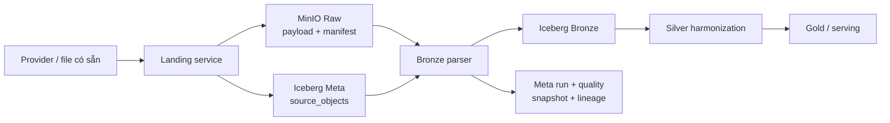
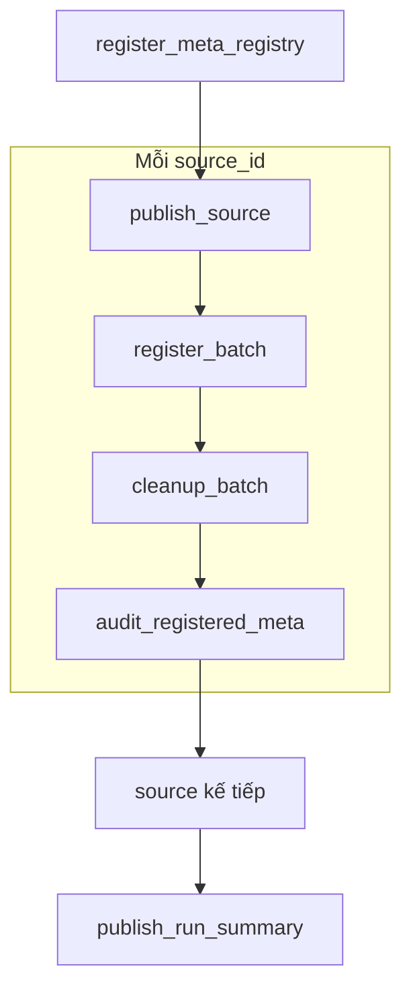
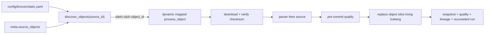
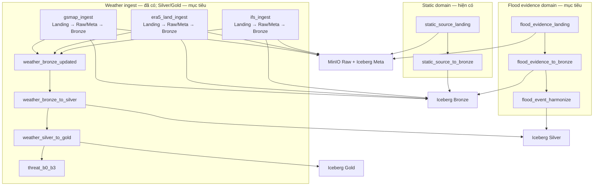
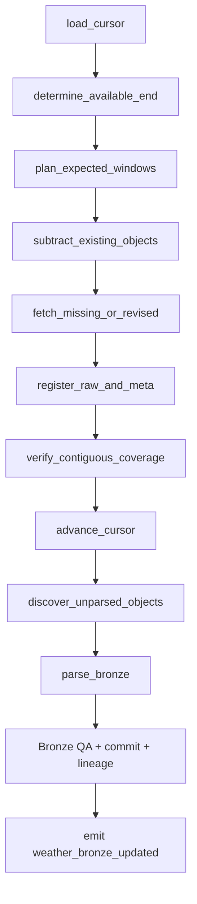

# Kiến trúc pipeline dữ liệu và kế hoạch triển khai

**Cập nhật:** 23/09/2026
**Phạm vi:** pipeline Raw/Landing, Meta, Bronze hiện có; kế hoạch tách flood event; kế hoạch ingest dữ liệu động GSMaP, ERA5-Land và IFS/Open-Meteo.

Tài liệu này phân biệt rõ:

- **Hiện có:** code, DAG và bảng đã chạy trong repository.
- **Mục tiêu:** thiết kế đã chốt nhưng chưa được triển khai.
- **Kế hoạch:** thứ tự thay đổi code, migration và tiêu chí nghiệm thu.

Schema chi tiết của từng bảng nằm tại [schema_contract/data.md](schema_contract/data.md). README vẫn là tài liệu cài đặt và vận hành nhanh; file này tập trung vào cách pipeline hoạt động và thứ tự đọc code.

## 1. Khái niệm chung

| Khái niệm | Ý nghĩa trong project |
| --- | --- |
| Source | Nhà cung cấp hoặc tập dữ liệu logic, ví dụ HydroBASINS, GSMaP hay IFS. |
| Asset | File hoặc tài nguyên logic được adapter phát hiện/tải về ở catalog local. |
| Landing | Quá trình lấy hoặc chọn asset, kiểm tra, đưa payload bất biến vào MinIO và đăng ký Meta. |
| Raw | Payload gần nguyên trạng do provider trả về, được lưu bất biến trong MinIO. |
| Meta | Registry, run, quality, snapshot và lineage của tất cả pipeline. |
| Bronze | Dữ liệu đã parse theo cấu trúc nguồn nhưng chưa harmonize về mô hình nghiệp vụ chung. |
| Silver | Dữ liệu đã chuẩn hóa CRS, unit, thời gian, ID và quan hệ không gian. |
| Gold | Dữ liệu tổng hợp theo basin, chỉ báo, trạng thái và sản phẩm phân tích. |

Landing là **quá trình**, Raw là **tầng lưu trữ**. Một luồng chuẩn luôn có dạng:



Không truyền file lớn qua Airflow XCom. Task chỉ truyền `source_id`, `object_id`, trạng thái và ID snapshot; bytes nằm trong MinIO.

## 2. Trạng thái pipeline hiện tại

### 2.1. Các pipeline đã có

| DAG | Trạng thái | Nhiệm vụ |
| --- | --- | --- |
| `static_source_landing` | Đã triển khai và đã chạy | Chọn/tải dữ liệu tĩnh, publish payload + manifest vào MinIO, đăng ký `meta.source_objects`, audit Meta. |
| `static_source_to_bronze` | Đã triển khai và đã chạy | Discover raw object chưa có kết quả hợp lệ, parse theo nguồn, chạy QA, ghi bảng Bronze và lineage. |

Hai DAG đều `schedule=None`, `catchup=False`, mặc định pause khi tạo. Việc chạy lại là idempotent theo object và kết quả đã publish, không dựa vào DAG run ID.

### 2.2. Dữ liệu đã có

Snapshot kiểm tra gần nhất có sáu bảng Bronze:

| Bảng | Số dòng | Nội dung |
| --- | ---: | --- |
| `bronze.basin_polygon_raw` | 1.194.591 | HydroBASINS và BasinATLAS level 12. |
| `bronze.river_reach_raw` | 1.428.959 | HydroRIVERS Asia. |
| `bronze.admin_boundary_raw` | 12.012 | Địa giới Sơn La và GADM. |
| `bronze.raster_coverage` | 111 | Chỉ mục band/tile của DEM, SoilGrids, WorldCover, WorldPop. |
| `bronze.historical_event_raw` | 32 | Dòng bằng chứng sự kiện lũ giữ theo nguồn. |
| `bronze.osm_feature_raw` | 763.704 | OSM thuộc các nhóm phục vụ lũ. |

Raw payload tương ứng nằm trong MinIO. `raster_coverage` chỉ lưu metadata band/tile; pixel vẫn nằm trong file Raw.

### 2.3. Nguồn hiện nằm trong static pipeline

| Source ID | Đích Bronze |
| --- | --- |
| `sonla_admin_2025` | `admin_boundary_raw` |
| `gadm_vnm_4_1` | `admin_boundary_raw` |
| `hydrobasins_v1c` | `basin_polygon_raw` |
| `basinatlas_v10` | `basin_polygon_raw` |
| `hydrorivers_v10` | `river_reach_raw` |
| `worldpop_vnm_2025` | `raster_coverage` |
| `geofabrik_vietnam_snapshot` | `osm_feature_raw` |
| `cop_dem_glo30_2024_1` | `raster_coverage` |
| `soilgrids_2_0` | `raster_coverage` |
| `esa_worldcover_2021_v200` | `raster_coverage` |

`historical_flood_evidence_2020_2026` đã được gỡ khỏi cấu hình của cả hai static DAG. Raw object, Meta audit/lineage và 32 dòng `bronze.historical_event_raw` từ các lần chạy trước vẫn được giữ để pipeline flood-event riêng tiếp quản mà không ingest lại.

## 3. Pipeline `static_source_landing` hiện có

### 3.1. Nhiệm vụ

DAG thực hiện bốn ranh giới chính:

1. Đăng ký source và dataset registry trong Meta.
2. Chuẩn bị, kiểm tra và publish raw payload + manifest vào MinIO.
3. Commit inventory object vào `meta.source_objects`.
4. Audit object đã đăng ký và chỉ dọn staging sau khi commit thành công.

DAG hỗ trợ cả hai loại nguồn:

- Adapter remote có thể resolve và tải từ provider.
- Adapter `existing` chọn file đã có trong dataset/catalog rồi publish vào MinIO.

Vì vậy DAG không chỉ kiểm tra file rồi ghi metadata. Đối với source có adapter tải dữ liệu, Landing gọi resolve/fetch; đối với source `existing`, Landing tái sử dụng file đã có.

### 3.2. Luồng task trong Airflow



Các source group hiện được nối tuần tự. Các thao tác publish/register dùng Airflow pool `source_landing_writer` để tránh nhiều writer cùng sửa inventory.

### 3.3. Luồng code theo thứ tự chạy

| Thứ tự | Hàm/lớp | File | Vai trò |
| ---: | --- | --- | --- |
| 1 | `static_source_landing_dag()` | [`airflow/dags/static_source_landing.py`](../airflow/dags/static_source_landing.py) | Khai báo DAG, source group và dependency. |
| 2 | `register_meta_registry()` | cùng file DAG | Đọc registry source/dataset rồi seed Meta. |
| 3 | `build_static_landing_service()` | [`src/flashflood_data/cli/app.py`](../src/flashflood_data/cli/app.py) | Ghép config, catalog, MinIO, Iceberg, fetcher và service. |
| 4 | `StaticSourceLandingService.prepare_run()` | [`src/flashflood_data/orchestration/landing/service.py`](../src/flashflood_data/orchestration/landing/service.py) | Tạo staging và inventory các source local đúng một lần trong service instance. |
| 5 | `acquire_validated_assets()` | [`src/flashflood_data/orchestration/landing/sources.py`](../src/flashflood_data/orchestration/landing/sources.py) | Resolve, fetch/reuse và validate asset; không harmonize. |
| 6 | `prepare_source_objects()` | cùng file | Chọn object chính xác; đóng gói shapefile sidecar thành ZIP xác định. |
| 7 | `StaticSourceLandingService.publish_source()` | `landing/service.py` | Tính checksum/object ID, publish payload + manifest bất biến. |
| 8 | `ObjectPublisher` | [`src/flashflood_data/storage/object_store.py`](../src/flashflood_data/storage/object_store.py) | Ghi object vào MinIO và phát hiện conflict. |
| 9 | `SourceObjectInventory.register_many()` | [`src/flashflood_data/storage/iceberg.py`](../src/flashflood_data/storage/iceberg.py) | Commit các hàng `meta.source_objects` trong một snapshot. |
| 10 | `audit_registered_batch()` | [`src/flashflood_data/orchestration/landing/meta_audit.py`](../src/flashflood_data/orchestration/landing/meta_audit.py) | Đối soát batch đăng ký, ghi run/quality/snapshot. |
| 11 | `cleanup_batch()` | DAG và `landing/service.py` | Dọn staging/local copy sau khi MinIO và Iceberg đã được xác minh. |
| 12 | `publish_run_summary()` | file DAG | Tổng hợp completed/failed source; làm run fail nếu thiếu source. |

### 3.4. Cấu hình liên quan

| File | Chức năng |
| --- | --- |
| [`config/landing/static.yaml`](../config/landing/static.yaml) | Source nào được land, mode individual/bundle, selection và basin level 12. |
| [`config/meta/static.yaml`](../config/meta/static.yaml) | Provider/source registry và dataset registry của static pipeline. |
| [`config/sources/`](../config/sources/) | Source spec, adapter, version, license và setting truy cập. |
| [`config/study_area.yaml`](../config/study_area.yaml) | AOI và threshold QA dùng bởi source adapter. |
| [`.env.example`](../.env.example) | Tên biến môi trường; secrets thật chỉ nằm trong `.env` hoặc Airflow Connection. |

### 3.5. Object identity và tính bất biến

`object_id` được tạo xác định từ:

```text
source_id
 source_version
 asset_id
 selection đã canonicalize
 checksum payload
 manifest_schema_version
```

Cùng identity và bytes sẽ được tái sử dụng. Cùng identity nhưng bytes/manifest khác sẽ báo conflict. Manifest không chứa credentials. Staging có thể bị dọn, nhưng payload đã commit trong MinIO không bị xóa.

## 4. Pipeline `static_source_to_bronze` hiện có

### 4.1. Nhiệm vụ

DAG đọc inventory Raw, chỉ chọn object cần xử lý, tải object từ MinIO vào temporary directory, parse, chạy quality gate rồi thay thế atomically lát Bronze của object đó.

### 4.2. Luồng task



Mỗi `source_id` luôn có task discover. Chỉ object chưa có kết quả publish hợp lệ mới tạo mapped parse task.

### 4.3. Điều kiện để một object được skip

Object chỉ được coi là đã xử lý khi đồng thời có:

1. Lineage khớp `object_id`, bảng đích và `mapping_version`.
2. `meta.pipeline_runs` có trạng thái `succeeded` và `published_at` khác null.
3. Lát dữ liệu của `object_id` vẫn tồn tại trong bảng Bronze.

Thay parser version, thay OSM policy hoặc dùng `force_reprocess=true` sẽ xử lý lại object. Việc ghi dùng replace-by-object nên retry không append thêm cùng một lát dữ liệu.

### 4.4. Luồng code theo thứ tự chạy

| Thứ tự | Hàm/lớp | File | Vai trò |
| ---: | --- | --- | --- |
| 1 | `static_source_to_bronze_dag()` | [`airflow/dags/static_source_to_bronze.py`](../airflow/dags/static_source_to_bronze.py) | Tạo discover task cho từng source và mapped parse tasks. |
| 2 | `load_bronze_config()` | [`src/flashflood_data/orchestration/bronze/config.py`](../src/flashflood_data/orchestration/bronze/config.py) | Validate target table, parser version và source status. |
| 3 | `build_bronze_service()` | [`src/flashflood_data/orchestration/bronze/factory.py`](../src/flashflood_data/orchestration/bronze/factory.py) | Ghép inventory, MinIO, Iceberg writer, Meta recorder và OSM policy. |
| 4 | `BronzeService.discover()` | [`src/flashflood_data/orchestration/bronze/service.py`](../src/flashflood_data/orchestration/bronze/service.py) | Đối chiếu raw object, run, lineage và lát Bronze. |
| 5 | `BronzeService.process_object()` | cùng file | Ghi run đang chạy, download, verify, parse, QA, commit và publish Meta. |
| 6 | parser vector/raster/event | [`src/flashflood_data/orchestration/bronze/parsers.py`](../src/flashflood_data/orchestration/bronze/parsers.py) | Chuyển raw payload thành row source-faithful. |
| 7 | parser OSM | [`src/flashflood_data/orchestration/bronze/osm.py`](../src/flashflood_data/orchestration/bronze/osm.py) | Stream PBF theo batch và lọc nhóm phục vụ lũ. |
| 8 | `check_parsed_rows()` | [`src/flashflood_data/orchestration/bronze/quality.py`](../src/flashflood_data/orchestration/bronze/quality.py) | Kiểm tra nonempty, key, geometry, bbox và raster metadata. |
| 9 | `IcebergTableStore` | [`src/flashflood_data/storage/iceberg_tables.py`](../src/flashflood_data/storage/iceberg_tables.py) | Ensure table và replace rows/batches theo object. |
| 10 | `MetaRecorder` | [`src/flashflood_data/orchestration/meta/service.py`](../src/flashflood_data/orchestration/meta/service.py) | Ghi pipeline run, quality, snapshot reference và lineage edge. |

### 4.5. Cấu hình và schema

| File | Chức năng |
| --- | --- |
| [`config/bronze/static.yaml`](../config/bronze/static.yaml) | `source_id → target_table`, parser version và QA rules. |
| [`config/bronze/osm.yaml`](../config/bronze/osm.yaml) | Các tag hydrology, hydraulic structure, transport và critical facility được giữ. |
| [`src/flashflood_data/storage/iceberg_schemas.py`](../src/flashflood_data/storage/iceberg_schemas.py) | Arrow schema và business key của Meta/Bronze. |
| [`src/flashflood_data/storage/iceberg_tables.py`](../src/flashflood_data/storage/iceberg_tables.py) | Tạo/ghi bảng Iceberg qua Polaris. |

## 5. Dữ liệu đi qua hệ thống hiện tại như thế nào

Ví dụ một file HydroBASINS:

```text
Provider/archive hoặc file local
  → adapter resolve/fetch/validate
  → chọn .shp + .dbf + .shx + .prj
  → đóng ZIP xác định trong staging
  → raw/static/hydrobasins_v1c/.../hydrobasins_l12.zip trên MinIO
  → manifest.json trên MinIO
  → meta.source_objects(object_id, URI, checksum, selection, ...)
  → BronzeService tải ZIP từ MinIO
  → parse từng polygon
  → bronze.basin_polygon_raw
  → meta.pipeline_runs
  → meta.quality_results
  → meta.table_snapshot_ref
  → meta.lineage_edges
```

Ví dụ raster DEM/SoilGrids:

```text
GeoTIFF Raw trên MinIO
  → meta.source_objects
  → parser đọc header/band
  → bronze.raster_coverage
```

Pixel không bị nhân thành hàng trong `raster_coverage`.

Flood event legacy đã lưu:

```text
Lu_Son_La_2020_2026.xlsx
  → source existing
  → MinIO Raw + meta.source_objects
  → parse row theo STT/vị trí dòng
  → bronze.historical_event_raw
```

Luồng trên mô tả dữ liệu đã có; hai static DAG không còn tạo hoặc parse object flood-event mới. Pipeline riêng ở mục 8 sẽ tiếp quản source và dữ liệu legacy này.

## 6. Cách đọc code hiện tại

Thứ tự dưới đây giúp người mới hiểu pipeline mà không phải đọc toàn repository:

1. [`compose.yaml`](../compose.yaml): service, volume và environment của MinIO, Polaris, Airflow.
2. [`config/landing/static.yaml`](../config/landing/static.yaml): danh sách và cách đóng gói source.
3. [`airflow/dags/static_source_landing.py`](../airflow/dags/static_source_landing.py): graph Airflow của Landing.
4. [`orchestration/landing/models.py`](../src/flashflood_data/orchestration/landing/models.py): contract truyền giữa task.
5. [`orchestration/landing/sources.py`](../src/flashflood_data/orchestration/landing/sources.py): resolve/fetch/reuse/select asset.
6. [`orchestration/landing/service.py`](../src/flashflood_data/orchestration/landing/service.py): transaction publish → register → cleanup.
7. [`storage/object_store.py`](../src/flashflood_data/storage/object_store.py): cách ghi/đọc MinIO.
8. [`storage/iceberg.py`](../src/flashflood_data/storage/iceberg.py): inventory `source_objects`.
9. [`config/bronze/static.yaml`](../config/bronze/static.yaml): source nào parse vào bảng nào.
10. [`airflow/dags/static_source_to_bronze.py`](../airflow/dags/static_source_to_bronze.py): discover và dynamic mapping.
11. [`orchestration/bronze/service.py`](../src/flashflood_data/orchestration/bronze/service.py): transaction parse và publish.
12. [`orchestration/bronze/parsers.py`](../src/flashflood_data/orchestration/bronze/parsers.py): row được tạo như thế nào.
13. [`orchestration/meta/service.py`](../src/flashflood_data/orchestration/meta/service.py): run, DQ, snapshot và lineage.
14. [`docs/schema_contract/data.md`](schema_contract/data.md): ý nghĩa và grain của các bảng.

## 7. Kiến trúc pipeline mục tiêu

Static, flood event và weather dùng chung MinIO, Iceberg Meta, DQ và lineage, nhưng mỗi domain có DAG và nhịp cập nhật riêng.



Weather có **một ingest DAG cho mỗi source**. Trong mỗi DAG, Landing và Bronze là hai TaskGroup nối tiếp nhau:

```text
plan/fetch
  → commit Raw + Meta
  → verify Raw coverage + advance acquisition watermark
  → discover mọi Raw object chưa có Bronze hợp lệ
  → parse/QA/commit Bronze
  → phát asset event
```

Cách tổ chức này giảm độ trễ và giúp vận hành theo source, nhưng vẫn giữ ranh giới commit rõ ràng:

- Raw đã commit không bị rollback nếu Bronze lỗi.
- Lần chạy sau discover lại Raw chưa parse và tiếp tục Bronze.
- Asset event chỉ là tín hiệu đánh thức downstream; Meta và snapshot đã publish mới là nguồn sự thật.
- Silver và Gold là DAG dùng chung, không nằm trong ingest DAG của provider.
- DAG chỉ orchestration; planner, provider adapter, parser, QA và storage transaction nằm trong package Python.
- Backfill, catch-up và polling dùng chung service; chúng chỉ khác khoảng thời gian cần lập kế hoạch.
- Không xóa raw object hoặc snapshot cũ khi provider phát hành revision mới.

Không gom Raw → Gold vào một DAG lớn vì retry một provider không nên chạy lại toàn bộ Silver/Gold. Cũng không tách Landing và Bronze thành sáu DAG nhỏ vì sẽ tăng số DAG, cấu hình trigger và điểm cần theo dõi mà không tạo thêm ranh giới dữ liệu cần thiết.

## 8. Pipeline flood event riêng

### 8.1. Lý do tách

Flood event có vòng đời khác dữ liệu static:

- Bằng chứng được bổ sung theo đợt và từ nhiều tài liệu.
- Một tài liệu có thể nhắc nhiều event; một event có thể có nhiều tài liệu.
- Thông tin ngày, địa danh, severity và footprint có thể được hiệu chỉnh.
- Cần revision, confidence, evidence role và quan hệ nhiều-nhiều với basin.

### 8.2. Ba DAG mục tiêu

#### `flood_evidence_landing`

Nhận XLSX, CSV, PDF, DOCX, HTML hoặc output crawler; lưu từng tài liệu/file bất biến; đăng ký `meta.source_objects`. File trùng checksum được tái sử dụng.

#### `flood_evidence_to_bronze`

Parse raw object thành `bronze.historical_event_raw`. Bronze giữ văn bản và field theo nguồn; không quyết định hai dòng có phải cùng một event hay không.

#### `flood_event_harmonize`

Chuẩn hóa vào:

- `silver.source_document`
- `silver.document_chunk`
- `silver.observed_flood_event`
- `silver.event_evidence`
- `silver.event_basin`

### 8.3. Quy tắc ID và revision

Không dùng số thứ tự dòng làm ID dài hạn.

| ID | Quy tắc |
| --- | --- |
| `source_record_id` | ID ổn định do collection cấp; không đổi khi sắp xếp file. |
| `source_document_id` | ID xác định từ định danh nguồn/URL và checksum tài liệu. |
| `flood_event_id` | ID nghiệp vụ ổn định của event đã resolve. |
| `event_revision` | Tăng khi diễn giải chuẩn hóa của event thay đổi. |
| `evidence_id` | ID của bằng chứng cụ thể liên kết event–document chunk. |

Quy tắc chạy lại:

- Cùng raw checksum: skip.
- Tài liệu mới cho event cũ: thêm evidence, giữ `flood_event_id`.
- Thuộc tính event thay đổi: tạo `event_revision` mới.
- Event mới: tạo `flood_event_id` mới.
- Chỉ có điểm/địa danh thì `affected_area_km2` để null; chỉ footprint đủ tin cậy mới tính diện tích giao basin.

### 8.4. Tổ chức file mục tiêu

```text
airflow/dags/
├── flood_evidence_landing.py
├── flood_evidence_to_bronze.py
└── flood_event_harmonize.py

config/
├── landing/flood_event.yaml
├── bronze/flood_event.yaml
└── meta/flood_event.yaml

src/flashflood_data/orchestration/flood_event/
├── models.py
├── landing.py
├── parsers.py
├── bronze.py
├── harmonize.py
└── quality.py
```

### 8.5. Migration khỏi static pipeline

Trạng thái migration:

1. Đã gỡ source khỏi `EXPECTED_SOURCE_IDS`, danh sách CLI mặc định, `config/landing/static.yaml` và `config/bronze/static.yaml`; hai static DAG không còn tạo task cho flood event.
2. Giữ tạm source/dataset declaration trong `config/meta/static.yaml` cùng adapter/parser/schema để dữ liệu legacy vẫn có contract trong lúc chưa có pipeline mới.
3. Tạo event configs, service và DAG mới.
4. Cho event Bronze service nhận cả source legacy `historical_flood_evidence_2020_2026` và source dài hạn `son_la_flood_evidence_compilation`.
5. Kiểm tra pipeline mới nhận ra object/snapshot đã publish và không tạo trùng.
6. Chuyển source/dataset declaration sang Meta config của event pipeline; sau đó mới bỏ declaration tương ứng khỏi `config/meta/static.yaml`.
7. Giữ nguyên raw object, Meta lineage và dữ liệu `bronze.historical_event_raw` hiện có.

Không cần ingest lại Raw chỉ vì thay owner DAG.

## 9. Pipeline weather động

### 9.1. Vai trò của ba nguồn

| Nguồn/product | Vai trò chính | Biến dự kiến |
| --- | --- | --- |
| GSMaP Gauge Standard | Mưa lịch sử đã hiệu chỉnh gauge | precipitation/rain rate và quality flags. |
| GSMaP Gauge NOW | Mưa gần hiện tại có độ trễ thấp | precipitation/rain rate và quality/reliability flags. |
| ERA5-Land | Reanalysis/backfill và baseline | total precipitation, soil moisture, surface runoff, subsurface runoff. |
| IFS qua Open-Meteo | Forecast tương lai và lấp khoảng trễ ERA5 dưới trạng thái provisional | precipitation, runoff và các tầng soil moisture. |

Chính sách chọn dữ liệu:

| Khoảng thời gian | Mưa | Soil moisture | Runoff | Trạng thái |
| --- | --- | --- | --- | --- |
| Quá khứ đã ổn định | GSMaP Standard; ERA5-Land dùng baseline/QA | ERA5-Land | ERA5-Land | `FINAL`/`REANALYSIS` |
| Khoảng trễ của nguồn final | GSMaP Gauge NOW | IFS | IFS | `PROVISIONAL` |
| Tương lai | IFS | IFS | IFS | `FORECAST` |

GSMaP NOW và IFS provisional không bị xóa khi dữ liệu final xuất hiện. Silver selector đổi bản ghi ưu tiên, còn lịch sử Raw/Bronze vẫn được giữ để replay, audit và đánh giá forecast.

### 9.2. Một ingest DAG cho mỗi source

| DAG đã triển khai | Wake-up schedule | Safe end hiện dùng | Công việc |
| --- | --- | --- | --- |
| `gsmap_ingest` | Phút 17 mỗi giờ | Đồng hồ UTC trừ lag riêng Standard/NOW; file thiếu làm run fail và giữ cursor | Standard cho lịch sử ổn định, NOW cho đoạn gần hiện tại; Landing → Bronze. |
| `ifs_ingest` | Phút 12 mỗi 6 giờ | UTC trừ 7 giờ, làm tròn theo cycle 6 giờ | Lấy explicit archived run qua Open-Meteo Single Runs; Landing → Bronze. |
| `era5_land_ingest` | 02:43 hằng ngày | UTC trừ 10 ngày rồi lùi về đầu tháng hoàn chỉnh gần nhất | Backfill/correction theo tháng; Landing → Bronze. |

Cả ba DAG đặt:

```python
catchup=False
max_active_runs=1
```

Airflow schedule chỉ dùng để **đánh thức** DAG. Airflow không cần tạo lại từng cron run đã bỏ lỡ khi Docker tắt. Mỗi lần DAG chạy, application planner tự tính khoảng thiếu từ trạng thái bền vững tới safe end hiện tại của provider.

Do đó:

- Nếu Docker chạy liên tục, DAG hoạt động như polling.
- Nếu Docker tắt vài ngày, các lần chạy sau khi bật lại tự tiếp tục từ cursor. Mỗi run bị giới hạn
  số object để không làm phình XCom; schedule hoặc manual trigger tiếp theo xử lý phần còn lại.
- Operator cũng có thể trigger thủ công bất cứ lúc nào; thuật toán catch-up không thay đổi.
- `docker compose down` không làm mất tiến độ nếu volume/catalog trong `dataset/lakehouse/` vẫn được giữ.
- Catch-up chỉ tự động được trong khoảng provider còn lưu archive; nếu downtime vượt retention, pipeline phải ghi gap và dùng nguồn/backfill archive thay thế.

### 9.3. Luồng task chuẩn của một ingest DAG



Các task được nhóm thành hai TaskGroup:

1. `landing_raw`: từ `load_cursor` tới `advance_cursor`.
2. `bronze`: từ `discover_unparsed_objects` tới phát asset event.

Ranh giới lỗi:

- Fetch lỗi: không đăng ký object hoàn tất và không tiến watermark.
- Raw commit thành công nhưng advance cursor lỗi: lần sau planner nhìn lại `meta.source_objects`, bỏ qua object đã có và hoàn tất cursor.
- Raw hoàn tất nhưng Bronze lỗi: Raw vẫn hợp lệ; `discover_unparsed_objects` của lần sau nhận lại object đó.
- Một object Bronze đã có lineage, run publish thành công và lát dữ liệu còn tồn tại sẽ được skip.
- Reconciliation luôn quét mọi Raw weather object chưa có Bronze hợp lệ. Vì vậy event bị gộp, scheduler nghỉ hoặc task trigger lỗi không làm thất lạc dữ liệu.

### 9.4. Catch-up bằng expected windows, không dùng `max(timestamp)`

Chỉ lấy `timestamp > max(existing)` là không đủ. Ví dụ hệ thống đã có 10:00 và 12:00 nhưng thiếu 11:00 thì max là 12:00 và khoảng hổng sẽ bị bỏ qua.

Planner phải làm theo tập identity mong đợi:

```text
expected identities trong [cursor - overlap, provider_safe_end]
  - identities đã tồn tại và hợp lệ trong meta.source_objects
  = identities cần tải hoặc cần lấy revision mới
```

Mỗi identity phụ thuộc source:

| Source | Identity tối thiểu |
| --- | --- |
| GSMaP | `product + version + valid_time + tile/AOI + source_revision` |
| ERA5-Land | `product + variable_group + valid window + AOI/request fingerprint + revision` |
| IFS | `model + cycle/run_time + lead_time + valid_time + variable_group + revision` |

Planner luôn đọc một khoảng overlap trước watermark để bắt dữ liệu đến muộn hoặc revision. Object mới có identity/revision mới; object cũ không bị ghi đè.

Watermark chỉ được tăng tới **mốc liên tục cuối cùng** sau khi:

1. Mọi expected identity trước mốc đó đã có Raw object hợp lệ; hoặc
2. Provider xác nhận time slot không tồn tại và pipeline ghi kết quả `NO_DATA`/gap có lý do.

Khoảng hổng chưa giải quyết được ghi vào quality result của run và giữ nguyên watermark. Nhờ vậy lần chạy sau vẫn thử lại.

### 9.5. Bảng Meta điều khiển tiến độ

Các weather DAG đã dùng bảng `meta.ingest_watermarks`:

| Field | Ý nghĩa |
| --- | --- |
| `source_id` | Source/provider sở hữu stream. |
| `product` | Product cụ thể, ví dụ GSMaP Standard và Gauge NOW không dùng chung cursor. |
| `stream_id` | Phân biệt request/cycle family khi một product có nhiều stream. |
| `cursor_time` | Mốc cuối liên tục đã có Raw hoặc đã ghi nhận NO_DATA hợp lệ. |
| `last_safe_end` | Safe end quan sát ở lần lập kế hoạch gần nhất. |
| `last_run_id` | Run đã cập nhật cursor gần nhất. |
| `status` | `ready`, `gap` hoặc `failed`. |
| `updated_at` | Thời điểm cập nhật UTC. |
| `detail_json` | Chi tiết gap/NO_DATA có schema version. |

Khóa logic là:

```text
(source_id, product, stream_id)
```

Vai trò các bảng không trùng nhau:

- `meta.source_objects` là inventory authoritative của Raw object đã commit.
- `meta.ingest_watermarks` là con trỏ acquisition để giới hạn khoảng lập kế hoạch.
- `meta.pipeline_runs`, `meta.quality_results` và `meta.lineage_edges` ghi kết quả chạy, gap/DQ và quan hệ Raw → Bronze.
- Bronze tiến tới đâu được xác định từ lineage + published run + lát bảng, không suy ra từ acquisition watermark.
- Silver và Gold dùng snapshot/lineage của chính chúng, không tái sử dụng Raw watermark.

Trước khi code bảng này phải cập nhật đồng bộ `docs/schema_contract/data.md`, draw.io, Iceberg schema/bootstrap, Meta repository và contract test.

### 9.6. Quy tắc tìm safe end theo provider

#### GSMaP

- Backfill project từ năm 2020 bằng Gauge Standard ở đoạn archive đã ổn định.
- Dùng Gauge NOW cho đoạn gần hiện tại chưa có Standard.
- Bản hiện tại dùng lag bảo thủ riêng cho Standard/NOW; file chưa tồn tại làm task fail và giữ watermark. Đọc listing thực tế là cải tiến tiếp theo.
- Gauge NOW biểu diễn cửa sổ mưa một giờ nhưng có request cadence 30 phút; expected assets gồm cả `HH:00` và `HH:30`.
- Binary Standard/NOW dùng float32 little-endian; `-4`, `-8`, `-99` được giữ là missing/null, không đổi thành mưa âm.
- Khi Standard xuất hiện cho time slot từng có NOW, ingest revision Standard mới và để Silver selector chuyển ưu tiên.
- Giữ product, version và revision trong object identity; không trộn Standard và NOW thành một chuỗi không phân biệt nguồn.

#### ERA5-Land

- Bản hiện tại lấy UTC trừ 10 ngày rồi lùi về đầu tháng hoàn chỉnh gần nhất; probe availability thực tế của CDS là cải tiến tiếp theo.
- Chia catch-up lớn theo tháng hoàn chỉnh để request identity ổn định; explicit backfill vẫn dùng khoảng operator cung cấp.
- Operational run nhìn lùi một khoảng overlap để nhận correction.
- Bronze giữ accumulation gốc từ 00 UTC; mốc 00 UTC đại diện 24 giờ trước. De-accumulation và đổi m → mm thực hiện ở Silver.
- Nếu ERA5 chưa tới hiện tại, Silver có thể dùng IFS provisional cho đoạn trễ.

#### IFS

- Bản hiện tại lập cycle 6 giờ từ UTC trừ lag bảo thủ; cycle chưa có làm task fail và giữ watermark. Enumerate availability thực tế là cải tiến tiếp theo.
- Lập expected identities theo `cycle + lead_time + valid_time + revision`.
- Chỉ tải model/product đã chốt; không dùng cơ chế “best match” có thể đổi model giữa các lần chạy.
- Open-Meteo request chốt `models=ecmwf_ifs` và `run=<cycle UTC>`.
- Schedule 6 giờ phát hiện cycle mới. Nếu Docker tắt, lần sau planner lập lại các cycle còn nằm trong archive và tải phần thiếu.

### 9.7. Backfill và operational dùng cùng code

DAG conf dự kiến:

```json
{
  "mode": "backfill",
  "start": "2020-01-01T00:00:00Z",
  "end": "2021-01-01T00:00:00Z"
}
```

Quy tắc:

- `mode=backfill` dùng khoảng operator cung cấp và chunk theo ngày/tháng tùy provider.
- `mode=catchup` hoặc không truyền conf dùng watermark → provider safe end.
- Cả hai mode gọi cùng planner, adapter, publisher, parser và QA.
- Backfill không tự đẩy watermark operational vượt qua gap chưa đầy.
- Khoảng backfill lớn tạo nhiều bounded batch để retry một phần, không tạo một task tải cả năm.
- Retry luôn đối chiếu `meta.source_objects` trước khi gọi provider để tránh tải lại bytes đã commit.

### 9.8. Temporal contract bắt buộc

```text
source_cycle_id
model_run_time
lead_time
valid_time
window_start
window_end
provider_issued_at
available_at
retrieved_at
source_revision
ingest_mode       = backfill | catchup
source_mode       = near_realtime | forecast | reanalysis
quality_status    = PROVISIONAL | FINAL | STALE | NO_DATA
```

Quy tắc:

- Timestamp lưu UTC.
- Missing giữ null, không đổi thành 0.
- Không cộng các cửa sổ mưa chồng lấn.
- IFS precipitation/runoff là lượng của khoảng trước mốc timestamp; soil moisture là instantaneous.
- `model_run_time` null với ERA5-Land reanalysis.
- Không dùng `retrieved_at` thay `model_run_time`, `valid_time` hoặc `available_at`.
- Replay tại `as_of_time` chỉ dùng record có `available_at <= as_of_time`.
- IFS lấp gap chỉ được chọn từ run đã khả dụng tại thời điểm cần tái hiện để tránh leakage.

### 9.9. Raw, Bronze, Silver và Gold

Raw layout dự kiến:

```text
raw/weather/gsmap/
└── product=<standard|gauge_now>/version=<version>/valid_date=YYYY-MM-DD/...

raw/weather/ifs/
└── model=ecmwf_ifs/run_time=YYYY-MM-DDTHH-MMZ/request_part=NNN/...

raw/weather/era5_land/
└── year=YYYY/month=MM/request_part=NNN/...
```

Raw chỉ lấy biến và spatial subset cần cho AOI khi provider hỗ trợ. Payload giữ gần nguyên trạng, được nén nếu phù hợp và luôn có manifest/request fingerprint.

Bronze dùng contract source-faithful đã benchmark. Nếu lưu dạng row, grain tối thiểu là:

```text
(object_id,
 source_grid_version,
 source_grid_id,
 variable,
 vertical_level,
 source_cycle_id,
 valid_time,
 window_start,
 window_end,
 source_revision)
```

Sau Bronze:

1. `weather_bronze_to_silver` chuẩn hóa variable, unit, interval, grid version và mapping cell → basin L12.
2. `weather_silver_to_gold` tạo `gold.basin_forcing`, selector final/provisional và các cửa sổ mưa.
3. `threat_b0_b3` dùng Gold forcing cùng static basin features để tính sản phẩm nghiệp vụ.

Mapping grid–basin được version riêng cho GSMaP, IFS và ERA5-Land. Weight giữ diện tích giao, mẫu số và valid coverage; Landing không làm spatial aggregation.

### 9.10. Tổ chức file hiện có và phần tiếp theo

```text
airflow/dags/
├── gsmap_ingest.py
├── era5_land_ingest.py
├── ifs_ingest.py
├── weather_bronze_to_silver.py
├── weather_silver_to_gold.py
└── threat_b0_b3.py

config/dynamic/
├── gsmap.yaml
├── era5_land.yaml
└── ifs.yaml

src/flashflood_data/orchestration/weather/
├── models.py
├── config.py
├── planner.py
├── watermarks.py
├── landing.py
├── bronze.py
├── parsers.py
├── factory.py
├── airflow_factory.py
├── providers/
│   ├── gsmap.py
│   ├── era5_land.py
│   └── ifs_openmeteo.py
├── silver/
│   ├── grid.py
│   ├── basin_weights.py
│   └── service.py
└── gold/
    ├── selector.py
    ├── windows.py
    └── service.py
```

DAG file chỉ khai báo TaskGroup, task dependency, schedule, pool và DAG conf. Provider API, cursor, fetch, parse và commit không viết trực tiếp trong DAG.

## 10. Kế hoạch triển khai theo thứ tự

Mỗi task phải tạo ra đầu ra chạy và kiểm thử độc lập. Không backfill lớn trước khi task 1–4 hoàn tất.

### Task 1 — Chốt source contract và fixture thật

- [ ] Tải một sample GSMaP Standard và Gauge NOW; ghi product/version, auth, format, flag, latency và license.
- [ ] Lưu IFS probe có cycle, lead time, request parameters và response nguyên trạng.
- [ ] Tải một ERA5-Land sample qua CDS cho đúng AOI và biến đã chọn.
- [ ] Benchmark một tháng để chốt Bronze weather dạng row hay chunk.
- [ ] Chốt temporal/unit semantics và provider-specific object identity.

**Nghiệm thu:** fixture đọc được offline; expected time slot của từng source xác định được; không còn quyết định schema bắt buộc chưa chốt.

### Task 2 — Bổ sung Meta watermark và catch-up planner

- [x] Thêm `meta.ingest_watermarks` vào schema contract, draw.io, Iceberg schema và repository.
- [x] Tạo planner lập expected windows theo cursor, overlap và provider safe end.
- [x] Trừ object đã có bằng identity trong `meta.source_objects`.
- [x] Chỉ advance cursor sau contiguous coverage hoặc `NO_DATA` có lý do.
- [x] Kiểm thử khoảng 10:00 và 12:00 đã có nhưng 11:00 thiếu vẫn được phát hiện.

**Nghiệm thu:** restart service không mất cursor; gap giữa chuỗi không bị bỏ qua; retry sau Raw commit không tải lại object.

### Task 3 — Xây common weather ingest và Bronze framework

- [x] Tạo model request/raw object, provider protocol và config loader dùng chung.
- [x] Mở rộng manifest/`SourceObjectRow` cho product, cycle, valid/available time, revision và request fingerprint.
- [x] Tái sử dụng `ObjectPublisher`, `SourceObjectInventory` và `MetaRecorder`.
- [x] Tạo parser dispatch và Bronze row contract.
- [x] Discover quét mọi Raw weather object chưa có parser version hiện tại.
- [ ] Thêm DQ cho interval, unit, negative precipitation, missing, out-of-order và coverage.

**Nghiệm thu:** fake provider chạy trọn Landing → Raw/Meta → Bronze; rerun không tạo lát trùng; Bronze lỗi có thể phục hồi từ Raw.

### Task 4 — Triển khai ba source ingest DAG

- [x] `gsmap_ingest`: Standard backfill, NOW near-real-time; revision được giữ cho Silver selector sau này.
- [x] `era5_land_ingest`: CDS request theo tháng, safe lag và correction overlap.
- [x] `ifs_ingest`: explicit archived cycle qua Single Runs API.
- [x] Mỗi DAG có TaskGroup `landing_raw` và `bronze`, `catchup=False`, `max_active_runs=1`.
- [x] Chỉ phát `weather_bronze_updated` sau Bronze snapshot đã publish; không phát khi danh sách parse rỗng.
- [ ] Thêm provider rate-limit, retry/backoff, pool và sanitized error.

**Nghiệm thu:** một provider lỗi không chặn provider khác; Docker tắt rồi bật lại tự lấp time slot thiếu; manual trigger và schedule dùng cùng code.

### Task 5 — Xây Weather Silver

- [ ] Tạo source grid/version và cell geometry cho từng provider.
- [ ] Tạo `grid_basin_weight` cho basin L12.
- [ ] Chuẩn hóa variable, unit, interval và revision vào Silver.
- [ ] Trigger bằng Bronze asset event và thêm reconciliation theo snapshot Meta.
- [ ] Kiểm thử area weight, valid coverage, missing và cửa sổ không chồng lấn.

**Nghiệm thu:** fixture tính tay cho cell/basin khớp kết quả; event bị lỡ vẫn được lần reconcile sau xử lý.

### Task 6 — Xây Weather Gold và threat trigger

- [ ] Aggregate `gold.basin_forcing` theo basin L12.
- [ ] Tạo selector ERA5/GSMaP final và IFS/NOW provisional.
- [ ] Tạo cửa sổ mưa 1h/3h/6h/24h/72h.
- [ ] Nối snapshot Gold đã publish sang `threat_b0_b3`.
- [ ] Hỗ trợ replay theo `as_of_time` mà không dùng dữ liệu tương lai.

**Nghiệm thu:** final thay quyền ưu tiên provisional mà không xóa lịch sử; replay không leakage; threat chỉ đọc snapshot hoàn tất.

### Task 7 — Tách flood event khỏi static pipeline

- [ ] Tạo config/model/service và ba DAG ở mục 8.
- [ ] Thay ID theo STT/vị trí dòng bằng stable source record ID.
- [ ] Cho pipeline mới tiếp quản object legacy và bảng `bronze.historical_event_raw`.
- [x] Gỡ event source khỏi hai static DAG; giữ adapter/parser cho pipeline mới tái sử dụng.
- [ ] Giữ nguyên Raw, Meta lineage và snapshot cũ.

**Nghiệm thu:** static DAG không còn sở hữu flood event; rerun không tăng row ngoài ý muốn; evidence mới và revision event hoạt động đúng.

### Task 8 — Observability, recovery và runbook

- [ ] Theo dõi source lag, polling lag, processing lag, data age, gap count và watermark age.
- [ ] Cảnh báo stale/missing theo product; không tự đổi nguồn âm thầm.
- [ ] Thêm reconcile command cho weather và flood event.
- [ ] Viết runbook backfill, retry, quarantine, revision và recovery sau downtime.
- [ ] Cập nhật README, schema contract và draw.io theo code đã triển khai.
- [ ] Kiểm thử Compose restart trên Linux và WSL2 với state được giữ.

**Nghiệm thu:** có thể replay một khoảng từ Raw; run lỗi không công bố snapshot hoàn tất; teammate dừng rồi bật Compose vẫn catch-up được.

## 11. Quyết định đã chốt và điểm cần xác minh

### Đã chốt

- Basin level 12 là đơn vị phân tích mục tiêu.
- Flood event có pipeline riêng và tái sử dụng hạ tầng chung.
- Weather có ba ingest DAG theo source: `gsmap_ingest`, `era5_land_ingest` và `ifs_ingest`.
- Mỗi ingest DAG chứa Landing/Raw commit và Bronze parse/commit theo hai TaskGroup.
- Silver, Gold và threat là các DAG downstream dùng chung.
- `catchup=False`; schedule là wake-up, application planner catch-up từ watermark.
- Không dùng `max(existing timestamp)` làm checkpoint duy nhất.
- `meta.source_objects` là inventory Raw; `meta.ingest_watermarks` là acquisition cursor.
- Reconciliation Raw → Bronze là backstop bắt buộc, không chỉ dựa vào asset event.
- Backfill và catch-up dùng chung code.
- IFS và GSMaP NOW provisional được giữ khi nguồn final xuất hiện.
- Product/version/revision luôn được bảo toàn trong identity và lineage.

### Cần xác minh trước khi backfill lớn

- Quyền truy cập, quota, license, archive listing và revision behavior thực tế của từng GSMaP product.
- Safe-end API/listing và retention thực tế của IFS/Open-Meteo.
- Availability/correction lag và request limit hiện hành của CDS ERA5-Land.
- Row-vs-chunk cho Bronze sau benchmark.
- Grid footprint/version và kích thước Raw thực tế.
- Overlap tối ưu cho từng source và retention đủ dài để catch-up sau downtime.
- Cụm basin/AOI đầu tiên dùng để kiểm thử end-to-end.

## 12. Lệnh vận hành

Pipeline hiện có:

```bash
# Static Landing
docker compose exec -T airflow-scheduler \
  airflow dags trigger static_source_landing

# Static Bronze cho riêng một source
docker compose exec -T airflow-scheduler \
  airflow dags trigger static_source_to_bronze \
  --conf '{"source_id":"geofabrik_vietnam_snapshot"}'

# Đối soát Raw, Meta và Bronze
.venv/bin/flashflood-data bronze reconcile

# Smoke test Meta/Bronze
make lakehouse-meta-bronze-smoke
```

Giao diện weather đã triển khai:

```bash
# Catch-up tự động từ watermark tới safe end của provider
docker compose exec -T airflow-scheduler \
  airflow dags trigger gsmap_ingest

# Backfill một khoảng rõ ràng
docker compose exec -T airflow-scheduler \
  airflow dags trigger gsmap_ingest \
  --conf '{"mode":"backfill","start":"2020-01-01T00:00:00Z","end":"2021-01-01T00:00:00Z"}'

docker compose exec -T airflow-scheduler \
  airflow dags trigger era5_land_ingest \
  --conf '{"mode":"backfill","start":"2020-01-01T00:00:00Z","end":"2020-12-31T23:59:59Z"}'

# Trigger IFS thủ công; DAG tự enumerate cycle/lead còn thiếu
docker compose exec -T airflow-scheduler \
  airflow dags trigger ifs_ingest
```

Các lệnh weather cần credential provider tương ứng trong `.env`; backfill không đẩy cursor operational.
