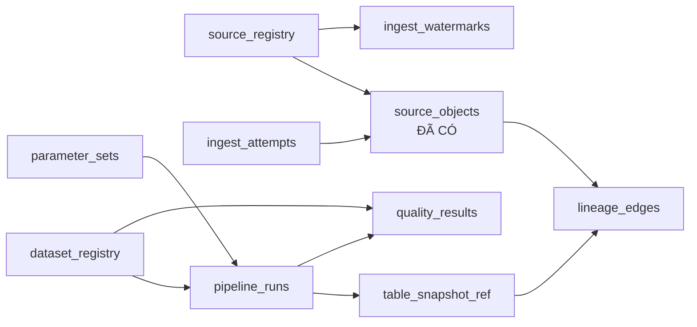
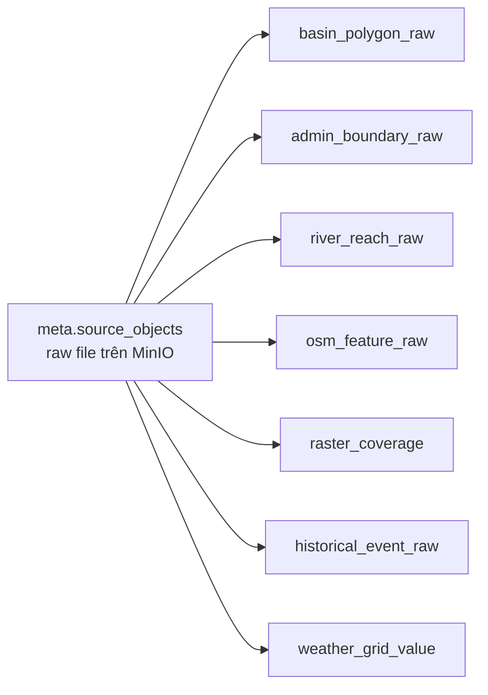
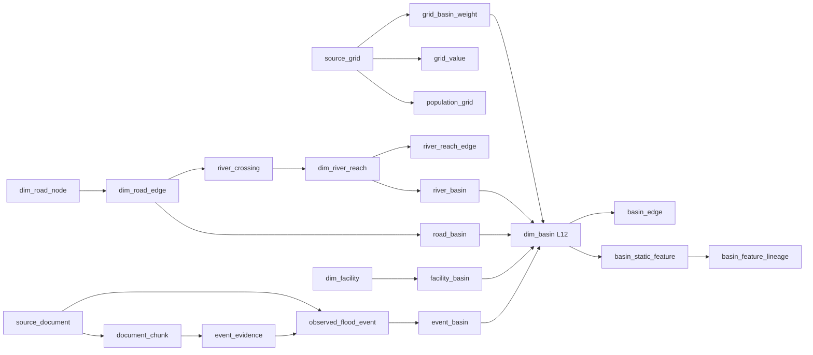
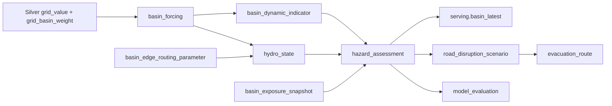
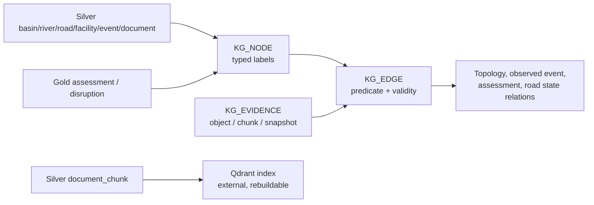

# Data schema contract — FloodLakeKG Sơn La

Tài liệu này là **data dictionary của schema đích** cho toàn bộ đường đi `raw/Meta → Bronze → Silver → Gold → Serving → Knowledge Graph`. Đọc cùng [schema contract tổng quan](../son_la_flood_schema_contract.md) và [class diagram draw.io](../son_la_flood_class_diagram.drawio). Meta, các bảng Bronze static và `bronze.weather_grid_value` đã có schema vật lý trong code; bảng chỉ được tạo trong Polaris khi pipeline đầu tiên gọi `ensure_table`. Silver trở đi vẫn là thiết kế đích.

Các sơ đồ Mermaid dưới đây biểu diễn quan hệ logic; bảng dữ liệu bên dưới mới là danh sách thuộc tính. `PK`/`FK` là ràng buộc cần pipeline kiểm tra vì Iceberg không tự thực thi khóa ngoại. `!` là không null, `?` là có thể null. Kiểu `timestamp` là UTC; `geometry_wkb` là WKB `binary` kèm `crs`/bbox. `json` nghĩa là chuỗi JSON có schema version cho tới khi có `struct`/`map` vật lý. ID basin luôn là chuỗi `HYBAS_ID` **level 12**; mọi tham chiếu tới basin dùng đủ `(basin_id, basin_version)`. `object_id` là SHA-256 ổn định, còn Iceberg snapshot ID là `long` và phải đi với tên bảng.

Đi nhanh theo tầng: [Meta](#1-meta--quản-trị-xuyên-tầng) · [Bronze](#2-bronze--dữ-liệu-đã-parse-theo-nguồn) · [Silver](#3-silver--dữ-liệu-chuẩn-hóa-và-quan-hệ-không-gian) · [Gold/Serving](#4-gold-và-serving--mô-hình-đánh-giá-sản-phẩm) · [KG](#5-knowledge-graph-và-vector-index) · [QA](#6-kiểm-tra-contract-trước-khi-tạo-bảng).

### Khóa định danh và chạy lại an toàn

**Surrogate key** là ID đại diện cho một thực thể, còn **idempotency key** là khóa dùng để nhận ra cùng một đầu ra khi job chạy lại. Hai khóa có thể trùng nhau nếu ID được tạo *xác định* từ business key; UUID ngẫu nhiên hoặc ID tăng tự động trên mỗi lần chạy không chống được ghi trùng. `ingest_run_id`/`pipeline_run_id` chỉ định danh lần chạy để audit, không được thêm vào khóa bản ghi nghiệp vụ chỉ để tránh xung đột.

Thiết kế hiện dùng `(basin_id, basin_version)` làm khóa tự nhiên của basin. Có thể thêm `basin_key = SHA-256(basin_id, basin_version)` để FK ngắn hơn, nhưng phải kiểm tra ánh xạ 1–1 với cặp gốc; riêng surrogate key không thay được `event_basin` vì một event có thể thuộc nhiều basin. Việc chống trùng dựa vào **business key/grain đầy đủ + cách ghi**, không dựa vào số cột của FK.

| Tầng/bảng | Khóa nhận diện cùng một kết quả | Quy tắc khi retry hoặc chạy lại |
| --- | --- | --- |
| `meta.source_objects` | `object_id = SHA-256(source_id, source_version, asset_id, selection, checksum, manifest_schema_version)` sau chuẩn hóa JSON | Cùng ID và cùng payload/URI thì tái sử dụng; cùng ID nhưng identity khác thì báo conflict; file đổi checksum là object mới có chủ đích. |
| Bronze parsed | Khóa grain ghi ở tiêu đề từng bảng, ví dụ `(object_id, source_feature_id)` | Chạy lại cùng parser không append thêm hàng. Nếu parser đổi, thay toàn bộ output của object một cách nguyên tử; snapshot Iceberg cũ giữ bản parse trước. |
| Silver versioned | Business key ghép ID nguồn với `basin_version`, `feature_build_version`, `topology_version` hoặc version tương ứng | Cùng key và cùng nội dung thì skip; cùng key nhưng nội dung khác thì fail và điều tra hoặc cấp version mới, không âm thầm append. |
| Gold facts | `forcing_id`, `indicator_id`, `hydro_state_id`, `assessment_id` là hash ổn định của **toàn bộ** context ghi trong business uniqueness, kể cả scenario, thời gian, revision và version | Upsert/merge theo ID ổn định; retry cùng input cho cùng ID, input/policy thay đổi phải có revision/version mới. |
| `serving.basin_latest` | `(basin_id, basin_version, scenario_id, product_view)` | Tính lại từ Gold bằng thứ tự chọn latest tất định rồi thay hàng hiện tại; không append thêm một “latest” thứ hai. |
| KG và Qdrant | Node/edge/point ID từ business key + version/model | Upsert cùng ID; đóng hiệu lực hoặc retract bản cũ khi phiên bản nguồn thay đổi. |

Iceberg không thực thi unique constraint cho các khóa logic này. Writer phải kiểm tra trùng trong batch, đọc trạng thái hiện có, ghi nguyên tử theo key/partition, retry khi commit conflict và kiểm tra uniqueness sau ghi. Với **hai writer đồng thời cùng một key**, thao tác “đọc thấy chưa có rồi append” vẫn có thể tạo trùng; cần serialize theo nguồn/bảng hoặc dùng cơ chế ghi có kiểm soát xung đột và kiểm tra lại sau commit. Hiện `static_source_landing` giới hạn một DAG run tại một thời điểm; `meta.source_objects` đã xử lý retry tuần tự nhưng **chưa là bảo đảm unique tuyệt đối trước writer bên ngoài chạy đồng thời**. Các quy tắc Bronze–Gold ở trên là yêu cầu triển khai, chưa có writer tương ứng trong code.

## 1. Meta — quản trị xuyên tầng

Meta là **control plane dùng chung** cho raw, Bronze, Silver, Gold và các projection sau đó: danh mục nguồn/bảng, run, chất lượng, snapshot và lineage. Nó không chứa bản sao pixel hay feature nghiệp vụ. `meta.source_objects` chỉ kiểm kê file raw; `meta.ingest_watermarks` giới hạn khoảng planner phải quét cho từng stream động; `meta.table_snapshot_ref` và `meta.lineage_edges` theo dõi các bảng về sau. Airflow logs/metrics, quyền MinIO và quyền catalog được thực thi ở hệ thống tương ứng; các bảng Meta chỉ giữ tham chiếu, trạng thái và bằng chứng cần truy vấn/tái lập.

### `meta.source_registry` — một dòng / `(source_id, source_version)`; đích

**Vai trò:** Danh mục các nguồn và phiên bản được phép ingest, kèm thông tin provider và phạm vi sử dụng.

| Thuộc tính | Kiểu / ràng buộc | Ý nghĩa |
| --- | --- | --- |
| `source_id` | string ! PK | Mã nguồn ổn định từ registry cấu hình. |
| `source_version` | string ! PK | Phiên bản sản phẩm/dataset nguồn. |
| `provider` | string ! | Tổ chức phát hành. |
| `dataset` | string ! | Tên bộ dữ liệu. |
| `license_uri` | string ? | URL hoặc mã điều khoản sử dụng. |
| `coverage_ref` | string ? | Tham chiếu AOI/extent được công bố. |
| `refresh_sla_minutes` | int ? | Chu kỳ mong đợi; null với nguồn không định kỳ. |
| `valid_from` | timestamp ! | Bắt đầu hiệu lực của cấu hình nguồn. |
| `valid_to` | timestamp ? | Kết thúc hiệu lực; null nếu hiện hành. |

### `meta.source_objects` — một dòng / `object_id`; **đã có**

**Vai trò:** Sổ kiểm kê file nguồn bất biến đã lưu trong MinIO, nối file với nguồn, checksum và lần ingest.

Các kiểu/null dưới đây đối chiếu trực tiếp với `source_objects_arrow_schema()` trong `src/flashflood_data/storage/iceberg.py`. Bốn thời điểm nhà cung cấp đang là `string` ở schema vật lý hiện tại; parser tầng sau mới chuẩn hóa chúng.

| Thuộc tính | Kiểu / ràng buộc | Ý nghĩa |
| --- | --- | --- |
| `object_id` | string ! PK | ID bất biến theo content/selection. |
| `asset_id` | string ! | Asset logic trong catalog. |
| `source_id` | string ! | Nguồn cung cấp. |
| `source_version` | string ! | Phiên bản nguồn. |
| `source_type` | string ! | Loại nguồn. |
| `product` | string ! | Sản phẩm của nguồn. |
| `basin_level` | int ? | Level đã chọn từ đầu; 12 với HydroBASINS/BasinATLAS L12. |
| `object_uri` | string ! | URI payload gốc trong MinIO. |
| `manifest_uri` | string ! | URI manifest của payload. |
| `media_type` | string ! | MIME/định dạng file. |
| `size_bytes` | long ! | Kích thước payload. |
| `checksum_algorithm` | string ! | Thuật toán checksum. |
| `checksum` | string ! | Digest của payload. |
| `source_uri` | string ! | URL hoặc vị trí lấy nguồn ban đầu. |
| `provider_issued_at` | string ? | Mốc phát hành do provider cung cấp, chưa ép kiểu. |
| `model_run_time` | string ? | Chu kỳ mô hình nếu là dữ liệu dự báo. |
| `valid_time` | string ? | Mốc thời gian dữ liệu mô tả. |
| `available_at` | string ? | Mốc dữ liệu có thể được biết từ nguồn. |
| `retrieved_at` | timestamp ! | Thời điểm hệ thống lấy file. |
| `first_seen_at` | timestamp ! | Thời điểm hệ thống lần đầu thấy object. |
| `ingest_run_id` | string ! | Lần ingest đã đăng ký object. |
| `status` | string ! | Trạng thái object; chỉ object đã xác minh mới `available`. |
| `selection_json` | json ! | AOI, level, layer và lựa chọn tải nguồn. |
| `provider_metadata_json` | json ! | Header/ETag/metadata nguồn chưa chuẩn hóa. |

### `meta.ingest_watermarks` — một dòng / `(source_id, product, stream_id)`; **đã có contract**

**Vai trò:** Giữ cursor operational bền vững cho từng product/stream động. Bảng này giảm khoảng cần lập kế hoạch; inventory `meta.source_objects` vẫn là bằng chứng authoritative rằng Raw object đã commit.

| Thuộc tính | Kiểu / ràng buộc | Ý nghĩa |
| --- | --- | --- |
| `source_id` | string ! PK/FK | Nguồn sở hữu stream, ví dụ `gsmap`. |
| `product` | string ! PK | Product có vòng đời riêng, ví dụ `gauge_standard_v8`. |
| `stream_id` | string ! PK | Request/cycle family có chung nhịp và cursor. |
| `cursor_time` | timestamp ! | Cuối khoảng liên tục đã có Raw hoặc `NO_DATA` hợp lệ. |
| `last_safe_end` | timestamp ! | Mốc provider-safe quan sát ở lần cập nhật gần nhất. |
| `last_run_id` | string ! | Airflow run cập nhật cursor. |
| `status` | string ! | `ready`, `gap` hoặc `failed`. |
| `updated_at` | timestamp ! | Thời điểm ghi cursor UTC. |
| `detail_json` | json ! | Chi tiết gap/NO_DATA có schema version; `{}` khi không có. |

Backfill explicit không cập nhật bảng này. Catch-up chỉ tăng `cursor_time` qua chuỗi cửa sổ liên tục; một object ở 12:00 không che được lỗ hổng 11:00.

### `meta.ingest_attempts` — một dòng / `(ingest_run_id, source_id, asset_id, attempt_no)`; đích

**Vai trò:** Nhật ký từng lần thử tải hoặc đăng ký asset, kể cả các lần thất bại để truy lỗi và retry.

| Thuộc tính | Kiểu / ràng buộc | Ý nghĩa |
| --- | --- | --- |
| `ingest_run_id` | string ! PK | Run ingest. |
| `source_id` | string ! PK | Nguồn đang lấy. |
| `asset_id` | string ! PK | Asset đang lấy. |
| `attempt_no` | int ! PK | Số lần thử trong run. |
| `request_fingerprint` | string ! | Hash request/selection để tái lập. |
| `http_status` | int ? | HTTP status nếu có gọi API. |
| `error_code` | string ? | Mã lỗi retry/validation. |
| `started_at` | timestamp ! | Bắt đầu thử. |
| `ended_at` | timestamp ? | Kết thúc thử. |
| `status` | string ! | `running`, `succeeded`, `failed`, `skipped`. |

### `meta.pipeline_runs` — một dòng / `pipeline_run_id`; đích

**Vai trò:** Ghi lại một lần chạy ETL hoặc mô hình cùng code, cấu hình, kết quả và trạng thái QA.

| Thuộc tính | Kiểu / ràng buộc | Ý nghĩa |
| --- | --- | --- |
| `pipeline_run_id` | string ! PK | ID lần xử lý. |
| `orchestrator_run_id` | string ? | Airflow DAG run ID. |
| `job_name` | string ! | Bước parse/harmonize/model. |
| `code_git_sha` | string ? | Commit code tạo output. |
| `image_digest` | string ? | Digest container chạy job. |
| `config_hash` | string ! | Hash cấu hình đầu vào. |
| `parameter_set_id` | string ? FK | Bộ tham số dùng bởi job. |
| `started_at` | timestamp ! | Bắt đầu job. |
| `finished_at` | timestamp ? | Kết thúc job. |
| `published_at` | timestamp ? | Lúc output qua QA và được phép cho tầng sau đọc; null nếu chưa publish. |
| `status` | string ! | Trạng thái run. |
| `retry_count` | int ! | Số lần retry của run. |
| `input_row_count` | long ? | Số bản ghi đầu vào. |
| `output_row_count` | long ? | Số bản ghi đầu ra. |
| `quality_result_json` | json ? | Tóm tắt QA; chi tiết từng rule ở `meta.quality_results`. |
| `metrics_json` | json ? | Số đo có schema version như source lag, processing lag, duration, retry. |
| `error_code` | string ? | Mã lỗi nếu thất bại. |

### `meta.table_snapshot_ref` — một dòng / `(pipeline_run_id, table_name, iceberg_snapshot_id, role)`; đích

**Vai trò:** Liên kết pipeline run với các Iceberg snapshot đã đọc hoặc tạo để tái lập kết quả.

| Thuộc tính | Kiểu / ràng buộc | Ý nghĩa |
| --- | --- | --- |
| `pipeline_run_id` | string ! PK/FK | Run sử dụng hoặc tạo snapshot. |
| `table_name` | string ! PK | Tên bảng đầy đủ catalog/namespace/table. |
| `iceberg_snapshot_id` | long ! PK | Snapshot của **bảng đó**. |
| `role` | string ! PK | `input` hoặc `output`. |
| `created_at` | timestamp ! | Lúc ghi quan hệ run–snapshot. |
| `quality_status` | string ! | QA của snapshot trong run. |

### `meta.parameter_sets` — một dòng / `parameter_set_id`; đích

**Vai trò:** Quản lý các bộ tham số và phiên bản phương pháp dùng cho routing, chỉ báo và đánh giá.

| Thuộc tính | Kiểu / ràng buộc | Ý nghĩa |
| --- | --- | --- |
| `parameter_set_id` | string ! PK | Bộ tham số bất biến. |
| `parameter_type` | string ! | Ví dụ `routing`, `ffg`, `risk_policy`. |
| `method_version` | string ! | Phương pháp/thuật toán hiệu chỉnh. |
| `parameters_json` | json ! | Các tham số khác và schema version. |
| `beta` | double ? | Hệ số tính `Kb = beta × Tc`; kịch bản mặc định 0.5/1/2. |
| `alpha_1h` | double ? | Hệ số suy giảm 1 giờ; không phải đo trực tiếp từ DEM. |
| `valid_from` | timestamp ! | Bắt đầu hiệu lực nghiệp vụ. |
| `valid_to` | timestamp ? | Kết thúc hiệu lực. |
| `is_active` | boolean ! | Trạng thái lựa chọn mặc định, không thay version. |

### `meta.dataset_registry` — một dòng / `(dataset_id, contract_version)`; đích

**Vai trò:** Danh mục các dataset/bảng qua mọi tầng, kèm owner, contract, phân loại truy cập và chính sách lưu giữ.

`dataset_id` là tên bảng đầy đủ `catalog.namespace.table` hoặc ID sản phẩm raw được quản trị; khác `source_id`, vốn định danh nhà cung cấp/bộ nguồn. Bảng này **mô tả** policy, không thay cơ chế cấp quyền thật tại MinIO/catalog/query engine.

| Thuộc tính | Kiểu / ràng buộc | Ý nghĩa |
| --- | --- | --- |
| `dataset_id` | string ! PK | ID dataset/bảng ổn định. |
| `contract_version` | string ! PK | Phiên bản schema và quy tắc dữ liệu. |
| `layer` | string ! | `raw`, `bronze`, `silver`, `gold`, `serving`, `kg`. |
| `description` | string ! | Nội dung, grain và mục đích sử dụng. |
| `owner` | string ! | Nhóm/người chịu trách nhiệm dữ liệu. |
| `source_id` | string ? FK | Nguồn chính nếu là sản phẩm raw/parsed một nguồn. |
| `schema_ref` | string ! | URI/path tới schema contract có version. |
| `data_classification` | string ! | Ví dụ `public`, `internal`, `restricted`. |
| `license_id` | string ? | License nguồn/kế thừa; null nếu chưa xác minh và bị chặn publish công khai. |
| `retention_policy_ref` | string ! | Chính sách giữ/xóa theo loại dataset. |
| `freshness_sla_minutes` | int ? | SLA độ mới; null với static không định kỳ. |
| `quality_policy_id` | string ! | Bộ rule QA áp dụng; rule nằm trong code/config có version. |
| `access_policy_ref` | string ! | ID policy được thực thi ở MinIO/catalog/query engine. |
| `valid_from` | timestamp ! | Bắt đầu hiệu lực bản contract. |
| `valid_to` | timestamp ? | Kết thúc hiệu lực. |

### `meta.quality_results` — một dòng / `(pipeline_run_id, check_phase, dataset_id, rule_id, rule_version, scope_key)`; đích

**Vai trò:** Ghi kết quả từng phép kiểm tra dữ liệu để quyết định publish, cảnh báo hoặc quarantine.

Rule/threshold nằm trong code/config có version; bảng này lưu **kết quả chạy**, không lưu một bản copy rule engine. Check trước commit có thể chưa có snapshot ID; check sau commit phải ghi đủ cặp bảng/snapshot. Failure ở mức hàng ghi `sample_uri`/`scope_key` để điều tra, không nhét toàn bộ hàng lỗi vào JSON.

| Thuộc tính | Kiểu / ràng buộc | Ý nghĩa |
| --- | --- | --- |
| `pipeline_run_id` | string ! PK/FK | Run được kiểm tra. |
| `check_phase` | string ! PK | `pre_commit`, `post_commit`, `pre_publish`. |
| `dataset_id` | string ! PK | Dataset được kiểm tra. |
| `rule_id` | string ! PK | Rule, ví dụ `basin_unique`, `raster_coverage`. |
| `rule_version` | string ! PK | Phiên bản rule và cách tính ngưỡng. |
| `scope_key` | string ! PK | `all`, partition, object ID hoặc basin ID. |
| `severity` | string ! | `fatal`, `warning`, `info`. |
| `status` | string ! | `passed`, `failed`, `error`, `skipped`. |
| `observed_value_json` | json ? | Giá trị thống kê đo được. |
| `expected_value_json` | json ? | Ngưỡng/giá trị kỳ vọng. |
| `failed_row_count` | long ? | Số hàng vi phạm nếu rule kiểm theo hàng. |
| `sample_uri` | string ? | URI mẫu lỗi hoặc danh sách quarantine. |
| `snapshot_table` | string ? | Bảng Iceberg được kiểm sau commit. |
| `snapshot_id` | long ? | Snapshot của `snapshot_table`; cùng null nếu chưa commit. |
| `checked_at` | timestamp ! | Thời điểm kiểm tra. |

### `meta.lineage_edges` — một dòng / `lineage_edge_id`; đích

**Vai trò:** Nối trực tiếp từng raw object hoặc input snapshot với output snapshot mà một pipeline run tạo ra.

`meta.table_snapshot_ref` chỉ liệt kê snapshot cùng tham gia một run; bảng này giải quyết trường hợp một run có nhiều input **và** nhiều output, tránh suy sai rằng mọi input tạo mọi output. Một input phải có **đúng một** dạng tham chiếu: `input_object_id` hoặc cặp `(input_table, input_snapshot_id)`. Chỉ ghi edge sau khi output snapshot đã commit. Provenance chi tiết theo basin/feature vẫn ở `silver.basin_feature_lineage`; KG dùng `kg.evidence` cho node/edge.

| Thuộc tính | Kiểu / ràng buộc | Ý nghĩa |
| --- | --- | --- |
| `lineage_edge_id` | string ! PK | Hash ổn định của run, input, output và role. |
| `pipeline_run_id` | string ! FK | Run tạo quan hệ input–output. |
| `input_kind` | string ! | `raw_object` hoặc `iceberg_snapshot`. |
| `input_object_id` | string ? FK | Raw object nếu `input_kind=raw_object`. |
| `input_table` | string ? | Bảng input nếu `input_kind=iceberg_snapshot`. |
| `input_snapshot_id` | long ? | Snapshot của `input_table`. |
| `output_table` | string ! | Bảng Iceberg output. |
| `output_snapshot_id` | long ! | Snapshot của `output_table`. |
| `transform_role` | string ! | Vai trò input, ví dụ `dem`, `soil`, `forcing`, `labels`. |
| `mapping_version` | string ? | Phiên bản parser/transform/mapping. |
| `created_at` | timestamp ! | Lúc edge được đăng ký. |

### Quan sát vận hành và quyền truy cập

Airflow giữ task log/retry; `meta.pipeline_runs` giữ trạng thái, row count, thời điểm publish và metrics tổng hợp; `meta.quality_results` giữ kết quả rule. Dashboard/alert đọc các nguồn đó và theo dõi source lag, processing lag, freshness, QA failure, commit error. Log chi tiết và metrics time series không cần nhân bản toàn bộ vào Iceberg.

`meta.dataset_registry` ghi owner, classification, license và `access_policy_ref`, nhưng **MinIO, Polaris/catalog và query/API** mới là nơi thực thi quyền. Ingest, ETL và consumer dùng service account riêng; raw/restricted không tự mở cho API. Audit truy cập lấy từ log của các hệ thống thực thi, không coi một hàng registry là bằng chứng đã chặn truy cập.

## 2. Bronze — dữ liệu đã parse theo nguồn

`source_objects` giữ tham chiếu tới **file nguồn bất biến** trong MinIO; `raster_coverage` chỉ mô tả band/tile sau khi đọc header, không chép pixel vào hàng Iceberg. Một object có thể sinh nhiều hàng Bronze. Các trường `ingest_run_id`, `parser_version`, `quality_status` thuộc schema của từng bảng Bronze parsed và được liệt kê trong sơ đồ draw.io.

### `bronze.basin_polygon_raw` — một dòng / `(object_id, source_feature_id)`; đích

**Vai trò:** Lưu từng polygon HydroBASINS/BasinATLAS L12 đã parse. Tên và giá trị field được giữ theo nguồn; BasinATLAS chỉ đọc allowlist phục vụ topology, area, terrain QA, hồ/đập, land cover, runoff/discharge QA và exposure để tránh nhân toàn bộ hơn 300 thuộc tính vào Bronze. File nguồn đầy đủ vẫn nằm ở Raw/MinIO.

| Thuộc tính | Kiểu / ràng buộc | Ý nghĩa |
| --- | --- | --- |
| `object_id` | string ! PK/FK | File HydroBASINS/BasinATLAS L12 gốc. |
| `source_feature_id` | string ! PK | Feature ID nguyên trạng trong file. |
| `source_id` | string ! | Provider/dataset để giải nghĩa raw fields. |
| `source_fields_json` | json ! | Thuộc tính gốc không đổi tên. Với BasinATLAS: `HYBAS_ID`, `NEXT_DOWN`, `NEXT_SINK`, `MAIN_BAS`, `DIST_SINK`, `DIST_MAIN`, `SUB_AREA`, `UP_AREA`, `PFAF_ID`, `SORT`, `ele_mt_sav`, `ele_mt_smn`, `ele_mt_smx`, `slp_dg_sav`, `sgr_dk_sav`, `lka_pc_sse`, `dor_pc_pva`, `rev_mc_usu`, `for_pc_sse`, `crp_pc_sse`, `glc_pc_s22`, `wet_pc_sg1`, `wet_pc_sg2`, `inu_pc_slt`, `gwt_cm_sav`, `run_mm_syr`, `dis_m3_pyr`, `dis_m3_pmx`, `pop_ct_ssu`, `ppd_pk_sav`. |
| `geometry_wkb` | binary ! | Polygon raw. |
| `crs` | string ! | CRS gốc. |
| `bbox_wgs84` | list<double> ! | `[min_lon,min_lat,max_lon,max_lat]`. |
| `ingest_run_id` | string ! | Run parser. |
| `parser_version` | string ! | Phiên bản đọc nguồn. |
| `quality_status` | string ! | Hình học/ID/AOI QA. |

### `bronze.river_reach_raw` — một dòng / `(object_id, source_feature_id)`; đích

**Vai trò:** Lưu từng đoạn sông từ file nguồn trước khi chuẩn hóa mạng sông và hướng dòng.

| Thuộc tính | Kiểu / ràng buộc | Ý nghĩa |
| --- | --- | --- |
| `object_id` | string ! PK/FK | File HydroRIVERS/nguồn sông gốc. |
| `source_feature_id` | string ! PK | Reach ID trong file. |
| `source_fields_json` | json ! | Thuộc tính gốc. |
| `geometry_wkb` | binary ! | LineString raw. |
| `crs` | string ! | CRS gốc. |
| `bbox_wgs84` | list<double> ! | Extent chuẩn hóa để lọc không gian. |
| `ingest_run_id` | string ! | Run parser. |
| `parser_version` | string ! | Phiên bản parser. |
| `quality_status` | string ! | QA hình học/ID. |

### `bronze.admin_boundary_raw` — một dòng / `(object_id, source_feature_id)`; đích

**Vai trò:** Lưu polygon ranh giới hành chính từ Sơn La 2025 và GADM dưới đúng tên trường gốc, trước bước đối chiếu mã/tên hành chính ở Silver.

| Thuộc tính | Kiểu / ràng buộc | Ý nghĩa |
| --- | --- | --- |
| `object_id` | string ! PK/FK | File hành chính đã đăng ký ở `meta.source_objects`. |
| `source_feature_id` | string ! PK | ID feature ổn định trong file nguồn. |
| `source_id` | string ! | `sonla_admin_2025` hoặc `gadm_vnm_4_1`. |
| `source_fields_json` | json ! | Tất cả thuộc tính nguyên gốc, chưa đổi tên hay chuẩn hóa mã. |
| `geometry_wkb` | binary ! | Polygon/MultiPolygon gốc. |
| `crs` | string ! | CRS gốc. |
| `bbox_wgs84` | list<double> ! | Extent `[min_lon,min_lat,max_lon,max_lat]` để lọc không gian. |
| `ingest_run_id` | string ! | Run parser. |
| `parser_version` | string ! | Phiên bản parser. |
| `quality_status` | string ! | QA ID, hình học và CRS. |

Chỉ parse file dữ liệu vector chính của hai nguồn; metadata/license sidecar vẫn ở raw/Meta, không tạo feature Bronze. Nếu file không có khóa feature ổn định, parser phải định nghĩa ID theo trường nguồn hoặc thứ tự bản ghi có kiểm chứng và ghi phiên bản quy tắc; không dùng UUID ngẫu nhiên.

### `bronze.osm_feature_raw` — một dòng / `(object_id, osm_type, osm_id)`; đích

**Vai trò:** Lưu node, way và relation OSM cùng tags gốc trước khi dựng road graph hoặc facility.

Parser chỉ giữ các feature phục vụ bài toán lũ theo policy có phiên bản tại
`config/bronze/osm.yaml`: thủy văn, công trình thủy, giao thông quan trọng và facility
thiết yếu. Facility gồm y tế, cứu hỏa/công an/cứu hộ, nơi trú ẩn, trường học, trung tâm
cộng đồng, chính quyền, điện, cấp/thoát nước và thông tin liên lạc. File PBF đầy đủ vẫn
được giữ ở Raw; thay đổi policy cần chạy lại object để thay thế lát dữ liệu Bronze tương ứng.

Trước khi tạo parse task, pipeline đối chiếu `object_id`, bảng đích, phiên bản parser/policy,
run đã publish, lineage và sự tồn tại của lát Bronze. Object đủ bằng chứng được skip; thiếu
bất kỳ bằng chứng nào sẽ được xử lý lại. Tham số `force_reprocess=true` dùng khi cần chủ
động thay thế lại dữ liệu của object.

| Thuộc tính | Kiểu / ràng buộc | Ý nghĩa |
| --- | --- | --- |
| `object_id` | string ! PK/FK | Snapshot OSM PBF gốc. |
| `osm_type` | string ! PK | `node`, `way` hoặc `relation`. |
| `osm_id` | string ! PK | OSM ID nguyên trạng, dùng string để tránh ép kiểu. |
| `tags_json` | json ! | Toàn bộ tags gốc của feature được chọn, không thêm nhãn dẫn xuất. |
| `geometry_wkb` | binary ? | Geometry tạo từ PBF; null nếu feature không có hình học hợp lệ. |
| `crs` | string ? | CRS của geometry đã parse. |
| `bbox_wgs84` | list<double> ? | Extent nếu có geometry. |
| `ingest_run_id` | string ! | Run parser. |
| `parser_version` | string ! | Phiên bản parser. |
| `quality_status` | string ! | QA OSM/geometry. |

### `bronze.raster_coverage` — một dòng / `(object_id, band_or_layer)`; đích

**Vai trò:** Lập chỉ mục không gian và metadata của từng band/tile raster để chọn đúng file khi xử lý.

| Thuộc tính | Kiểu / ràng buộc | Ý nghĩa |
| --- | --- | --- |
| `object_id` | string ! PK/FK | GeoTIFF/COG/NetCDF object gốc. |
| `band_or_layer` | string ! PK | Band, subdataset hoặc biến trong file. |
| `property` | string ? | Ví dụ `clay`, `sand`, `elevation`, `population`. |
| `depth_interval` | string ? | Ví dụ `0-5cm`, `5-15cm`, `15-30cm`. |
| `statistic` | string ? | Ví dụ `Q0.05`, `Q0.50`, `Q0.95`, `mean`. |
| `object_uri` | string ! | URI raster trong MinIO; không chứa pixel. |
| `crs` | string ! | CRS raster. |
| `bbox_wgs84` | list<double> ! | Extent tile ở EPSG:4326. |
| `resolution_x` | double ! | Độ phân giải trục X theo đơn vị CRS. |
| `resolution_y` | double ! | Độ phân giải trục Y theo đơn vị CRS. |
| `nodata` | double ? | Mã NoData; null nếu không khai báo. |
| `dtype` | string ! | Kiểu giá trị pixel. |
| `checksum` | string ! | Đối chiếu `meta.source_objects`; không tính checksum mới cho band. |
| `ingest_run_id` | string ! | Run parser header. |
| `parser_version` | string ! | Phiên bản parser header. |
| `quality_status` | string ! | QA CRS, extent, band, nodata. |

`flow_direction` và `flow_accumulation` nếu được tạo từ DEM phải có **object riêng và lineage tới DEM đầu vào**; không ép chúng thành một số trên mỗi basin. Nếu việc tạo raster derived thuộc Silver, ghi `processing_version` và output object ở bảng asset lineage tương ứng khi triển khai.

### `bronze.historical_event_raw` — một dòng / `(object_id, source_record_id)`; đích

**Vai trò:** Giữ bản ghi hoặc đoạn văn sự kiện lũ nguyên gốc để truy lại nguồn chứng cứ.

| Thuộc tính | Kiểu / ràng buộc | Ý nghĩa |
| --- | --- | --- |
| `object_id` | string ! PK/FK | File/tài liệu lịch sử gốc. |
| `source_record_id` | string ! PK | ID dòng/sự kiện trong nguồn. |
| `source_document_id` | string ? | ID tài liệu nếu dòng thuộc một tài liệu. |
| `event_text` | string ? | Văn bản nguyên gốc. |
| `original_fields_json` | json ! | Các cột nguồn chưa harmonize. |
| `source_valid_time` | string ? | Thời gian theo nguyên văn nguồn. |
| `ingest_run_id` | string ! | Run parser. |
| `parser_version` | string ! | Phiên bản parser/OCR. |
| `quality_status` | string ! | Mức đọc được/thiếu thông tin. |

### `bronze.weather_grid_value` — một dòng / `(object_id, source_grid_version, source_grid_id, variable, vertical_level, source_cycle_id, valid_time, window_start, window_end, source_revision)`; **đã có contract**

**Vai trò:** Biểu diễn giá trị thời tiết/dòng chảy theo ô lưới và thời gian sau khi parse file động.

Ba weather ingest DAG parse GSMaP, ERA5-Land và IFS/Open-Meteo sang dạng hàng này. File gzip/NetCDF/JSON gốc vẫn nằm trong Raw để replay; `source_grid_version` định danh ô lưới xuyên các lần đổi grid.

| Thuộc tính | Kiểu / ràng buộc | Ý nghĩa |
| --- | --- | --- |
| `object_id` | string ! PK/FK | File động gốc. |
| `source_id` | string ! | Provider/product grid, đối chiếu `meta.source_objects`. |
| `source_grid_id` | string ! PK | Ô lưới theo provider. |
| `source_grid_version` | string ! PK | Phiên bản định nghĩa lưới. |
| `variable` | string ! PK | Biến khí tượng/thủy văn. |
| `vertical_level` | string ! PK | Level; dùng giá trị quy ước `surface` nếu không có. |
| `valid_time` | timestamp ! PK | Thời điểm giá trị có hiệu lực. |
| `window_start` | timestamp ! PK | Đầu khoảng tích lũy, inclusive. |
| `window_end` | timestamp ! PK | Cuối khoảng tích lũy, exclusive. |
| `source_revision` | int ! PK | Revision nhà cung cấp. |
| `source_cycle_id` | string ! PK | Chu kỳ/reanalysis product. |
| `model_run_time` | timestamp ? | Run model, null với reanalysis. |
| `available_at` | timestamp ! | Lúc nguồn công bố/khả dụng. |
| `value` | double ? | Giá trị; null nếu missing theo source. |
| `unit` | string ! | Đơn vị gốc đã khai báo. |
| `value_kind` | string ! | Instant, preceding-hour sum, rate hoặc `accumulation_since_00_utc`; ERA5-Land giữ accumulation gốc và de-accumulate ở Silver. |
| `ingest_run_id` | string ! | Run parser. |
| `parser_version` | string ! | Phiên bản parser. |
| `quality_status` | string ! | QA temporal/unit/missing. |

## 3. Silver — dữ liệu chuẩn hóa và quan hệ không gian

Các bảng Silver dưới đây là **đích**. Khóa ghép ghi đầy đủ ở tiêu đề; nếu bảng có cột `source_object_id`/`raw_object_id`, cột đó trỏ về `meta.source_objects.object_id`. Tất cả geometry sau harmonize dùng EPSG:4326 trừ khi `crs` ghi khác. Phiên bản business key không được thay bằng cờ `is_current`.

### `silver.dim_basin` — `(basin_id, basin_version)`

**Vai trò:** Tạo danh mục basin L12 chuẩn, gồm polygon, diện tích và ID topology dùng chung cho các tầng.

| Thuộc tính | Kiểu / ràng buộc | Ý nghĩa |
| --- | --- | --- |
| `basin_id` | string ! PK | `HYBAS_ID` L12 nguyên vẹn. |
| `basin_version` | string ! PK | Phiên bản geometry/boundary. |
| `hydrobasins_level` | int ! = 12 | Level đã chọn tại nguồn. |
| `geometry_wkb` | binary ! | Polygon basin. |
| `crs` | string ! | CRS của polygon; chuẩn EPSG:4326. |
| `geometry_hash` | string ! | Hash hình học sau chuẩn hóa. |
| `next_down_id` | string ? | `NEXT_DOWN` gốc; FK cùng version nếu còn trong AOI, giữ ID ngoài AOI để QA. |
| `main_basin_id` | string ? | `MAIN_BAS` gốc. |
| `pfaf_id` | string ? | `PFAF_ID` dạng chuỗi. |
| `topology_sort_hint` | long ? | `SORT` gốc để QA, không thay topological sort tự tính. |
| `basin_area_km2` | double ! | `SUB_AREA`, diện tích riêng basin. |
| `upstream_area_km2` | double ! | `UP_AREA`, diện tích góp tại outlet. |
| `distance_to_main_sink_km` | double ? | `DIST_MAIN`. |
| `next_sink_id` | string ? | `NEXT_SINK` phục vụ QA. |
| `distance_to_sink_km` | double ? | `DIST_SINK` phục vụ QA. |
| `valid_from` | timestamp ! | Bắt đầu hiệu lực boundary version. |
| `valid_to` | timestamp ? | Kết thúc hiệu lực. |
| `source_object_id` | string ! FK | Object polygon/Atlas gốc được chọn. |

### `silver.basin_edge` — `(topology_version, basin_version, upstream_basin_id)`

**Vai trò:** Biểu diễn quan hệ chảy trực tiếp từ basin thượng nguồn sang basin hạ nguồn.

| Thuộc tính | Kiểu / ràng buộc | Ý nghĩa |
| --- | --- | --- |
| `topology_version` | string ! PK | Bản đồ liên kết basin bất biến. |
| `basin_version` | string ! PK/FK | Cùng version cho hai đầu cạnh. |
| `upstream_basin_id` | string ! PK/FK | Basin nguồn cạnh. |
| `downstream_basin_id` | string ? FK | Basin nhận; null khi ra ngoài AOI. |
| `edge_status` | string ! | `internal`, `exits_AOI`, `terminal`. |
| `river_length_km` | double ? | Chiều dài kênh dùng QA/ước lượng, không phải thời gian truyền. |
| `elevation_drop_m` | double ? | Chênh cao theo kênh. |
| `channel_slope_m_m` | double ? | Slope cạnh nếu có. |
| `cycle_check` | string ! | Kết quả kiểm tra chu trình. |
| `outlet_check` | string ! | Kết quả kiểm tra outlet/hạ nguồn. |
| `source_object_id` | string ! FK | Object chứa `NEXT_DOWN`. |

### `silver.basin_static_feature` — `(basin_id, basin_version, feature_build_version)`

**Vai trò:** Gom các đặc trưng tĩnh DEM, SoilGrids và Atlas theo một basin để dùng trong mô hình và QA.

Một dòng feature cho một basin và một lần xây dựng. `double ?` cho phép thiếu có kiểm soát; cột bắt buộc về mặt mô hình phải được QA trước khi dùng Gold. `feature_build_version` trỏ tới cấu hình phương pháp, ngưỡng stream, công thức `Tc`, cách tổng hợp độ sâu SoilGrids và thống kê bất định. DEM là terrain chính; Atlas terrain/runoff/discharge chỉ QA/reference.

SoilGrids 0–30 cm cần tổng hợp có trọng số theo bề dày các khoảng 0–5, 5–15, 15–30 cm và áp đúng scale/unit theo metadata từng property. Không diễn giải giá trị raw là phần trăm hay m³/m³ trước bước chuyển đơn vị.

| Thuộc tính | Kiểu / ràng buộc | Ý nghĩa / nguồn |
| --- | --- | --- |
| `basin_id` | string ! PK/FK | Basin L12. |
| `basin_version` | string ! PK/FK | Geometry version. |
| `feature_build_version` | string ! PK | Phiên bản tính feature. |
| `elevation_mean_m` | double ? | DEM: cao độ trung bình basin. |
| `elevation_min_m` | double ? | DEM: cao độ nhỏ nhất. |
| `elevation_max_m` | double ? | DEM: cao độ lớn nhất. |
| `relief_m` | double ? | `elevation_max_m - elevation_min_m`. |
| `slope_mean_deg` | double ? | DEM: dốc địa hình trung bình, độ. |
| `slope_p90_deg` | double ? | DEM: phân vị 90 của dốc địa hình. |
| `outlet_lon` | double ? | Kinh độ pour point đã snap lên stream. |
| `outlet_lat` | double ? | Vĩ độ pour point đã snap. |
| `outlet_elevation_m` | double ? | DEM tại outlet. |
| `longest_flow_path_m` | double ? | Chiều dài đường dòng chảy dài nhất tới outlet. |
| `source_elevation_m` | double ? | DEM tại đầu longest flow path. |
| `main_channel_slope_m_m` | double ? | `(source_elevation_m - outlet_elevation_m)/longest_flow_path_m`; không lấy mean terrain slope. |
| `stream_length_km` | double ? | Tổng chiều dài stream trong basin. |
| `drainage_density_km_km2` | double ? | `stream_length_km / basin_area_km2`. |
| `hand_mean_m` | double ? | DEM/HAND: trung bình cao hơn dòng thoát gần nhất. |
| `hand_p10_m` | double ? | DEM/HAND: phân vị 10. |
| `twi_mean` | double ? | Topographic Wetness Index trung bình. |
| `twi_p90` | double ? | TWI phân vị 90. |
| `tc_hours` | double ? | Thời gian tập trung theo L và channel slope; method version bắt buộc. |
| `kb_fast_hours` | double ? | `0.5 × tc_hours`. |
| `kb_central_hours` | double ? | `1.0 × tc_hours`. |
| `kb_slow_hours` | double ? | `2.0 × tc_hours`. |
| `soil_clay_pct_0_30` | double ? | SoilGrids `clay`, trung bình theo 0–30 cm. |
| `soil_sand_pct_0_30` | double ? | SoilGrids `sand`, trung bình theo 0–30 cm. |
| `soil_silt_pct_0_30` | double ? | SoilGrids `silt`, trung bình theo 0–30 cm. |
| `bulk_density_kg_dm3_0_30` | double ? | SoilGrids `bdod`, đổi scale về kg/dm³. |
| `coarse_fragments_pct_0_30` | double ? | SoilGrids `cfvo`, phần trăm sỏi/đá. |
| `soil_organic_carbon_gkg_0_30` | double ? | SoilGrids `soc`, g/kg. |
| `field_capacity_m3m3_0_30` | double ? | SoilGrids `wv0033`, m³/m³. |
| `wilting_point_m3m3_0_30` | double ? | SoilGrids `wv1500`, m³/m³. |
| `awc_m3m3_0_30` | double ? | `field_capacity - wilting_point`, không âm sau QA. |
| `soil_uncertainty_ratio` | double ? | `(Q95-Q05)/Q50`; property/statistic sử dụng phải nằm trong build config. |
| `forest_pct` | double ? | BasinATLAS `for_pc_sse`/land-cover được chọn. |
| `cropland_pct` | double ? | BasinATLAS `crp_pc_sse`. |
| `artificial_surface_pct` | double ? | BasinATLAS `glc_pc_s22`. |
| `wetland_pct` | double ? | BasinATLAS `wet_pc_sg1/sg2`; quy tắc kết hợp có version. |
| `lake_area_pct` | double ? | BasinATLAS `lka_pc_sse`. |
| `degree_of_regulation_pct` | double ? | BasinATLAS `dor_pc_pva`. |
| `upstream_reservoir_volume` | double ? | BasinATLAS `rev_mc_usu`; unit gốc lưu trong method config. |
| `longterm_inundation_pct` | double ? | BasinATLAS `inu_pc_slt`. |
| `groundwater_depth_cm` | double ? | BasinATLAS `gwt_cm_sav`. |
| `atlas_elevation_mean_m` | double ? | `ele_mt_sav`, chỉ QA với DEM. |
| `atlas_elevation_min_m` | double ? | `ele_mt_smn`, chỉ QA. |
| `atlas_elevation_max_m` | double ? | `ele_mt_smx`, chỉ QA. |
| `atlas_terrain_slope` | double ? | `slp_dg_sav`, chỉ QA. |
| `atlas_stream_gradient` | double ? | `sgr_dk_sav`, tham khảo/QA; không thay channel slope. |
| `atlas_mean_annual_runoff_mm` | double ? | `run_mm_syr`, reference dài hạn; không thay runoff hourly. |
| `atlas_discharge_mean` | double ? | `dis_m3_pyr`, reference modelled, không phải trạm đo. |
| `atlas_discharge_max` | double ? | `dis_m3_pmx`, reference modelled. |
| `pipeline_run_id` | string ! FK | Run xây dựng feature. |
| `quality_status` | string ! | QA độ phủ, unit, null và quan hệ vật lý. |

`flow_direction` và `flow_accumulation` là raster asset trong object storage, không là cột scalar ở bảng này. `alpha_1h` nằm trong `meta.parameter_sets`; `beta`/`kb_hours` được chọn theo scenario khi chạy Gold. Nếu mở rộng 30–200 cm, thêm field có hậu tố độ sâu hoặc bảng feature theo `(basin_id, basin_version, depth_interval, build_version)`, không đổi nghĩa các cột 0–30 cm.

### `silver.basin_feature_lineage` — `(basin_id, basin_version, feature_build_version, object_id, role)`

**Vai trò:** Chỉ ra từng raw object đã đóng góp vào bộ đặc trưng tĩnh của một basin.

| Thuộc tính | Kiểu / ràng buộc | Ý nghĩa |
| --- | --- | --- |
| `basin_id` | string ! PK/FK | Basin đã tính. |
| `basin_version` | string ! PK/FK | Geometry version. |
| `feature_build_version` | string ! PK/FK | Feature row được giải thích. |
| `object_id` | string ! PK/FK | Raw/derived object đóng góp. |
| `role` | string ! PK | Ví dụ `dem`, `soil`, `atlas`, `landcover`. |
| `contribution` | string ? | Phạm vi tile/layer/biến đóng góp. |
| `qa_status` | string ! | Kiểm tra lineage/coverage. |

### `silver.source_grid` — `(source_id, source_grid_version, source_grid_id)`

**Vai trò:** Định nghĩa hình học và phiên bản các ô lưới của từng sản phẩm raster hoặc thời tiết.

| Thuộc tính | Kiểu / ràng buộc | Ý nghĩa |
| --- | --- | --- |
| `source_id` | string ! PK | Provider/product grid. |
| `source_grid_version` | string ! PK | Phiên bản định nghĩa grid. |
| `source_grid_id` | string ! PK | ID ô trong grid đó. |
| `geometry_wkb` | binary ! | Polygon ô lưới. |
| `crs` | string ! | CRS geometry. |
| `bbox_wgs84` | list<double> ! | Extent. |
| `resolution_x` | double ! | Kích thước ô trục X. |
| `resolution_y` | double ! | Kích thước ô trục Y. |
| `centroid_lon` | double ! | Kinh độ tâm ô. |
| `centroid_lat` | double ! | Vĩ độ tâm ô. |

### `silver.grid_basin_weight` — `(source_id, source_grid_version, source_grid_id, basin_id, basin_version, geometry_processing_version)`

**Vai trò:** Lưu trọng số giao nhau giữa ô lưới và basin để aggregate dữ liệu động theo lưu vực.

| Thuộc tính | Kiểu / ràng buộc | Ý nghĩa |
| --- | --- | --- |
| `source_id` | string ! PK/FK | Nguồn grid. |
| `source_grid_version` | string ! PK/FK | Grid version. |
| `source_grid_id` | string ! PK/FK | Ô lưới. |
| `basin_id` | string ! PK/FK | Basin nhận trọng số. |
| `basin_version` | string ! PK/FK | Geometry basin. |
| `geometry_processing_version` | string ! PK | Cách overlay/reprojection. |
| `intersection_area_m2` | double ! | Diện tích giao nhau. |
| `weight_by_basin` | double ! | `intersection_area / basin_area`. |
| `weight_by_grid` | double ! | `intersection_area / grid_cell_area`. |
| `quality_status` | string ! | QA tổng trọng số, clipping, sliver. |

### `silver.grid_value` — một dòng / `business_key_hash`

**Vai trò:** Chuẩn hóa giá trị thời tiết theo ô lưới, biến, chu kỳ, thời điểm và đơn vị.

Hash khóa business phải bao gồm nguồn/grid/version/biến/level/cycle/valid time/window/revision; pipeline kiểm tra uniqueness của cả tuple trước khi hash.

| Thuộc tính | Kiểu / ràng buộc | Ý nghĩa |
| --- | --- | --- |
| `business_key_hash` | string ! PK | Hash khóa business chuẩn hóa. |
| `source_id` | string ! FK | Nguồn grid. |
| `source_grid_version` | string ! FK | Phiên bản grid. |
| `source_grid_id` | string ! FK | Ô lưới. |
| `raw_object_id` | string ! FK | File nguồn chứa giá trị. |
| `source_cycle_id` | string ! | Chu kỳ nguồn. |
| `model_run_time` | timestamp ? | Chu kỳ model; null với reanalysis. |
| `valid_time` | timestamp ! | Thời điểm có hiệu lực. |
| `window_start` | timestamp ! | Đầu khoảng tích lũy. |
| `window_end` | timestamp ! | Cuối khoảng tích lũy. |
| `variable` | string ! | Biến đã chuẩn hóa. |
| `vertical_level` | string ! | Level hoặc `surface`. |
| `value` | double ? | Giá trị sau chuẩn hóa. |
| `unit` | string ! | Đơn vị chuẩn. |
| `value_kind` | string ! | Instant/accumulated/mean/rate. |
| `source_revision` | int ! | Revision nguồn. |
| `available_at` | timestamp ! | Dùng chống future leakage. |
| `quality_flags_json` | json ! | Cờ missing/range/temporal QA. |

### `silver.dim_river_reach` — `(river_reach_id, river_version)`

**Vai trò:** Tạo danh mục các đoạn sông chuẩn với hình học và ID ổn định theo phiên bản.

| Thuộc tính | Kiểu / ràng buộc | Ý nghĩa |
| --- | --- | --- |
| `river_reach_id` | string ! PK | ID reach chuẩn hóa. |
| `river_version` | string ! PK | Phiên bản river network. |
| `geometry_wkb` | binary ! | LineString reach. |
| `crs` | string ! | CRS geometry. |
| `hydrorivers_id` | string ? | ID HydroRIVERS gốc. |
| `osm_way_id` | string ? | OSM way nếu có đối chiếu. |
| `river_name` | string ? | Tên sông/suối. |
| `stream_order` | int ? | Bậc mạng sông. |
| `length_km` | double ! | Chiều dài reach. |
| `upstream_node_id` | string ? | Nút đầu reach. |
| `downstream_node_id` | string ? | Nút cuối reach. |
| `source_object_id` | string ! FK | Raw network object. |

### `silver.river_reach_edge` — `(river_version, upstream_reach_id, topology_version)`

**Vai trò:** Nối các đoạn sông theo hướng thượng lưu–hạ lưu để kiểm tra và khai thác river network.

| Thuộc tính | Kiểu / ràng buộc | Ý nghĩa |
| --- | --- | --- |
| `river_version` | string ! PK/FK | Version chung hai reach. |
| `upstream_reach_id` | string ! PK/FK | Reach thượng nguồn. |
| `downstream_reach_id` | string ? FK | Reach hạ nguồn; null ở sink. |
| `topology_version` | string ! PK | Phiên bản nối mạng. |
| `length_km` | double ? | Chiều dài liên kết. |
| `elevation_drop_m` | double ? | Chênh cao kênh. |
| `channel_slope_m_m` | double ? | Gradient kênh. |
| `quality_status` | string ! | QA hướng/cycle/dangling. |

### `silver.river_basin` — `(river_reach_id, river_version, basin_id, basin_version, geometry_processing_version)`

**Vai trò:** Cho biết mỗi đoạn sông cắt những basin nào và chiều dài nằm trong từng basin.

| Thuộc tính | Kiểu / ràng buộc | Ý nghĩa |
| --- | --- | --- |
| `river_reach_id` | string ! PK/FK | Reach cắt basin. |
| `river_version` | string ! PK/FK | Version reach. |
| `basin_id` | string ! PK/FK | Basin L12. |
| `basin_version` | string ! PK/FK | Version basin. |
| `geometry_processing_version` | string ! PK | Thuật toán cắt. |
| `length_inside_km` | double ! | Chiều dài reach nằm trong basin. |
| `intersection_ratio` | double ! | Tỷ lệ chiều dài trong basin. |
| `spatial_relation` | string ! | `intersects`, `within`, `touches` theo quy tắc. |
| `quality_status` | string ! | QA topology và ratio. |

### `silver.dim_facility` — `(facility_id, facility_version)`

**Vai trò:** Chuẩn hóa vị trí và thuộc tính các cơ sở có thể dùng trong phân tích tác động hoặc sơ tán.

| Thuộc tính | Kiểu / ràng buộc | Ý nghĩa |
| --- | --- | --- |
| `facility_id` | string ! PK | ID công trình/cơ sở. |
| `facility_version` | string ! PK | Phiên bản nguồn/harmonize. |
| `facility_type` | string ! | Loại cơ sở: y tế, trú ẩn, v.v. |
| `name` | string ? | Tên cơ sở. |
| `geometry_wkb` | binary ! | Vị trí/hình học. |
| `crs` | string ! | CRS geometry. |
| `capacity` | int ? | Sức chứa; chỉ khi nguồn cung cấp. |
| `criticality_level` | int ? | Mức thiết yếu, có method version. |
| `source_object_id` | string ! FK | Object gốc. |
| `valid_from` | timestamp ! | Bắt đầu hiệu lực. |
| `valid_to` | timestamp ? | Kết thúc hiệu lực. |
| `is_current` | boolean ! | Chỉ dẫn serving; không thay version. |

### `silver.facility_basin` — `(facility_id, facility_version, basin_id, basin_version, geometry_processing_version)`

**Vai trò:** Gán cơ sở vào basin và tính quan hệ không gian với stream hoặc outlet.

| Thuộc tính | Kiểu / ràng buộc | Ý nghĩa |
| --- | --- | --- |
| `facility_id` | string ! PK/FK | Cơ sở. |
| `facility_version` | string ! PK/FK | Version cơ sở. |
| `basin_id` | string ! PK/FK | Basin liên quan. |
| `basin_version` | string ! PK/FK | Version basin. |
| `geometry_processing_version` | string ! PK | Cách gán không gian. |
| `spatial_relation` | string ! | Trong/cắt/gần basin. |
| `distance_to_stream_m` | double ? | Khoảng cách tới stream. |
| `distance_to_outlet_m` | double ? | Khoảng cách tới outlet. |
| `quality_status` | string ! | QA gán basin. |

### `silver.population_grid` — `(source_id, source_grid_version, source_grid_id, reference_year)`

**Vai trò:** Lưu ước tính dân số theo ô lưới và năm tham chiếu để tính exposure.

| Thuộc tính | Kiểu / ràng buộc | Ý nghĩa |
| --- | --- | --- |
| `source_id` | string ! PK/FK | Sản phẩm dân số, ví dụ WorldPop. |
| `source_grid_version` | string ! PK/FK | Grid của sản phẩm. |
| `source_grid_id` | string ! PK/FK | Ô dân số. |
| `reference_year` | int ! PK | Năm dân số. |
| `population_count` | double ? | Tổng người ước tính. |
| `population_density` | double ? | Mật độ theo unit sản phẩm. |
| `children_population` | double ? | Chỉ từ nguồn tuổi riêng, không suy từ tổng. |
| `elderly_population` | double ? | Chỉ từ nguồn tuổi riêng. |
| `available_at` | timestamp ! | Mốc công bố của sản phẩm. |
| `source_object_id` | string ! FK | Raster/object nguồn. |

### `silver.dim_road_node` — `(road_node_id, road_version)`

**Vai trò:** Định nghĩa các nút của mạng đường theo phiên bản road graph.

| Thuộc tính | Kiểu / ràng buộc | Ý nghĩa |
| --- | --- | --- |
| `road_node_id` | string ! PK | ID nút road graph. |
| `road_version` | string ! PK | Version road graph. |
| `osm_node_id` | long ? | OSM node gốc nếu tồn tại. |
| `geometry_wkb` | binary ! | Điểm nút. |
| `crs` | string ! | CRS geometry. |
| `elevation_m` | double ? | Cao độ DEM tại nút. |
| `node_type` | string ! | Junction, endpoint, access point. |
| `source_object_id` | string ! FK | Snapshot OSM gốc. |

### `silver.dim_road_edge` — `(road_edge_id, road_version)`

**Vai trò:** Định nghĩa các cạnh đường và thuộc tính tĩnh phục vụ tìm đường.

| Thuộc tính | Kiểu / ràng buộc | Ý nghĩa |
| --- | --- | --- |
| `road_edge_id` | string ! PK | ID cạnh đường. |
| `road_version` | string ! PK | Version graph. |
| `from_node_id` | string ! FK | Nút đầu cùng `road_version`. |
| `to_node_id` | string ! FK | Nút cuối cùng `road_version`. |
| `osm_way_id` | long ? | Way ID gốc. |
| `geometry_wkb` | binary ! | LineString cạnh. |
| `crs` | string ! | CRS geometry. |
| `length_m` | double ! | Chiều dài cạnh. |
| `base_travel_time_s` | double ? | Thời gian đi khi không xét scenario. |
| `oneway` | boolean ! | Hướng đi cho phép. |
| `highway_class` | string ? | Phân loại OSM. |
| `surface` | string ? | Loại mặt đường. |
| `bridge` | boolean ? | Có cầu. |
| `tunnel` | boolean ? | Có hầm. |
| `source_object_id` | string ! FK | Snapshot OSM gốc. |

### `silver.road_basin` — `(road_edge_id, road_version, basin_id, basin_version, geometry_processing_version)`

**Vai trò:** Cho biết đoạn đường đi qua basin nào và phần chiều dài nằm trong basin đó.

| Thuộc tính | Kiểu / ràng buộc | Ý nghĩa |
| --- | --- | --- |
| `road_edge_id` | string ! PK/FK | Cạnh đường. |
| `road_version` | string ! PK/FK | Version road graph. |
| `basin_id` | string ! PK/FK | Basin giao với cạnh. |
| `basin_version` | string ! PK/FK | Basin version. |
| `geometry_processing_version` | string ! PK | Cách overlay. |
| `length_inside_m` | double ! | Chiều dài cạnh nằm trong basin. |
| `intersection_ratio` | double ! | Tỷ lệ cạnh trong basin. |
| `quality_status` | string ! | QA gán basin. |

### `silver.river_crossing` — một dòng / `crossing_id`

**Vai trò:** Xác định vị trí đường cắt sông, phục vụ kiểm tra cầu/điểm vượt và rủi ro gián đoạn.

| Thuộc tính | Kiểu / ràng buộc | Ý nghĩa |
| --- | --- | --- |
| `crossing_id` | string ! PK | ID ổn định của giao cắt. |
| `road_edge_id` | string ! FK | Cạnh đường. |
| `road_version` | string ! FK | Version cạnh đường. |
| `river_reach_id` | string ! FK | Reach sông. |
| `river_version` | string ! FK | Version reach. |
| `crossing_type` | string ! | Cầu, ford, điểm giao chưa rõ. |
| `geometry_wkb` | binary ! | Điểm giao. |
| `crs` | string ! | CRS geometry. |
| `deck_height_m` | double ? | Cao độ mặt cầu, chỉ khi có nguồn. |
| `geometry_processing_version` | string ! | Cách phát hiện giao cắt. |
| `quality_status` | string ! | QA false intersection. |

### `silver.source_document` — một dòng / `document_id`

**Vai trò:** Quản lý tài liệu nguồn đã chuẩn hóa và liên kết về file gốc.

| Thuộc tính | Kiểu / ràng buộc | Ý nghĩa |
| --- | --- | --- |
| `document_id` | string ! PK | ID tài liệu sau chuẩn hóa. |
| `raw_object_id` | string ! FK | File gốc. |
| `source_uri` | string ! | URI nơi công bố. |
| `title` | string ? | Tiêu đề. |
| `document_type` | string ! | Báo cáo, tin, bảng sự kiện, v.v. |
| `source_valid_time` | string ? | Thời gian nguồn mô tả nếu chưa đủ chính xác để cast. |
| `extraction_version` | string ! | Phiên bản OCR/parse. |

### `silver.document_chunk` — một dòng / `chunk_id`

**Vai trò:** Chia văn bản tài liệu thành các đoạn có thể tìm kiếm và trích dẫn.

| Thuộc tính | Kiểu / ràng buộc | Ý nghĩa |
| --- | --- | --- |
| `chunk_id` | string ! PK | ID đoạn tài liệu. |
| `document_id` | string ! FK | Tài liệu chứa đoạn. |
| `raw_object_id` | string ! FK | File gốc. |
| `chunk_index` | int ! | Vị trí đoạn trong tài liệu. |
| `chunk_text` | string ! | Văn bản sau trích xuất. |
| `extraction_version` | string ! | Cách trích xuất/chia đoạn. |
| `created_at` | timestamp ! | Lúc tạo đoạn. |
| `quality_status` | string ! | QA OCR/language/empty text. |

### `silver.observed_flood_event` — `(flood_event_id, event_revision)`

**Vai trò:** Chuẩn hóa sự kiện lũ được báo cáo từ tài liệu, có revision và độ tin cậy.

| Thuộc tính | Kiểu / ràng buộc | Ý nghĩa |
| --- | --- | --- |
| `flood_event_id` | string ! PK | ID sự kiện ổn định qua revision. |
| `event_revision` | int ! PK | Phiên bản diễn giải từ evidence. |
| `event_start` | timestamp ? | Mốc bắt đầu nếu biết. |
| `event_end` | timestamp ? | Mốc kết thúc nếu biết. |
| `reported_place` | string ? | Địa danh như nguồn mô tả. |
| `event_geometry_wkb` | binary ? | Hình học sự kiện nếu xác định được. |
| `event_geometry_kind` | string ? | `flood_footprint`, `reported_location` hoặc `administrative_reference`; chỉ footprint mới dùng tính diện tích ngập. |
| `severity_level` | int ? | Mức độ được mã hóa; không suy diễn nếu thiếu. |
| `source_document_id` | string ? FK | Tài liệu chính; evidence khác cần bảng lineage khi mở rộng. |
| `confidence_level` | string ! | Độ tin cậy nhận dạng. |
| `is_current` | boolean ! | Revision được chọn phục vụ truy vấn. |
| `pipeline_run_id` | string ! FK | Run extraction/harmonize. |

### `silver.event_basin` — `(flood_event_id, event_revision, basin_id, basin_version)`

**Vai trò:** Liên kết một sự kiện lũ với một hoặc nhiều basin, kèm diện tích ảnh hưởng theo từng basin khi có footprint đáng tin cậy.

| Thuộc tính | Kiểu / ràng buộc | Ý nghĩa |
| --- | --- | --- |
| `flood_event_id` | string ! PK/FK | Sự kiện. |
| `event_revision` | int ! PK/FK | Revision sự kiện. |
| `basin_id` | string ! PK/FK | Basin được gán. |
| `basin_version` | string ! PK/FK | Geometry version. |
| `spatial_relation` | string ! | Nằm trong/giao/địa danh liên quan. |
| `affected_area_km2` | double ? | Diện tích giao giữa footprint ngập được xác minh và polygon basin, tính trong CRS bảo toàn diện tích. |
| `affected_fraction_of_basin` | double ? | `affected_area_km2 / basin_area_km2`, trong khoảng 0–1. |
| `area_estimation_method` | string ? | Phiên bản phương pháp/chứng cứ tạo footprint và tính diện tích. |
| `evidence_id` | string ? | Tham chiếu chứng cứ gán basin. |
| `qa_status` | string ! | QA địa danh, thời gian, giao không gian. |

Nếu nguồn chỉ cho biết một điểm hoặc địa danh hành chính, vẫn có thể gán `spatial_relation`, nhưng để hai cột diện tích là `null`. Không dùng diện tích huyện/xã được nhắc trong báo cáo như diện tích thực sự bị ngập.

### `silver.event_evidence` — `(flood_event_id, event_revision, chunk_id, evidence_role)`

**Vai trò:** Liên kết sự kiện lũ với các đoạn tài liệu hỗ trợ, phản bác hoặc bổ sung bối cảnh.

Một sự kiện có thể được xác nhận hoặc bác bỏ bởi nhiều đoạn tài liệu; một đoạn có thể nhắc nhiều sự kiện. Bảng bridge này là provenance cho nhãn sự kiện trước khi đưa sang Gold/KG.

| Thuộc tính | Kiểu / ràng buộc | Ý nghĩa |
| --- | --- | --- |
| `flood_event_id` | string ! PK/FK | Sự kiện được nói đến. |
| `event_revision` | int ! PK/FK | Revision diễn giải. |
| `chunk_id` | string ! PK/FK | Đoạn tài liệu làm chứng cứ. |
| `evidence_role` | string ! PK | `supports`, `contradicts`, `context`. |
| `extraction_version` | string ! | Phiên bản rule/NER/linking. |
| `confidence_score` | double ? | Độ tin cậy liên kết, 0–1. |
| `qa_status` | string ! | QA đối chiếu văn bản và thời gian. |

## 4. Gold và Serving — mô hình, đánh giá, sản phẩm

Toàn bộ các bảng trong mục này là **đích**. `q_out_m3s` là lưu lượng **modeled/proxy**; dữ liệu trạm đo, nếu có, cần bảng observation riêng và provenance riêng. Replay chỉ được dùng đầu vào có `available_at <= as_of_time`. `valid_time` khác `issued_at`/`published_at`; cửa sổ tích lũy luôn `[window_start, window_end)`. Khi một sản phẩm đọc nhiều bảng/snapshot, `input_snapshot_table`/`input_snapshot_id` chỉ là input chính; danh sách đầy đủ phải được ghi ở `meta.table_snapshot_ref` theo `pipeline_run_id`.

### `gold.basin_forcing` — một dòng / `forcing_id`

**Vai trò:** Tổng hợp mưa và runoff từ lưới nguồn thành chuỗi forcing theo basin và thời gian.

Business uniqueness: basin/version × product × source cycle × valid time × window × revision × `as_of_time`. `forcing_id` là hash của tuple này.

| Thuộc tính | Kiểu / ràng buộc | Ý nghĩa |
| --- | --- | --- |
| `forcing_id` | string ! PK | ID forcing đã tổng hợp. |
| `basin_id` | string ! FK | Basin L12. |
| `basin_version` | string ! FK | Boundary dùng để aggregate. |
| `source_product` | string ! | ERA5-Land, IFS, GSMaP, v.v. |
| `source_cycle_id` | string ! | Chu kỳ/reanalysis source. |
| `model_run_time` | timestamp ? | Run time dự báo; null với reanalysis. |
| `valid_time` | timestamp ! | Thời điểm forcing áp dụng. |
| `window_start` | timestamp ! | Đầu khoảng tích lũy. |
| `window_end` | timestamp ! | Cuối khoảng tích lũy. |
| `source_revision` | int ! | Revision nguồn. |
| `available_at` | timestamp ! | Thời điểm source khả dụng. |
| `as_of_time` | timestamp ! | Mốc tri thức của lần aggregate. |
| `runoff_depth_mm` | double ? | Độ sâu runoff trong cửa sổ; không nhân trực tiếp SoilGrids. |
| `precipitation_mm` | double ? | Mưa tích lũy trong cửa sổ. |
| `grid_coverage_ratio` | double ! | Phần basin có grid hợp lệ, 0–1. |
| `input_snapshot_table` | string ! | Bảng Iceberg chứa input. |
| `input_snapshot_id` | long ! | Snapshot của bảng input. |
| `pipeline_run_id` | string ! FK | Run tổng hợp. |
| `quality_status` | string ! | QA unit, temporal, coverage. |

### `gold.basin_dynamic_indicator` — một dòng / `indicator_id`

**Vai trò:** Tính các chỉ báo động như mưa nhiều cửa sổ, FFG và phân vị runoff.

| Thuộc tính | Kiểu / ràng buộc | Ý nghĩa |
| --- | --- | --- |
| `indicator_id` | string ! PK | ID chỉ báo theo context/version. |
| `basin_id` | string ! FK | Basin. |
| `basin_version` | string ! FK | Boundary version. |
| `forcing_id` | string ! FK | Forcing dùng để tính. |
| `valid_time` | timestamp ! | Mốc hiệu lực chỉ báo. |
| `as_of_time` | timestamp ! | Cutoff dữ liệu được biết. |
| `precip_1h_mm` | double ? | Mưa 1 giờ. |
| `precip_3h_mm` | double ? | Mưa 3 giờ. |
| `precip_6h_mm` | double ? | Mưa 6 giờ. |
| `antecedent_precip_24h_mm` | double ? | Mưa 24 giờ trước đó. |
| `ffg_1h_mm` | double ? | Ngưỡng FFG 1 giờ, chỉ khi có method. |
| `ffg_3h_mm` | double ? | FFG 3 giờ. |
| `ffg_6h_mm` | double ? | FFG 6 giờ. |
| `ffg_method` | string ! | `calibrated`, `proxy`, `absent`. |
| `soil_moisture` | double ? | Chỉ báo ẩm đất động nếu nguồn cho phép. |
| `runoff_percentile` | double ? | Phân vị runoff theo baseline xác định. |
| `indicator_version` | string ! | Method/baseline version. |
| `pipeline_run_id` | string ! FK | Run tính chỉ báo; input 3/6/24 giờ nằm trong run snapshot refs. |
| `quality_status` | string ! | QA input window/coverage. |

### `gold.basin_edge_routing_parameter` — `(topology_version, basin_version, upstream_basin_id, scenario_id, parameter_set_id)`

**Vai trò:** Gắn thời gian truyền và suy giảm theo kịch bản cho từng cạnh topology basin.

| Thuộc tính | Kiểu / ràng buộc | Ý nghĩa |
| --- | --- | --- |
| `topology_version` | string ! PK/FK | Topology Silver đang dùng. |
| `basin_version` | string ! PK/FK | Boundary chung của hai basin. |
| `upstream_basin_id` | string ! PK/FK | Cạnh routing gắn với basin thượng nguồn. |
| `scenario_id` | string ! PK | Fast/central/slow hoặc kịch bản khác. |
| `parameter_set_id` | string ! PK/FK | Bộ tham số bất biến. |
| `velocity_ms` | double ? | Vận tốc giả định/hiệu chuẩn trên cạnh. |
| `travel_time_hours` | double ? | Thời gian truyền qua cạnh. |
| `attenuation_factor` | double ? | Hệ số suy giảm. |
| `method_version` | string ! | Phương pháp ước lượng tham số cạnh. |

### `gold.hydro_state` — một dòng / `hydro_state_id`

**Vai trò:** Lưu trạng thái dòng chảy do mô hình runoff-routing tính tại outlet của từng basin.

Business uniqueness: basin/version × valid time × source cycle × scenario × hydro model × parameter set × input revision × as-of time.

| Thuộc tính | Kiểu / ràng buộc | Ý nghĩa |
| --- | --- | --- |
| `hydro_state_id` | string ! PK | ID trạng thái routing. |
| `basin_id` | string ! FK | Basin tại outlet. |
| `basin_version` | string ! FK | Boundary version. |
| `valid_time` | timestamp ! | Mốc trạng thái. |
| `as_of_time` | timestamp ! | Cutoff dữ liệu dùng để replay. |
| `source_cycle_id` | string ! | Chu kỳ forcing nguồn. |
| `scenario_id` | string ! | Kịch bản routing. |
| `hydro_model_version` | string ! | Phiên bản mô hình. |
| `parameter_set_id` | string ! FK | Bộ beta/alpha/attenuation. |
| `input_revision` | string ! | Hash/revision đầu vào. |
| `beta` | double ! | Beta thực dùng. |
| `kb_hours` | double ! | `beta × tc_hours` thực dùng. |
| `alpha_1h` | double ? | Suy giảm 1 giờ thực dùng. |
| `local_inflow_m3s` | double ? | Dòng vào địa phương từ runoff × diện tích riêng. |
| `q_upstream_m3s` | double ? | Tổng inflow từ thượng nguồn sau routing. |
| `q_out_m3s` | double ? | Lưu lượng ra basin do mô hình tính. |
| `estimate_kind` | string ! | `modeled` hoặc `proxy`; không dùng `observed`. |
| `input_snapshot_table` | string ! | Bảng Iceberg input chính. |
| `input_snapshot_id` | long ! | Snapshot của bảng đó. |
| `pipeline_run_id` | string ! FK | Run mô hình. |
| `quality_status` | string ! | QA cân bằng nước/topology/missing. |

### `gold.basin_exposure_snapshot` — `(basin_id, basin_version, exposure_reference_date, exposure_build_version)`

**Vai trò:** Tổng hợp dân số, cơ sở và đường sá thành ảnh chụp exposure theo basin.

| Thuộc tính | Kiểu / ràng buộc | Ý nghĩa |
| --- | --- | --- |
| `basin_id` | string ! PK/FK | Basin L12. |
| `basin_version` | string ! PK/FK | Boundary version. |
| `exposure_reference_date` | date ! PK | Ngày tham chiếu exposure. |
| `exposure_build_version` | string ! PK | Phương pháp tính exposure. |
| `available_at` | timestamp ! | Mốc muộn nhất mà toàn bộ nguồn exposure đã khả dụng. |
| `population_total` | double ? | Tổng dân số từ grid được chọn. |
| `population_density` | double ? | Mật độ dân số. |
| `vulnerable_population` | double ? | Chỉ khi có dữ liệu tuổi/yếu thế riêng. |
| `facility_count` | long ? | Số cơ sở trong basin. |
| `road_length_km` | double ? | Tổng đường trong basin. |
| `exposure_score` | double ? | Điểm phơi nhiễm theo method version. |
| `source_snapshot_refs_json` | json ! | Danh sách `(table, snapshot_id)` của input. |
| `pipeline_run_id` | string ! FK | Run tính exposure. |
| `quality_status` | string ! | QA năm/coverage/nguồn dân số. |

### `gold.hazard_assessment` — một dòng / `assessment_id`

**Vai trò:** Kết hợp threat, susceptibility và exposure thành đánh giá, impact và mức alert có phiên bản.

Business uniqueness: basin/version × scenario × valid time × as-of × policy/model/parameter versions × assessment revision.

| Thuộc tính | Kiểu / ràng buộc | Ý nghĩa |
| --- | --- | --- |
| `assessment_id` | string ! PK | ID đánh giá bất biến. |
| `basin_id` | string ! FK | Basin đánh giá. |
| `basin_version` | string ! FK | Boundary version. |
| `scenario_id` | string ! | Kịch bản. |
| `valid_time` | timestamp ! | Mốc nguy cơ áp dụng. |
| `as_of_time` | timestamp ! | Cutoff tri thức của đánh giá. |
| `issued_at` | timestamp ! | Lúc tạo assessment. |
| `hydrological_threat_score` | double ? | Điểm threat động. |
| `hydrological_threat_level` | string ! | `NO_DATA`, `LOW`, các mức tăng dần theo policy. |
| `static_susceptibility_score` | double ? | Điểm dễ tổn thương tĩnh, tách khỏi threat. |
| `static_susceptibility_level` | string ? | Mức susceptibility. |
| `exposure_score` | double ? | Điểm exposure, dùng cho impact/ưu tiên. |
| `impact_level` | string ? | Mức tác động ước tính. |
| `alert_level` | string ! | Mức alert tổng hợp theo policy. |
| `reason_codes_json` | json ! | Các lý do/quy tắc kích hoạt. |
| `provisional` | boolean ! | Đánh giá tạm thời/chưa hiệu chuẩn. |
| `confidence_level` | string ! | Độ tin cậy đầu ra. |
| `hydro_state_id` | string ? FK | Hydro state đã dùng, null nếu policy không dùng routing. |
| `indicator_id` | string ? FK | Dynamic indicator đã dùng. |
| `exposure_reference_date` | date ? FK | Snapshot exposure nếu tính impact. |
| `exposure_build_version` | string ? FK | Ghép với basin/version/date để trỏ exposure. |
| `risk_policy_version` | string ! | Phiên bản chính sách ngưỡng. |
| `hydro_model_version` | string ! | Phiên bản mô hình runoff-routing. |
| `parameter_set_id` | string ! FK | Bộ tham số. |
| `assessment_revision` | int ! | Revision của cùng context. |
| `pipeline_run_id` | string ! FK | Run đánh giá, mang đầy đủ input snapshot refs. |
| `published_at` | timestamp ? | Lúc sản phẩm được công bố. |
| `quality_status` | string ! | QA input freshness/lineage. |

### `gold.road_disruption_scenario` — `(scenario_id, road_edge_id, road_version, valid_time)`

**Vai trò:** Ước lượng trạng thái đi lại của từng cạnh đường theo scenario và thời điểm.

| Thuộc tính | Kiểu / ràng buộc | Ý nghĩa |
| --- | --- | --- |
| `scenario_id` | string ! PK | Scenario nguy cơ. |
| `road_edge_id` | string ! PK/FK | Cạnh đường được đánh giá. |
| `road_version` | string ! PK/FK | Version cạnh đường. |
| `valid_time` | timestamp ! PK | Thời điểm passability. |
| `road_graph_version` | string ! | Graph dùng để routing. |
| `assessment_id` | string ! FK | Assessment dẫn tới trạng thái. |
| `disruption_level` | int ? | Mức gián đoạn theo policy. |
| `passable` | boolean ? | Null khi chưa đủ chứng cứ. |
| `travel_time_multiplier` | double ? | Hệ số thời gian đi theo scenario. |
| `confidence_level` | string ! | Độ tin cậy. |
| `model_version` | string ! | Version quy tắc gián đoạn. |
| `quality_status` | string ! | QA evidence/graph. |

### `gold.evacuation_route` — một dòng / `route_id`

**Vai trò:** Lưu tuyến ứng viên từ điểm xuất phát tới cơ sở đích theo road graph và scenario.

| Thuộc tính | Kiểu / ràng buộc | Ý nghĩa |
| --- | --- | --- |
| `route_id` | string ! PK | ID tuyến theo context/version. |
| `scenario_id` | string ! | Scenario routing. |
| `road_graph_version` | string ! | Road graph được tính. |
| `origin_node_id` | string ! FK | Nút xuất phát. |
| `road_version` | string ! FK | Version của origin/edges. |
| `destination_facility_id` | string ! FK | Cơ sở đích. |
| `destination_facility_version` | string ! FK | Version cơ sở đích. |
| `valid_time` | timestamp ! | Thời điểm tuyến áp dụng. |
| `ordered_edge_refs_json` | json ! | Danh sách cạnh có thứ tự; khi lớn tách bảng route-edge. |
| `total_distance_m` | double ! | Tổng chiều dài. |
| `travel_time_s` | double ? | Thời gian di chuyển giả định. |
| `safety_status` | string ! | `candidate`, `blocked`, `unknown`; không tự nhận là an toàn. |
| `routing_algorithm_version` | string ! | Phiên bản thuật toán và cost function. |
| `quality_status` | string ! | QA kết nối, trạng thái cạnh. |

### `gold.model_evaluation` — một dòng / `evaluation_id`

**Vai trò:** Lưu kết quả đánh giá mô hình so với catalog sự kiện quan trắc đã kiểm chứng.

Chỉ có ý nghĩa khi nhãn quan trắc và quy tắc ghép basin–thời gian đã được kiểm chứng.

| Thuộc tính | Kiểu / ràng buộc | Ý nghĩa |
| --- | --- | --- |
| `evaluation_id` | string ! PK | ID experiment đánh giá. |
| `model_variant` | string ! | Biến thể thử nghiệm. |
| `hydro_model_version` | string ! | Model được đánh giá. |
| `parameter_set_id` | string ! FK | Bộ tham số. |
| `event_catalog_version` | string ! | Catalog nhãn sự kiện. |
| `label_protocol_version` | string ! | Quy tắc gán nhãn. |
| `window_start` | timestamp ! | Đầu kỳ đánh giá. |
| `window_end` | timestamp ! | Cuối kỳ đánh giá. |
| `pod_recall` | double ? | Probability of detection/recall. |
| `false_alarm_ratio` | double ? | Tỷ lệ báo sai. |
| `csi` | double ? | Critical Success Index. |
| `median_lead_time_hours` | double ? | Lead time trung vị. |
| `evaluated_basin_count` | long ! | Số basin có nhãn hợp lệ. |
| `metrics_json` | json ! | Metrics chi tiết, mẫu số và CI. |

### `serving.basin_latest` — `(basin_id, basin_version, scenario_id, product_view)`

**Vai trò:** Cung cấp bản đánh giá mới nhất đã chọn theo quy tắc cho API, dashboard hoặc truy vấn nhanh.

Bảng/view này chọn revision bằng quy tắc ổn định: `as_of_time`, `valid_time`, `assessment_revision`, freshness và quality. `NO_DATA` không được coi như `LOW`.

| Thuộc tính | Kiểu / ràng buộc | Ý nghĩa |
| --- | --- | --- |
| `basin_id` | string ! PK/FK | Basin. |
| `basin_version` | string ! PK/FK | Geometry version. |
| `scenario_id` | string ! PK | Kịch bản. |
| `product_view` | string ! PK | API/view tiêu thụ. |
| `latest_assessment_id` | string ? FK | Assessment được chọn; null khi NO_DATA. |
| `as_of_time` | timestamp ! | Mốc truy vấn sản phẩm. |
| `valid_time` | timestamp ? | Mốc trạng thái được chọn. |
| `q_proxy_m3s` | double ? | Lưu lượng modeled/proxy, không phải trạm. |
| `q_percentile` | double ? | Phân vị so baseline có version. |
| `hydrological_threat_level` | string ! | Threat hiện tại hoặc `NO_DATA`. |
| `susceptibility_level` | string ? | Mức tĩnh. |
| `alert_level` | string ! | Mức alert phục vụ. |
| `state` | string ! | `NO_DATA`, `LOW` hoặc mức tăng dần. |
| `provisional` | boolean ! | Có/không tạm thời. |
| `confidence_level` | string ! | Độ tin cậy. |
| `freshness_seconds` | long ? | Độ cũ dữ liệu so với `as_of_time`. |
| `assessment_revision` | int ? | Revision được chọn. |
| `updated_at` | timestamp ! | Lần cập nhật view/materialization. |

## 5. Knowledge Graph và vector index

KG là **projection có version** từ Silver/Gold, không phải nguồn sự thật thứ hai. `KG_NODE`, `KG_EDGE`, `KG_EVIDENCE` là hợp đồng logic cho graph store; các `*Node` bên dưới là label/view có typed properties trên `KG_NODE`, không nhất thiết là bảng Iceberg riêng. Qdrant là chỉ mục ngoài graph và có thể tái tạo từ `silver.document_chunk`. Mỗi edge phải có predicate thuộc allowlist domain/range; khi nguồn thay version, loader đóng `valid_to` hoặc retract edge cũ rồi upsert idempotent.

### `kg.node` / `KG_NODE` — một dòng/node / `node_id`

**Vai trò:** Định danh các thực thể trong graph từ business key và phiên bản của Silver/Gold.

Business uniqueness: `(node_type, business_key, business_version)`.

| Thuộc tính | Kiểu / ràng buộc | Ý nghĩa |
| --- | --- | --- |
| `node_id` | string ! PK | Hash/ID ổn định từ business key + version. |
| `node_type` | string ! | Label được kiểm soát. |
| `business_key` | string ! | ID nghiệp vụ nguồn. |
| `business_version` | string ! | Version nguồn/scenario/revision. |
| `display_name` | string ? | Nhãn hiển thị. |
| `properties_json` | json ! | Thuộc tính typed theo label/schema version. |
| `geometry_ref` | string ? | Tham chiếu geometry ở Silver/Gold; không sao chép WKB lớn. |
| `valid_from` | timestamp ! | Bắt đầu hiệu lực node. |
| `valid_to` | timestamp ? | Kết thúc hiệu lực. |
| `source_table` | string ! | Bảng nguồn đầy đủ. |
| `source_snapshot_id` | long ! | Snapshot thuộc `source_table`. |

### `kg.edge` / `KG_EDGE` — một dòng/edge / `edge_id`

**Vai trò:** Lưu quan hệ có hướng giữa các thực thể, kèm thời gian hiệu lực và chứng cứ.

| Thuộc tính | Kiểu / ràng buộc | Ý nghĩa |
| --- | --- | --- |
| `edge_id` | string ! PK | ID từ hai node, predicate, version, scenario/validity. |
| `from_node_id` | string ! FK | Node nguồn. |
| `predicate` | string ! | Quan hệ thuộc allowlist, ví dụ `FLOWS_TO`, `INTERSECTS`, `AFFECTS`, `MENTIONS`. |
| `to_node_id` | string ! FK | Node đích. |
| `valid_from` | timestamp ! | Bắt đầu hiệu lực quan hệ. |
| `valid_to` | timestamp ? | Kết thúc hiệu lực. |
| `scenario_id` | string ? | Bắt buộc với quan hệ trạng thái/kịch bản. |
| `properties_json` | json ! | Thuộc tính cạnh có schema version. |
| `confidence_score` | double ? | Độ tin cậy, 0–1 khi có mô hình. |
| `evidence_id` | string ! FK | Chứng cứ tạo edge. |
| `rule_or_extraction_version` | string ! | Rule/map/extraction version. |
| `edge_status` | string ! | `active` hoặc `retracted`. |

### `kg.evidence` / `KG_EVIDENCE` — một dòng / `evidence_id`

**Vai trò:** Gắn quan hệ KG với raw object, document chunk hoặc Iceberg snapshot tạo ra nó.

| Thuộc tính | Kiểu / ràng buộc | Ý nghĩa |
| --- | --- | --- |
| `evidence_id` | string ! PK | ID provenance. |
| `evidence_type` | string ! | `raw`, `derived`, `text`. |
| `raw_object_id` | string ? FK | Raw object liên quan. |
| `chunk_id` | string ? FK | Document chunk nếu là evidence văn bản. |
| `source_table` | string ? | Bảng Iceberg nguồn. |
| `iceberg_snapshot_id` | long ? | Snapshot của `source_table`; cả hai cùng có hoặc cùng null. |
| `rule_or_extraction_version` | string ! | Rule ánh xạ/trích xuất. |
| `confidence_score` | double ? | Confidence của evidence. |
| `created_at` | timestamp ! | Lúc evidence được ghi. |

### Typed node labels — thuộc tính riêng và cột chung kế thừa

Mỗi label kế thừa `node_id` và các cột chung của `kg.node`. Bảng dưới liệt kê **từng thuộc tính** và bảng nguồn chuẩn; `geometry_ref` là cột chung kế thừa, các field khác là typed properties trong `properties_json`. Dấu `?` ở kiểu cho phép thiếu dữ liệu thật. `business_version` phải ghép đủ mọi version/revision trong nguồn được nêu.

| Label | Thuộc tính | Kiểu | Nguồn / ý nghĩa |
| --- | --- | --- | --- |
| `BasinNode` | `basin_id` | string ! | `silver.dim_basin.basin_id`. |
| `BasinNode` | `basin_version` | string ! | Geometry version. |
| `BasinNode` | `topology_version` | string ! | Version cạnh `silver.basin_edge`. |
| `BasinNode` | `upstream_area_km2` | double ! | Diện tích upstream. |
| `BasinNode` | `geometry_ref` | string ! | Tham chiếu `silver.dim_basin` geometry. |
| `RiverReachNode` | `river_reach_id` | string ! | `silver.dim_river_reach`. |
| `RiverReachNode` | `river_version` | string ! | River network version. |
| `RiverReachNode` | `river_name` | string ? | Tên reach. |
| `RiverReachNode` | `stream_order` | int ? | Bậc mạng sông. |
| `RiverReachNode` | `length_km` | double ! | Chiều dài reach. |
| `RoadEdgeNode` | `road_edge_id` | string ! | `silver.dim_road_edge`. |
| `RoadEdgeNode` | `road_version` | string ! | Road graph version. |
| `RoadEdgeNode` | `osm_way_id` | long ? | Way nguồn. |
| `RoadEdgeNode` | `street_name` | string ? | Tên đường từ OSM. |
| `RoadEdgeNode` | `highway_class` | string ? | Loại đường tĩnh. |
| `FacilityNode` | `facility_id` | string ! | `silver.dim_facility`. |
| `FacilityNode` | `facility_version` | string ! | Version facility. |
| `FacilityNode` | `facility_type` | string ! | Loại cơ sở. |
| `FacilityNode` | `facility_name` | string ? | Tên cơ sở. |
| `FacilityNode` | `capacity` | int ? | Sức chứa theo nguồn. |
| `FacilityNode` | `criticality_level` | int ? | Mức thiết yếu. |
| `PopulationZoneNode` | `zone_id` | string ! | ID vùng exposure; mapping phải được định nghĩa từ grid/basin trước khi tạo node. |
| `PopulationZoneNode` | `zone_version` | string ! | Phiên bản vùng. |
| `PopulationZoneNode` | `reference_year` | int ! | Năm dân số. |
| `PopulationZoneNode` | `population_total` | double ? | Tổng dân số. |
| `PopulationZoneNode` | `vulnerable_population` | double ? | Chỉ từ nguồn nhân khẩu riêng. |
| `PopulationZoneNode` | `geometry_ref` | string ! | Tham chiếu vùng nguồn. |
| `FloodEventNode` | `flood_event_id` | string ! | `silver.observed_flood_event`. |
| `FloodEventNode` | `event_revision` | int ! | Revision nhãn sự kiện. |
| `FloodEventNode` | `event_start` | timestamp ? | Bắt đầu sự kiện. |
| `FloodEventNode` | `event_end` | timestamp ? | Kết thúc sự kiện. |
| `FloodEventNode` | `reported_place` | string ? | Địa danh nguồn. |
| `FloodEventNode` | `confidence_level` | string ! | Độ tin cậy extraction. |
| `AssessmentNode` | `assessment_id` | string ! | `gold.hazard_assessment`. |
| `AssessmentNode` | `basin_id` | string ! | Basin được đánh giá. |
| `AssessmentNode` | `basin_version` | string ! | Boundary version. |
| `AssessmentNode` | `scenario_id` | string ! | Kịch bản. |
| `AssessmentNode` | `valid_time` | timestamp ! | Thời điểm đánh giá áp dụng. |
| `AssessmentNode` | `as_of_time` | timestamp ! | Cutoff tri thức. |
| `AssessmentNode` | `threat_level` | string ! | Hydrological threat level. |
| `AssessmentNode` | `impact_level` | string ? | Mức impact. |
| `AssessmentNode` | `alert_level` | string ! | Mức alert. |
| `AssessmentNode` | `confidence_level` | string ! | Độ tin cậy. |
| `DocumentChunkNode` | `chunk_id` | string ! | `silver.document_chunk`. |
| `DocumentChunkNode` | `document_id` | string ! | Tài liệu chứa chunk. |
| `DocumentChunkNode` | `source_uri` | string ! | URL nguồn từ `silver.source_document`. |
| `DocumentChunkNode` | `chunk_text_ref` | string ! | Tham chiếu văn bản chunk; nội dung ở Silver. |
| `DocumentChunkNode` | `extraction_version` | string ! | Phiên bản extraction. |
| `RoadDisruptionStateNode` | `road_edge_id` | string ! | Cạnh đường gốc. |
| `RoadDisruptionStateNode` | `road_version` | string ! | Road graph version. |
| `RoadDisruptionStateNode` | `scenario_id` | string ! | Kịch bản trạng thái. |
| `RoadDisruptionStateNode` | `valid_time` | timestamp ! | Thời điểm hiệu lực. |
| `RoadDisruptionStateNode` | `passability_status` | string ! | `passable`, `blocked`, `unknown`. |
| `RoadDisruptionStateNode` | `assessment_id` | string ! | Assessment tạo trạng thái. |
| `RoadDisruptionStateNode` | `quality_status` | string ! | QA evidence. |

Quan hệ `MENTIONS` chỉ lưu như `kg.edge`, không thêm `mentioned_node_ids` vào chunk. `FLOWS_TO` lấy từ `silver.basin_edge` cùng topology version; passability phải là `RoadDisruptionStateNode` theo scenario/thời gian, không là property tĩnh của `RoadEdgeNode`.

### Qdrant index — một point / `(chunk_id, embedding_model_version)`; ngoài Iceberg/KG

**Vai trò:** Lập chỉ mục vector cho document chunk để tìm kiếm ngữ nghĩa; có thể dựng lại từ Silver.

| Thuộc tính | Kiểu / ràng buộc | Ý nghĩa |
| --- | --- | --- |
| `point_id` | string ! PK | ID point ổn định. |
| `chunk_id` | string ! FK logic | Chunk nguồn ở Silver. |
| `embedding_model_version` | string ! | Model embedding. |
| `vector_dimension` | int ! | Số chiều vector. |
| `source_snapshot_table` | string ! | Bảng chứa chunk. |
| `source_snapshot_id` | long ! | Snapshot của bảng đó. |
| `payload_ref` | string ! | Tham chiếu metadata/text nguồn. |

Vector số thực nằm trong payload/vector store của Qdrant, không lưu ở bảng data contract này. Point có thể được rebuild từ chunk và model version.

## 6. Kiểm tra contract trước khi tạo bảng

| Phạm vi | Bất biến cần kiểm tra |
| --- | --- |
| Meta/Raw | `object_id` unique, URI/checksum/size khớp object; retry cùng object không tăng số hàng; run có input/output snapshot refs đúng; fatal QA chặn `published_at`; policy được thực thi ngoài bảng registry. |
| Bronze | Khóa grain unique kể cả sau retry/reparse; raw fields/geometry và parser version giữ nguyên provenance; raster bbox/CRS/band khớp header; `window_start < window_end`. |
| Silver | Basin đúng L12, composite FK cùng version, cùng business key không có hai payload khác nhau; graph không cycle ngoài sink hợp lệ, tổng grid weight/coverage trong ngưỡng, unit/scale SoilGrids được chuẩn hóa. |
| Gold | Tất cả input `available_at <= as_of_time`; runoff/precipitation đúng accumulation window; `q_out_m3s` ghi modeled/proxy; chọn đúng parameter/topology/source snapshot. |
| Serving | Quy tắc chọn latest tất định, `NO_DATA` tách khỏi `LOW`, freshness và revision hiển thị đúng. |
| KG/Qdrant | Node/edge upsert idempotent theo business key/version, retract bản cũ, edge có evidence và domain/range hợp lệ, Qdrant point khớp chunk snapshot. |

Thứ tự triển khai: xác nhận mẫu nguồn và quyền truy cập → `meta.pipeline_runs`/`table_snapshot_ref`/`quality_results` cùng Bronze đầu tiên → `meta.lineage_edges` và registry dataset → Silver basin/weight/feature + QA → Gold temporal/routing/assessment → Serving → KG/Qdrant. Bảng thuộc tính ở đây là hợp đồng logic để duyệt trước khi viết DDL; nếu dữ liệu nguồn không cung cấp field, giữ null có lý do/QA, không tự suy đoán giá trị.
