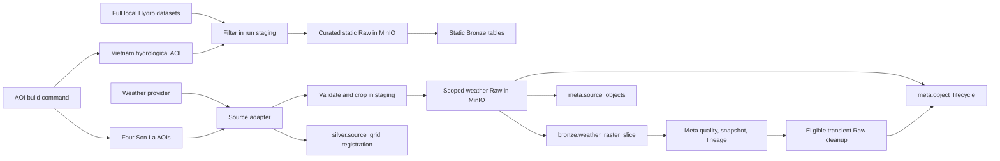

# Weather Raster Slice and AOI Design

**Date:** 2026-09-27  
**Status:** Approved design, awaiting implementation plan  
**Scope:** Restructure static vector landing scope and dynamic weather Raw-to-Bronze ingestion. Weather aggregation from Bronze to Silver is intentionally excluded.

## 1. Goals

This change has four goals:

1. Keep the four existing Son La AOIs and add a reusable hydrological AOI for Vietnam.
2. Stop publishing continent-wide HydroBASINS, BasinATLAS, and HydroRIVERS payloads to MinIO Raw when the project only needs Vietnam and its directly connected upstream basins.
3. Store dynamic weather in Bronze as compact raster slices instead of one Iceberg row per grid cell.
4. Separate GSMaP NOW and GSMaP Standard into independently scheduled DAGs, with explicit retention and replay rules for every weather source.

The design preserves the current restart-safe planner, immutable source-object identity, Iceberg snapshot lineage, and late-data handling. It changes the spatial scope, Bronze weather contract, object lifecycle, and DAG boundaries.

## 2. Decisions

### 2.1 AOIs

The current files remain unchanged in purpose:

- `core_aoi.geoparquet`: Son La administrative boundary.
- `hydrological_aoi.geoparquet`: Son La-intersecting HydroBASINS level 12 basins plus one direct upstream hop.
- `environmental_aoi.geoparquet`: buffered area used by DEM, WorldCover, and SoilGrids.
- `exposure_aoi.geoparquet`: area used by OSM and exposure data.

The AOI build command also creates:

- `vietnam_hydrological_aoi.geoparquet`: the union of all HydroBASINS level 12 basins that intersect Vietnam, plus one direct upstream hop.

The national AOI uses the same configured `hydrobasins_level=12` and `upstream_hops=1` as the Son La hydrological AOI. Rebuilding AOIs is deterministic. The four existing outputs must still be produced and validated.

### 2.2 Static source scope before Raw

Only the sources currently published at continental or global vector scope are reduced:

| Source | Current Raw scope | New Raw scope | Geometry rule |
|---|---|---|---|
| HydroBASINS L12 | Asia | Basins selected by `vietnam_hydrological_aoi` | Preserve complete selected basin polygons |
| BasinATLAS L12 | Global | Same `HYBAS_ID` set as HydroBASINS | Preserve complete selected basin polygons and the existing field allowlist |
| HydroRIVERS | Asia | Reaches intersecting `vietnam_hydrological_aoi` | Preserve complete intersecting reach geometry; do not clip at the AOI border |

Filtering happens in local run-scoped staging before upload to MinIO. The curated subset is packaged deterministically and becomes the registered Raw payload. Its manifest records:

- original local asset URI and checksum;
- curated payload checksum;
- AOI identity and AOI checksum;
- basin level and upstream-hop count;
- selected and original feature counts;
- selection algorithm version.

The full downloaded archives may remain in the local `dataset/` directory for rebuilding another scope, but they are not copied into MinIO Raw by these source adapters. DEM, WorldCover, SoilGrids, WorldPop, OSM, and administrative sources retain their currently approved scopes. This change does not expand static rasters to Vietnam.

### 2.3 Dynamic weather spatial scope

GSMaP NOW, GSMaP Standard, ERA5-Land, and IFS/Open-Meteo publish only the current Son La `hydrological_aoi` to Raw and Bronze.

If a provider returns a larger file, the adapter downloads it to run-scoped staging, validates it, extracts the cells needed by the configured spatial scope, and publishes only the subset. A staged provider file is not a Raw object and is deleted after successful publication or retained only for failed-run diagnosis according to the existing staging cleanup policy.

Every published object carries a versioned `spatial_scope_id`. The initial value identifies the Son La L12 plus one-upstream-hop scope and includes an AOI content hash. A later province expansion therefore creates a new scope identity instead of silently changing an old stream.

## 3. End-to-end architecture



Thin Airflow DAG files own schedules and task topology. Shared orchestration code owns planning, availability lag, fetch, crop, publication, lifecycle, grid registration, parsing, quality checks, lineage, and watermark advancement. Provider modules continue to own only source-specific request and file-format behavior.

## 4. DAG boundaries and schedules

GSMaP is split because NOW and Standard have different availability, cadence, retention, and reconciliation behavior.

| DAG | Schedule | Product behavior | Raw retention |
|---|---|---|---|
| `gsmap_now_ingest` | `7,37 * * * *` | Poll half-hour releases; each value represents a provider-defined rolling one-hour window | At least 7 days from Raw publication; deletion also requires successful Bronze, DQ, and lineage commits |
| `gsmap_standard_ingest` | `27 */6 * * *` | Recover available finalized hourly windows; normally delayed about three days | Durable |
| `era5_land_ingest` | Existing daily schedule | Backfill finalized historical hourly precipitation, soil moisture, surface runoff, and subsurface runoff | Durable |
| `ifs_ingest` | Existing six-hour schedule | Fill forecast and recent ERA5-Land latency using Open-Meteo sampling | At least 7 days from Raw publication; deletion also requires successful Bronze, DQ, and lineage commits |

All DAGs remain `catchup=False`, use `max_active_runs=1`, and recover downtime through the durable watermark plus overlap planner. An operational run plans every missing expected object after its scope-specific cursor up to the current provider-safe end. Explicit backfills use supplied start/end values and do not advance the operational cursor.

The watermark logical key includes:

```text
source_id + product + stream + spatial_scope_id
```

This prevents a newly added province scope from inheriting a cursor that was completed for Son La.

## 5. Raw and object lifecycle

`meta.source_objects` remains the immutable catalog of verified Raw publications. It records identity, object URI, checksum, provider timing, selection, and the original ingest run. Deleting a transient payload must not rewrite or erase this provenance row.

A new `meta.object_lifecycle` table records current storage state:

| Field | Type | Meaning |
|---|---|---|
| `object_id` | string, key | FK to `meta.source_objects` |
| `retention_class` | string | `durable` or `transient_7d` |
| `storage_status` | string | `available`, `eligible_for_expiry`, `expired`, or `delete_failed` |
| `expires_at` | UTC timestamp, nullable | Earliest permitted deletion time |
| `bronze_snapshot_id` | long, nullable | Bronze snapshot proving publication |
| `quality_status` | string | Latest required DQ result |
| `lineage_edge_id` | string, nullable | Evidence linking Raw object to Bronze output |
| `deleted_at` | UTC timestamp, nullable | Confirmed payload deletion time |
| `last_checked_at` | UTC timestamp | Last lifecycle evaluation |
| `reason` | string, nullable | Cleanup or failure explanation |

The cleanup transition is guarded:

```text
available
  -> eligible_for_expiry only when expires_at has passed
     and Bronze snapshot exists
     and all fatal DQ checks passed
     and Raw-to-Bronze lineage exists
  -> expired only after MinIO confirms deletion
```

For `transient_7d`, `expires_at` is the Raw publication time plus seven days. Failed or delayed Bronze processing extends the real retention period because every evidence gate must also pass. If deletion fails, the payload remains addressable and state becomes `delete_failed`; a later run retries it. Bronze discovery reads `meta.source_objects` and excludes lifecycle rows whose effective state is `expired`. Manifests remain durable even when a transient payload expires, so request metadata and checksums remain auditable.

## 6. Bronze weather contract

`bronze.weather_grid_value` is retired. Its replacement is `bronze.weather_raster_slice`, with one row per Raw object, variable, vertical level, cycle, validity window, and revision.

| Field | Required | Meaning |
|---|---:|---|
| `slice_id` | yes | Deterministic hash of the full slice business key |
| `object_id` | yes | FK to `meta.source_objects` |
| `source_id` | yes | Provider source |
| `source_product` | yes | NOW, Standard, ERA5-Land, or IFS/Open-Meteo product |
| `source_grid_version` | yes | Version of the provider grid definition |
| `spatial_scope_id` | yes | Versioned AOI used to create this slice |
| `variable` | yes | Precipitation, soil moisture layer, surface runoff, or subsurface runoff |
| `vertical_level` | yes | Level/layer identity; use an explicit surface marker when not layered |
| `source_cycle_id` | yes | Model/release cycle; use the approved product release identity for nonforecast data |
| `model_run_time` | no | Forecast model run time |
| `valid_time` | yes | Validity timestamp |
| `window_start` | yes | Start of the represented accumulation/state window |
| `window_end` | yes | End of the represented accumulation/state window |
| `source_revision` | yes | Provider revision identity |
| `cell_indices` | yes | Sorted unique indices into `silver.source_grid` |
| `values` | yes | Values aligned positionally with `cell_indices` |
| `unit` | yes | Canonical physical unit |
| `value_kind` | yes | Accumulation, mean rate, or instantaneous state |
| `available_at` | no | Provider availability time |
| `parser_version` | yes | Parser contract version |
| `ingest_run_id` | yes | Pipeline run producing the row |
| `quality_status` | yes | `passed`, `warning`, or `failed` |

The business key is:

```text
object_id + source_grid_version + spatial_scope_id + variable + vertical_level
+ source_cycle_id + valid_time + window_start + window_end + source_revision
```

Required fatal checks are:

- `len(cell_indices) == len(values)`;
- `cell_indices` are sorted and unique;
- every index exists in the matching `silver.source_grid` version;
- timestamps and windows are internally consistent;
- units and `value_kind` match the variable contract;
- missing provider values are represented consistently and never shifted against their cell indices.

Each Raw object is replaced atomically by its complete slice batch. An identical rerun performs no write. A revised provider object produces a new immutable object identity and slice revision; it does not destructively overwrite older provenance.

## 7. Provider grid registry

Each dynamic DAG ensures its provider grid exists in `silver.source_grid` before writing Bronze. This is a spatial reference dimension, not a Bronze-to-Silver weather transformation.

The table grain is one cell per `(source_id, source_grid_version, source_grid_id)` and includes:

```text
source_id, source_grid_version, source_grid_id, cell_index,
row_index, column_index, geometry_wkb, bbox_wgs84, centroid_lon,
centroid_lat, resolution_x, resolution_y, crs, scope_ids
```

The registered grid covers `vietnam_hydrological_aoi`, while each Bronze slice contains only indices for its current Son La scope. `scope_ids` is an array because one cell may belong to Vietnam, Son La, and future province scopes.

Cell identity must remain stable when the study area expands:

- GSMaP uses the documented JAXA regular 0.1-degree grid alignment.
- ERA5-Land uses the CDS regular 0.1-degree grid alignment requested by this project.
- IFS/Open-Meteo uses a project-defined, globally anchored 0.1-degree sampling lattice; it must not start its row or column numbering at arbitrary AOI bounds.
- `cell_index` is derived from the stable global row/column address, not from dense enumeration within the current AOI.

Grid registration is idempotent. If the same version and definition already exist, the DAG reuses it. A changed resolution, alignment, coordinate convention, or provider grid definition requires a new `source_grid_version`.

## 8. Late data and future reconciliation

Bronze retains source revisions and does not decide which product is authoritative. GSMaP NOW represents rolling one-hour windows updated every 30 minutes; adjacent NOW values must not be summed to manufacture hourly Standard values.

Future Silver logic may prefer GSMaP Standard only when its window exactly matches a NOW window. A shifted half-hour NOW window remains a distinct observation. IFS may temporarily cover recent periods unavailable from ERA5-Land, but ERA5-Land and IFS stay distinct sources with different semantics. No replacement or aggregation policy is implemented in this change.

## 9. Failure and recovery behavior

- Provider failure leaves the watermark behind the missing object, so a later run replans it.
- Failure after staging but before Raw publication never creates a registered Raw object.
- Raw publication and `meta.source_objects` registration remain independently recoverable through deterministic object identity and manifests.
- Bronze failure leaves durable Raw available; transient Raw cannot expire until Bronze, DQ, and lineage evidence exist.
- The acquisition watermark advances only across contiguous Raw publication coverage. Bronze progress is determined independently from slice output and lineage. A malformed slice therefore remains discoverable for Bronze retry even when its Raw acquisition window is already complete.
- A partial grid registry is rejected; Bronze cannot reference unknown cell indices.
- Cleanup is retryable and never marks an object expired before MinIO confirms deletion.

## 10. Migration and reset

This development environment does not need an online migration from `bronze.weather_grid_value`. The new table is created under the new name, and the old contract is removed from active code and documentation. Existing local dynamic tables and objects should be reset before the first run of the revised DAGs so test data cannot be mistaken for the new contract.

The same one-time development reset applies to the old continent-wide HydroBASINS, BasinATLAS, and HydroRIVERS Raw/Meta/Bronze state. Otherwise those still-available object registrations would remain eligible for parsing beside the new national subsets. The README must provide an explicit operator command for this reset; application code must not execute it automatically.

Static subset object identities include the AOI checksum and selection version. Rerunning static landing after this change therefore publishes new curated objects rather than reusing old continent-wide payloads. Bronze replacement remains keyed by the new object IDs. No destructive reset is performed automatically by application code.

## 11. Code organization

The implementation keeps source-independent flow separate from provider behavior:

```text
airflow/dags/
  gsmap_now_ingest.py
  gsmap_standard_ingest.py
  era5_land_ingest.py
  ifs_ingest.py

config/dynamic/
  gsmap_now.yaml
  gsmap_standard.yaml
  era5_land.yaml
  ifs.yaml

src/flashflood_data/orchestration/weather/
  airflow_factory.py       # common TaskFlow graph
  config.py                # validated source and retention config
  planner.py               # gap and overlap planning by spatial scope
  landing.py               # staged subset publication and lifecycle registration
  bronze.py                # raster-slice writes, DQ, snapshots, lineage
  grids.py                 # stable national provider-grid registration
  lifecycle.py             # guarded transient Raw expiry
  providers/               # source-specific request and parsing behavior

src/flashflood_data/static/
  harmonize/aoi.py         # five AOI outputs
  sources/                 # deterministic static vector subset packaging
```

Large responsibilities should be moved into these focused modules instead of making DAG files or the shared factory source-specific.

## 12. Verification

Tests use local fixtures and fake clients; they must not call live provider APIs.

Required coverage includes:

- AOI build still writes the four existing outputs and adds the national hydrological AOI;
- Vietnam L12 selection includes exactly one upstream hop and is deterministic;
- HydroBASINS and BasinATLAS select the same IDs;
- HydroRIVERS preserves complete intersecting features;
- manifests contain original and subset checksums, counts, scope, and selection version;
- NOW and Standard DAG IDs, schedules, configs, and retention differ as specified;
- planner and watermark keys include `spatial_scope_id`;
- provider grid cell IDs and indices remain stable when a scope expands;
- slice arrays have equal length, sorted unique known indices, and correctly aligned missing values;
- identical reruns do not create a new Bronze commit;
- transient cleanup cannot run before expiry, Bronze snapshot, passing DQ, and lineage;
- failed deletion remains retryable;
- schema, README, roadmap, and draw.io descriptions agree with the executable contracts.

Focused tests run first, followed by the full unit and contract suite, Ruff, DAG import checks, `docker compose config --quiet`, and `git diff --check`.

## 13. Explicitly out of scope

This implementation does not create:

- `silver.grid_basin_weight`;
- `silver.basin_weather_value`;
- a Bronze-to-Silver weather DAG;
- source-priority reconciliation between NOW and Standard or IFS and ERA5-Land;
- Gold forecasts, alerts, or basin aggregates;
- nationwide static raster ingestion.

Those features will consume the stable provider grid and raster-slice contracts defined here in a later design.
