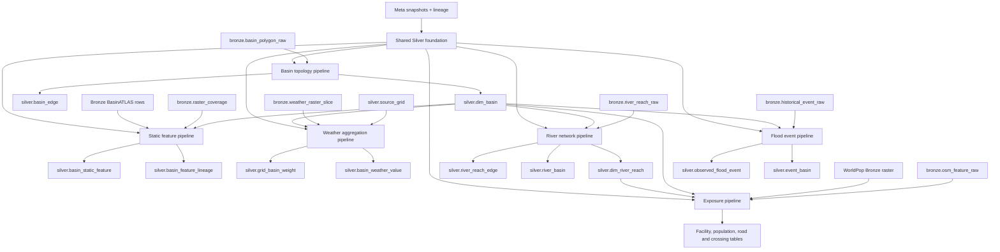
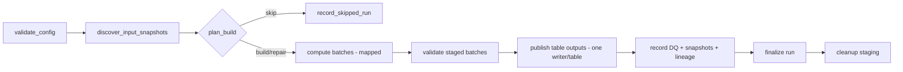

# Bronze to Silver Pipelines Design

**Vietnamese version:** `docs/superpowers/specs/2026-09-30-bronze-to-silver-pipelines-design.vi.md`

**Two-person assignment:** `docs/phan_cong_trien_khai_silver_2_nguoi.md`

**Date:** 2026-09-30  
**Status:** Approved  
**Scope:** Thiết kế các pipeline chuẩn hóa từ Bronze sang Silver theo từng domain, kèm ranh giới file, dependency và thứ tự triển khai.

## 1. Mục tiêu

Đợt triển khai này chuyển dữ liệu đã parse ở Bronze thành các bảng Silver có schema ổn định, version rõ ràng, chạy lại không nhân bản dữ liệu và có đầy đủ DQ, snapshot, lineage trong Meta.

Thiết kế phải giúp người phát triển đọc code theo một đường thẳng:

```text
Airflow DAG
  -> domain factory
  -> domain service
  -> reader / transform / quality của domain
  -> shared Silver publisher + Meta audit
  -> Iceberg Silver tables
```

Mỗi pipeline có package, cấu hình, DAG và test riêng. Phần dùng chung chỉ chứa cơ chế kỹ thuật thực sự giống nhau; logic nghiệp vụ không được đưa vào một service tổng quát lớn.

## 2. Phạm vi và phần tạm hoãn

### 2.1 Trong phạm vi

1. Shared Silver foundation.
2. Basin topology.
3. Basin static features.
4. Weather basin aggregation.
5. River network.
6. Exposure network.
7. Flood event to basin.

### 2.2 Tạm hoãn

- Gold, serving, PostGIS projection và KG.
- Qdrant, embedding và semantic search.
- `silver.source_document`.
- `silver.document_chunk`.
- `silver.event_evidence`.
- Pipeline trích xuất tài liệu/OCR/NER.

Trong đợt này, flood event chỉ tạo `silver.observed_flood_event` và `silver.event_basin`. `observed_flood_event.source_document_id` và `event_basin.evidence_id` để `null`. Ba bảng tài liệu vẫn có thể được giữ trong contract dài hạn nhưng không xuất hiện trong DAG, code runtime hay task triển khai Silver hiện tại.

Pipeline flood event Silver cần `bronze.historical_event_raw` làm đầu vào. Việc thu thập và parse nguồn flood event thành bảng Bronze này thuộc pipeline flood event landing/bronze riêng, không được ghép lại vào hai DAG static hiện có.

`bronze.admin_boundary_raw` chưa có bảng dimension Silver tương ứng trong contract hiện tại. Nó chỉ được dùng như lookup tùy chọn để QA địa danh và hỗ trợ gán flood event vào basin; pipeline này không tự tạo thêm một bảng Silver ngoài contract.

Hai chi tiết contract được chốt khi viết implementation plan:

- Derived hydrology raster không được ghi vào `meta.source_objects` vì bảng đó chỉ kiểm kê Raw. Static-feature plan bổ sung `meta.derived_objects` và `object_kind` trong `silver.basin_feature_lineage` để phân biệt raw source với derived asset.
- `silver.source_grid` là registry grid không gian dùng chung. Weather ingest tiếp tục đăng ký grid thời tiết; exposure pipeline dùng cùng registrar để bổ sung grid WorldPop trước khi ghi `silver.population_grid`.

## 3. Trạng thái đầu vào trước khi triển khai

Raw và Bronze hiện đã có nền tảng contract, idempotency, Meta audit và Iceberg writer. Trước khi chạy Silver cần hoàn tất ba điều kiện vận hành:

1. Deploy code Raw/Bronze mới nhất vào image Airflow.
2. Chạy thành công các DAG nguồn cần dùng và xác nhận snapshot Bronze có dữ liệu đúng AOI.
3. Xác nhận `silver.source_grid` đã được đăng ký cho từng nguồn thời tiết; bảng này được tạo bởi weather ingest và là input có sẵn của Silver, không được tạo lại trong weather aggregation.

## 4. Kiến trúc tổng thể



Dependency bắt buộc:

```text
shared foundation
  -> basin topology
       -> static features
       -> weather aggregation
       -> river network
            -> exposure network
       -> flood event
```

Static features, weather và river có thể triển khai độc lập sau basin. Exposure cần cả basin và river. Flood event chỉ cần basin và Bronze event.

## 5. Quy tắc tổ chức code

### 5.1 Luật dependency

- File DAG chỉ định schedule, task dependency, pool và retry; không chứa thuật toán GIS hay SQL nghiệp vụ.
- `factory.py` chỉ khởi tạo dependency production và trả về service; không xử lý dữ liệu.
- `service.py` điều phối một use case hoàn chỉnh; không chứa công thức địa hình, overlay hoặc mapping field dài.
- File transform là hàm thuần hoặc class không biết Airflow.
- `quality.py` của từng domain sở hữu rule nghiệp vụ của domain đó.
- Package `common` không import ngược bất kỳ package domain nào.
- Một domain không import `service.py`, `factory.py` hoặc module nội bộ của domain khác. Nó đọc output của domain trước qua Iceberg reader và contract công khai.
- Không import code từ `airflow/dags/` vào `src/`.

### 5.2 Fan-out tính toán, fan-in ghi dữ liệu

Các task có thể chia batch để đọc và tính toán song song. Kết quả trung gian được ghi vào staging theo `pipeline_run_id`; sau đó một task writer cho từng bảng sẽ:

1. đọc toàn bộ batch đã hoàn tất;
2. chạy DQ toàn batch;
3. commit một snapshot Iceberg;
4. ghi snapshot ref và lineage;
5. đánh dấu run thành công;
6. dọn staging.

Không cho nhiều mapped task commit đồng thời vào cùng một bảng Iceberg. Cách này giảm commit nhỏ, tránh conflict và giúp retry không tạo output nửa vời.

### 5.3 Idempotency và version

Mỗi lần build có `build_signature` xác định từ:

```text
sorted input table snapshot IDs
+ config content hash
+ transform/mapping version
+ output contract version
```

`build_signature` được dùng để:

- quyết định skip khi cùng input và config đã publish thành công;
- sinh các version như `basin_version`, `topology_version`, `feature_build_version`, `geometry_processing_version` khi phù hợp;
- tìm output dang dở để repair khi một run chỉ commit được một phần bảng;
- liên kết Meta input snapshots với output snapshots.

Iceberg không có transaction xuyên nhiều bảng. Vì vậy run chỉ có trạng thái `succeeded` sau khi tất cả bảng đích, DQ, snapshot refs và lineage đã ghi xong. Retry dùng cùng `build_signature`, kiểm tra từng output rồi chỉ sửa phần thiếu.

## 6. Kế hoạch 0 — Shared Silver foundation

### 6.1 File production

```text
src/flashflood_data/orchestration/silver/
  __init__.py
  common/
    __init__.py
    models.py
    versioning.py
    discovery.py
    staging.py
    publisher.py
    audit.py
    factory.py
```

| File | Trách nhiệm | Được gọi bởi | Gọi / phụ thuộc |
| --- | --- | --- | --- |
| `common/models.py` | Các model dùng chung: `InputSnapshotRef`, `SilverBuildRequest`, `StagedBatch`, `PublishedOutput`, `SilverRunResult`. | Tất cả Silver service. | Pydantic/dataclass chuẩn; không gọi storage. |
| `common/versioning.py` | Canonical JSON và hash deterministic cho build/version/business key. | Planner và transform của các domain. | Chỉ thư viện chuẩn. |
| `common/discovery.py` | Đọc snapshot hiện tại, Meta refs và run cũ; trả về input snapshot set và quyết định build/skip/repair. | Domain service. | `IcebergTableStore` và Meta read API. |
| `common/staging.py` | Tạo run directory, ghi/đọc batch Parquet, marker hoàn tất và cleanup an toàn. | Mapped compute tasks và publish task. | `ProjectPaths`, PyArrow, filesystem. |
| `common/publisher.py` | Validate batch schema, replace/upsert theo business key, commit một writer cho mỗi table. | Domain service publish phase. | `IcebergTableStore`; không ghi Meta trực tiếp. |
| `common/audit.py` | Ghi `pipeline_runs`, `quality_results`, `table_snapshot_ref`, `lineage_edges` theo batch. | Domain service finalize phase. | `MetaRecorder`. |
| `common/factory.py` | Khởi tạo catalog, table store, Meta recorder và staging store dùng chung. | Mỗi domain `factory.py`. | `LakehouseSettings`, `ProjectPaths`, storage hiện có. |

`src/flashflood_data/orchestration/quality.py` tiếp tục giữ `QualityResult` và `fatal_failures`; không tạo contract DQ thứ hai trong package Silver.

### 6.2 Test

```text
tests/unit/silver/common/
  test_versioning.py
  test_discovery.py
  test_staging.py
  test_publisher.py
  test_audit.py
```

Acceptance chính: cùng input/config sinh cùng signature; input snapshot khác sinh signature khác; rerun đã hoàn tất trả về skip; run dở chỉ publish output thiếu; Meta audit chỉ đánh dấu thành công sau đủ output.

## 7. Kế hoạch 1 — Basin topology

### 7.1 Input và output

| Input | Output |
| --- | --- |
| `bronze.basin_polygon_raw` của HydroBASINS L12 và BasinATLAS subset đã chọn | `silver.dim_basin` |
| Meta input snapshot và source object refs | `silver.basin_edge` |

HydroBASINS là nguồn geometry/topology chính. BasinATLAS chỉ bổ sung allowlist thuộc tính cần thiết theo `HYBAS_ID`; không mang toàn bộ cột Atlas sang Silver.

### 7.2 File production

```text
config/silver/basin_topology.yaml
airflow/dags/silver_basin_topology.py
src/flashflood_data/orchestration/silver/basin/
  __init__.py
  config.py
  models.py
  reader.py
  normalize.py
  topology.py
  quality.py
  service.py
  factory.py
```

| File | Trách nhiệm | Được gọi bởi | Gọi / phụ thuộc |
| --- | --- | --- | --- |
| `config.py` | Parse level 12, AOI/scope, field mapping và version rule. | `factory.py`, DAG parse-time validation. | YAML + Pydantic. |
| `models.py` | Row model cho basin, edge và topology report. | Reader, transform, quality, service. | Common models. |
| `reader.py` | Đọc đúng Bronze snapshots và tách HydroBASINS/BasinATLAS rows. | `service.py`. | Iceberg table store. |
| `normalize.py` | Chuẩn geometry EPSG:4326, ID/string type, area và field allowlist. | `service.py`. | Hàm geometry thuần; có thể tái dùng kernel trong `static/harmonize/hydro.py` nếu không phụ thuộc file path. |
| `topology.py` | Tạo `basin_edge`, phân loại internal/exits_AOI/terminal và topological sort. | `service.py`. | `models.py`; không biết storage. |
| `quality.py` | Unique key, geometry validity, area, dangling downstream, cycle, một sink hợp lệ. | `service.py`. | Shared `QualityResult`. |
| `service.py` | Discover → read → normalize → topology → stage → publish → audit. | DAG task callable. | Common Silver modules và các file domain trên. |
| `factory.py` | Tạo `BasinSilverService`. | DAG. | `common.factory`, config. |
| DAG | Khai báo task graph và một writer/table. | Airflow scheduler. | Chỉ `factory.py` và DTO serializable. |

### 7.3 Test

```text
tests/unit/silver/basin/
  test_config.py
  test_normalize.py
  test_topology.py
  test_quality.py
  test_service.py
tests/integration/silver/test_basin_pipeline.py
```

## 8. Kế hoạch 2 — Basin static features

### 8.1 Input và output

| Input | Output |
| --- | --- |
| `silver.dim_basin` | `silver.basin_static_feature` |
| `bronze.raster_coverage` cho DEM, WorldCover, SoilGrids | `silver.basin_feature_lineage` |
| BasinATLAS rows/snapshot ở Bronze | Derived DEM assets trong MinIO khi cần flow direction, accumulation, HAND, TWI |

Pipeline chỉ tính các field đã chốt trong contract. DEM là terrain chính, SoilGrids là soil chính, BasinATLAS terrain/runoff/discharge là QA/reference. Soil 0–30 cm được tổng hợp theo bề dày 0–5, 5–15, 15–30 cm và scale/unit nguồn.

### 8.2 File production

```text
config/silver/basin_static_features.yaml
airflow/dags/silver_basin_static_features.py
src/flashflood_data/orchestration/silver/static_features/
  __init__.py
  config.py
  models.py
  reader.py
  raster_inputs.py
  terrain.py
  hydrology.py
  soil.py
  landcover.py
  atlas.py
  assemble.py
  lineage.py
  quality.py
  service.py
  factory.py
```

| File | Trách nhiệm | Được gọi bởi | Gọi / phụ thuộc |
| --- | --- | --- | --- |
| `config.py` | Depth weights, units, stream threshold, Tc method, beta scenarios, raster resampling và batch size. | Factory/service và transform modules. | YAML + Pydantic. |
| `models.py` | Partial feature models, final feature row và contribution record. | Toàn domain. | Common models. |
| `reader.py` | Đọc basin, raster coverage, Atlas rows và object URI từ Meta. | `service.py`. | Iceberg/object store readers. |
| `raster_inputs.py` | Mở đúng raster object, kiểm tra CRS/nodata/coverage và cung cấp window theo basin. | Terrain, hydrology, soil, landcover. | Rasterio/Xarray; không commit output. |
| `terrain.py` | Elevation min/mean/max, relief, slope mean/P90. | `service.py`. | Có thể tái dùng hàm thuần ở `static/features/terrain.py`. |
| `hydrology.py` | Flow direction/accumulation, outlet, longest path, channel slope, streams, HAND, TWI, Tc/Kb và derived assets. | `service.py`. | Kernel `static/features/hydrology.py`, object publisher qua interface truyền vào. |
| `soil.py` | Chuyển scale/unit, weighted depth 0–30 cm, AWC và uncertainty. | `service.py`. | Kernel `static/features/soil.py`. |
| `landcover.py` | Zonal statistics cho forest/cropland/artificial/wetland khi chọn WorldCover làm nguồn. | `service.py`. | Kernel `static/features/landcover.py`. |
| `atlas.py` | Map allowlist BasinATLAS và các field QA/reference. | `service.py`. | Mapping config. |
| `assemble.py` | Ghép partial rows theo basin/version thành đúng một feature row/build. | `service.py`. | Domain models. |
| `lineage.py` | Tạo contribution theo basin/object/role và manifest cho derived raster. | `service.py`. | Common versioning. |
| `quality.py` | Coverage, unit, range, null bắt buộc, AWC, outlet/path/slope và lineage completeness. | `service.py`. | Shared DQ contract. |
| `service.py` | Lập batch basin, điều phối compute, stage, publish hai bảng và audit derived assets. | DAG tasks. | Các module domain + common. |
| `factory.py` | Tạo service và dependency raster/object-store. | DAG. | Common factory. |

Code cũ trong `src/flashflood_data/static/features/` chỉ được tái dùng cho thuật toán thuần đã có test. Không gọi `static/workflow/runner.py`, handler file-first hoặc state local từ DAG Silver.

### 8.3 Test

```text
tests/unit/silver/static_features/
  test_config.py
  test_raster_inputs.py
  test_terrain.py
  test_hydrology.py
  test_soil.py
  test_landcover.py
  test_atlas.py
  test_assemble.py
  test_lineage.py
  test_quality.py
  test_service.py
tests/integration/silver/test_static_features_pipeline.py
```

## 9. Kế hoạch 3 — Weather basin aggregation

### 9.1 Input và output

| Input | Output |
| --- | --- |
| `bronze.weather_raster_slice` | `silver.basin_weather_value` |
| `silver.source_grid` | `silver.grid_basin_weight` |
| `silver.dim_basin` | Meta input/output snapshot refs và lineage |

`grid_basin_weight` chỉ build lại khi grid version, basin version hoặc geometry processing config thay đổi. `basin_weather_value` có thể chạy incremental theo các slice chưa có output cho cùng business key/revision.

### 9.2 File production

```text
config/silver/weather_aggregation.yaml
airflow/dags/silver_weather_aggregation.py
src/flashflood_data/orchestration/silver/weather/
  __init__.py
  config.py
  models.py
  reader.py
  weights.py
  aggregate.py
  revisions.py
  quality.py
  service.py
  factory.py
```

| File | Trách nhiệm | Được gọi bởi | Gọi / phụ thuộc |
| --- | --- | --- | --- |
| `config.py` | Variable units, aggregation type, coverage threshold, geometry version và batch size. | Factory/service. | YAML + Pydantic. |
| `models.py` | Weight row, basin value row và aggregation report. | Toàn domain. | Common models. |
| `reader.py` | Discover slice revisions chưa xử lý; đọc aligned `cell_indices`/`values`, source grid và basin snapshot. | `service.py`. | Iceberg store. |
| `weights.py` | Overlay grid cell với basin trong equal-area CRS và sinh hai loại weight. | `service.py`. | GeoPandas/Shapely/PyProj; không biết weather value. |
| `aggregate.py` | Ánh xạ array value theo `cell_index`, bỏ nodata đúng cách, tính weighted value và coverage. | `service.py`. | NumPy/PyArrow + weight rows. |
| `revisions.py` | Giữ NOW/Standard/ERA5/IFS là observation riêng, tạo business key/revision và quy tắc exact-window preference metadata. | `service.py`. | Common versioning. |
| `quality.py` | Tổng trọng số, orphan cell, coverage, unit/window, NaN/nodata, uniqueness. | `service.py`. | Shared DQ. |
| `service.py` | Ensure/reuse weights, aggregate missing slices theo batch, publish và audit. | DAG. | Domain modules + common. |
| `factory.py` | Tạo weather Silver service. | DAG. | Common factory. |

Đợt Silver này không xóa NOW khi Standard xuất hiện. Hai nguồn/revision cùng tồn tại; selection authoritative được thực hiện ở Gold theo exact window và `available_at`, tránh làm mất cửa sổ NOW lệch 30 phút.

### 9.3 Test

```text
tests/unit/silver/weather/
  test_config.py
  test_weights.py
  test_aggregate.py
  test_revisions.py
  test_quality.py
  test_service.py
tests/integration/silver/test_weather_aggregation_pipeline.py
```

## 10. Kế hoạch 4 — River network

### 10.1 Input và output

| Input | Output |
| --- | --- |
| `bronze.river_reach_raw` | `silver.dim_river_reach` |
| `silver.dim_basin` | `silver.river_reach_edge` |
| Optional DEM-derived elevations from approved static build | `silver.river_basin` |

### 10.2 File production

```text
config/silver/river_network.yaml
airflow/dags/silver_river_network.py
src/flashflood_data/orchestration/silver/river/
  __init__.py
  config.py
  models.py
  reader.py
  normalize.py
  topology.py
  basin_overlay.py
  quality.py
  service.py
  factory.py
```

| File | Trách nhiệm | Được gọi bởi | Gọi / phụ thuộc |
| --- | --- | --- | --- |
| `config.py` | ID mapping, snap tolerance, topology và overlay version. | Factory/service. | YAML + Pydantic. |
| `models.py` | Reach, reach edge, river-basin row. | Domain modules. | Common models. |
| `reader.py` | Đọc HydroRIVERS Bronze và basin snapshot. | Service. | Iceberg store. |
| `normalize.py` | Geometry/field normalize và stable reach ID. | Service. | Geometry kernels. |
| `topology.py` | Nối reach theo node/hướng, sinh edge và slope nếu đủ elevation. | Service. | Domain models. |
| `basin_overlay.py` | Cắt/đo length reach trong basin với CRS phù hợp. | Service. | GeoPandas/Shapely/PyProj. |
| `quality.py` | Geometry, length, cycle, dangling node, direction và intersection ratio. | Service. | Shared DQ. |
| `service.py` | Điều phối ba output, stage, publish và audit. | DAG. | Domain + common. |
| `factory.py` | Tạo river service. | DAG. | Common factory. |

### 10.3 Test

```text
tests/unit/silver/river/
  test_normalize.py
  test_topology.py
  test_basin_overlay.py
  test_quality.py
  test_service.py
tests/integration/silver/test_river_pipeline.py
```

## 11. Kế hoạch 5 — Exposure network

### 11.1 Input và output

| Input | Output |
| --- | --- |
| `bronze.osm_feature_raw` đã lọc nhóm phục vụ lũ | `silver.dim_facility`, `silver.facility_basin` |
| WorldPop Bronze raster coverage/object | `silver.population_grid` |
| `silver.dim_basin` | `silver.dim_road_node`, `silver.dim_road_edge`, `silver.road_basin` |
| `silver.dim_river_reach` | `silver.river_crossing` |

### 11.2 File production

```text
config/silver/exposure_network.yaml
airflow/dags/silver_exposure_network.py
src/flashflood_data/orchestration/silver/exposure/
  __init__.py
  config.py
  models.py
  reader.py
  osm_tags.py
  facilities.py
  roads.py
  population.py
  basin_overlay.py
  crossings.py
  quality.py
  service.py
  factory.py
```

| File | Trách nhiệm | Được gọi bởi | Gọi / phụ thuộc |
| --- | --- | --- | --- |
| `config.py` | Facility/tag allowlist, road classes, graph/overlay versions, population semantics. | Factory/service. | YAML + Pydantic. |
| `models.py` | Facility, population cell, road node/edge, relation, crossing row. | Domain modules. | Common models. |
| `reader.py` | Đọc OSM, WorldPop, basin và river snapshots. | Service. | Iceberg/object store. |
| `osm_tags.py` | Chuẩn hóa tag và quyết định facility/road classification. | Facilities/roads. | Config only. |
| `facilities.py` | Stable ID, geometry và critical facility attributes. | Service. | `osm_tags.py`. |
| `roads.py` | Tạo graph node/edge, oneway, bridge/tunnel, length và base travel time. | Service. | `osm_tags.py`, geometry library. |
| `population.py` | Đọc raster population và tạo grid/value theo năm tham chiếu. | Service. | Raster reader; không suy children/elderly nếu nguồn không có. |
| `basin_overlay.py` | Gán facility/road/population grid với basin. | Service. | Basin rows + spatial index. |
| `crossings.py` | Phát hiện road-river intersection và phân biệt bridge/ford/unknown. | Service. | Road + river outputs. |
| `quality.py` | Stable key, graph endpoint, geometry, tag allowlist, basin assignment và false crossing checks. | Service. | Shared DQ. |
| `service.py` | Điều phối compute batches và publish từng bảng qua một writer/table. | DAG. | Domain + common. |
| `factory.py` | Tạo exposure service. | DAG. | Common factory. |

Không tạo một service duy nhất chứa toàn bộ OSM. Facility, road và crossing giữ module riêng nhưng chung một DAG vì cùng snapshot OSM và cùng version graph. Nếu runtime thực tế quá lớn, DAG có thể tách task group/publish phase mà không đổi package hay contract.

### 11.3 Test

```text
tests/unit/silver/exposure/
  test_osm_tags.py
  test_facilities.py
  test_roads.py
  test_population.py
  test_basin_overlay.py
  test_crossings.py
  test_quality.py
  test_service.py
tests/integration/silver/test_exposure_pipeline.py
```

## 12. Kế hoạch 6 — Flood event to basin

### 12.1 Input và output

| Input | Output |
| --- | --- |
| `bronze.historical_event_raw` | `silver.observed_flood_event` |
| `silver.dim_basin` | `silver.event_basin` |

Không có `source_document`, `document_chunk`, `event_evidence`, embedding hoặc Qdrant trong pipeline này.

### 12.2 File production

```text
config/silver/flood_events.yaml
airflow/dags/silver_flood_events.py
src/flashflood_data/orchestration/silver/events/
  __init__.py
  config.py
  models.py
  reader.py
  normalize.py
  basin_link.py
  quality.py
  service.py
  factory.py
```

| File | Trách nhiệm | Được gọi bởi | Gọi / phụ thuộc |
| --- | --- | --- | --- |
| `config.py` | Source field mappings, stable event ID/revision rule, time/place/geometry policy. | Factory/service. | YAML + Pydantic. |
| `models.py` | Event row, event-basin row và normalization report. | Domain modules. | Common models. |
| `reader.py` | Đọc event Bronze snapshot và basin version. | Service. | Iceberg store. |
| `normalize.py` | Chuẩn timestamp, place, severity, geometry kind, confidence và stable revision. | Service. | Config + domain models. |
| `basin_link.py` | Spatial join; tính affected area chỉ khi geometry kind là verified flood footprint. | Service. | Equal-area projection + basin rows. |
| `quality.py` | Time order, revision uniqueness, confidence, geometry kind, affected fraction và null-area rule. | Service. | Shared DQ. |
| `service.py` | Discover → normalize → basin link → stage → publish hai bảng → audit. | DAG. | Domain + common. |
| `factory.py` | Tạo flood event Silver service. | DAG. | Common factory. |

Nếu event chỉ có địa danh hoặc điểm báo cáo, pipeline vẫn tạo `event_basin.spatial_relation` nhưng để `affected_area_km2` và `affected_fraction_of_basin` là `null`. Không dùng diện tích hành chính làm diện tích ngập.

### 12.3 Test

```text
tests/unit/silver/events/
  test_normalize.py
  test_basin_link.py
  test_quality.py
  test_service.py
tests/integration/silver/test_event_pipeline.py
```

## 13. Airflow task pattern

Mỗi DAG dùng cùng pattern nhưng có task group domain riêng:



Thiết kế ban đầu dùng `schedule=None` cho các DAG Silver để người phát triển kiểm soát thứ tự trong giai đoạn xây dựng. Mỗi DAG vẫn tự reconcile snapshot nên trigger lại an toàn. Sau khi integration test và thời gian chạy ổn định, có thể bật schedule hoặc dataset-trigger mà không sửa service domain.

## 14. Cấu hình và registry

Các file `config/silver/*.yaml` chỉ chứa tham số có tác động đến kết quả và phải tham gia `build_signature`. Secret, endpoint và đường dẫn runtime tiếp tục ở `.env`/`LakehouseSettings`.

`meta.dataset_registry` cần bổ sung contract cho từng bảng Silver trước lần publish đầu tiên. Registry được quản lý tập trung, nhưng mỗi implementation plan chỉ đăng ký các bảng do pipeline đó sở hữu. Không cho một pipeline tự đăng ký hoặc ghi vào bảng output của pipeline khác.

## 15. Data quality, lineage và observability

Mỗi pipeline phải ghi:

- một `meta.pipeline_runs` row với status đầy đủ;
- input và output `meta.table_snapshot_ref`;
- pre-commit và post-commit `meta.quality_results`;
- `meta.lineage_edges` từ từng input snapshot đến từng output snapshot;
- structured log gồm `pipeline_run_id`, `build_signature`, batch, row count, elapsed time và snapshot ID.

DQ chung kiểm tra schema, primary/business key, null contract và commit row count. DQ domain nằm trong `quality.py` của domain tương ứng. Fatal check chặn publish; warning được publish nhưng phải ghi audit.

## 16. Thứ tự tạo implementation plan

Sau khi tài liệu thiết kế này được duyệt, tạo bảy plan độc lập trong `docs/superpowers/plans/` theo thứ tự:

1. `2026-09-30-silver-common-foundation.md`
2. `2026-09-30-silver-basin-topology.md`
3. `2026-09-30-silver-basin-static-features.md`
4. `2026-09-30-silver-weather-aggregation.md`
5. `2026-09-30-silver-river-network.md`
6. `2026-09-30-silver-exposure-network.md`
7. `2026-09-30-silver-flood-events.md`

Mỗi plan phải có:

- file tree trước danh sách task;
- task tạo từng file một;
- interface file tạo ra;
- file nào import/call interface đó;
- test viết trước cho hành vi quan trọng;
- command kiểm tra cụ thể;
- checkpoint sau mỗi nhóm file để người phát triển đọc và kiểm soát code trước khi tiếp tục.

## 17. Điều kiện hoàn tất toàn bộ Bronze to Silver

- Tất cả bảng Silver trong phạm vi có contract registry và truy vấn được bằng Trino.
- Rerun cùng snapshot/config không tạo row hoặc snapshot output thừa.
- Input snapshot mới chỉ rebuild domain bị ảnh hưởng.
- Mỗi output truy ngược được đến input snapshot qua Meta.
- Không có mapped task ghi đồng thời vào cùng bảng Iceberg.
- Không có code Qdrant, embedding hay document chunk trong runtime Silver.
- Test unit cho logic thuần và ít nhất một integration test cho mỗi pipeline đều pass.
